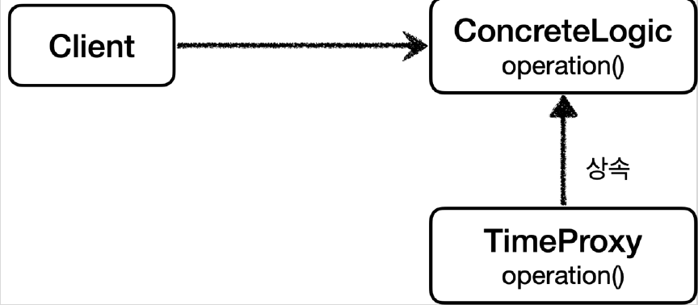
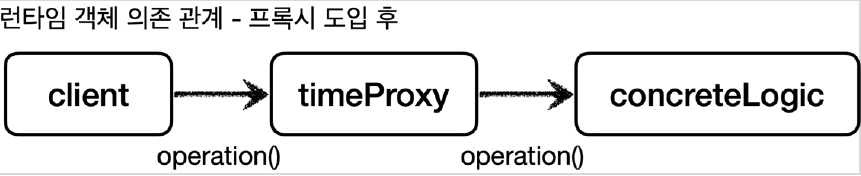

# <a href = "../README.md" target="_blank">스프링 핵심 원리 - 고급편</a>
## Chapter 04. 프록시 패턴과 데코레이터 패턴
### 4.15 구체 클래스 기반 프록시 - 예제2
1) 구체 클래스 기반 프록시 도입 원리 : 상속과 다형성
2) 예제 코드 : 구체 클래스 기반 프록시 도입
3) 실행 및 로그 확인 : 구체 클래스의 경우 상속을 통해 프록시를 만들 수 있다.

---

# 4.15 구체 클래스 기반 프록시 - 예제2

---

## 1) 구체 클래스 기반 프록시 도입 원리 : 상속과 다형성
지금까지 인터페이스를 기반으로 프록시를 도입했다.  
그런데 자바의 다형성은 인터페이스를 구현하든, 아니면 클래스를 상속하든 상위 타입만 맞으면 다형성이 적용된다.  

### 1.1 다형성 : 인터페이스의 구현 또는 상속
- 자바 언어에서 다형성은 인터페이스나 클래스를 구분하지 않고 모두 적용된다.
- 해당 타입과 그 타입의 하위 타입은 모두 다형성의 대상이 된다.
- 자바 언어의 너무 기본적인 내용을 이야기했지만, 인터페이스가 없어도 프록시가 가능하다는 것을 확실하게 집고 넘어갈 필요가 있어서 자세히 설명했다.

### 1.2 상속을 통해 프록시를 만들 수 있다!
- 쉽게 이야기해서 인터페이스가 없어도 프록시를 만들수 있다는 뜻이다.
- 그래서 이번에는 인터페이스가 아니라 클래스를 기반으로 상속을 받아서 프록시를 만들어보겠다.

---

## 2) 예제 코드 : 구체 클래스 기반 프록시 도입

### 2.1 클래스 의존 관계


### 2.2 런타임 객체 의존 관계


### 2.3 TimeProxy
```java
@Slf4j
public class TimeProxy extends ConcreteLogic {

    private ConcreteLogic concreteLogic;

    public TimeProxy(ConcreteLogic concreteLogic) {
        this.concreteLogic = concreteLogic;
    }

    @Override
    public String operation() {
        log.info("TimeDecorator 실행");
        long startTime = System.currentTimeMillis();

        String result = concreteLogic.operation();

        long endTime = System.currentTimeMillis();
        long resultTime = endTime - startTime;
        log.info("TimeDecorator 종료 resultTime = {}ms", resultTime);
        return result;
    }
}
```
- `TimeProxy` 프록시는 시간을 측정하는 부가 기능을 제공한다.
- 인터페이스가 아니라 클래스인 `ConcreteLogic` 를 상속 받아서 만든다.

### 2.4 `ConcreteProxyTest.addProxy()`
```java
    @Test
    void addProxy() {
        ConcreteLogic concreteLogic = new ConcreteLogic();
        TimeProxy timeProxy = new TimeProxy(concreteLogic);
        ConcreteClient client = new ConcreteClient(timeProxy); // TimeProxy는 ConcreteLogic의 하위 클래스이므로 다형성에 의해 주입될 수 있다.
        client.execute();
    }
```
- 여기서 핵심은 `ConcreteClient` 의 생성자에 `concreteLogic` 이 아니라 `timeProxy` 를 주입하는 부분이다.
- `ConcreteClient` 는 `ConcreteLogic` 을 의존하는데, 다형성에 의해 `ConcreteLogic` 에 `concreteLogic` 도 들어갈 수 있고, `timeProxy` 도 들어갈 수 있다.

### 2.5 `ConcreteClient` 참고
```java
public class ConcreteClient {

    private ConcreteLogic concreteLogic; //ConcreteLogic, TimeProxy 모두 주입 가능

    public ConcreteClient(ConcreteLogic concreteLogic) {
        this.concreteLogic = concreteLogic;
    }

    public void execute() {
        concreteLogic.operation();
    }
}
```
- (cf) ConcreteLogic 자리에 들어갈 수 있는 클래스
    - `ConcreteLogic = concreteLogic (본인과 같은 타입을 할당)`
    - `ConcreteLogic = timeProxy (자식 타입을 할당)`

---

## 3) 실행 및 로그 확인 : 구체 클래스의 경우 상속을 통해 프록시를 만들 수 있다.
```shell
TimeDecorator 실행
ConcreteLogic 실행
TimeDecorator 종료 resultTime=1
```
실행 결과를 보면 인터페이스가 없어도 클래스 기반의 프록시가 잘 적용된 것을 확인할 수 있다.

---
