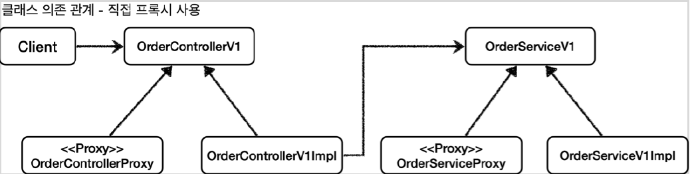
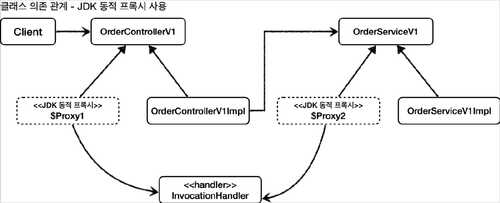

# <a href = "../README.md" target="_blank">스프링 핵심 원리 - 고급편</a>
## Chapter 05. 동적 프록시 기술
### 5.4 JDK 동적 프록시 - 적용1
1) JDK 동적 프록시를 애플리케이션에 적용 (인터페이스 기반)
2) 의존관계 비교
3) 남은 문제 : 프록시의 부가기능을 사용하고 싶지 않을 때는?

---

# 5.4 JDK 동적 프록시 - 적용1

---

## 1) JDK 동적 프록시를 애플리케이션에 적용 (인터페이스 기반)
참고 : JDK 동적 프록시는 인터페이스가 필수이기 때문에 V1 애플리케이션에만 적용할 수 있다.

### 1.1 LogTraceBasicHandler : 프록시가 수행할 공통 로직
```java
public class LogTraceBasicHandler implements InvocationHandler {

    private final Object target;
    private final LogTrace logTrace;

    public LogTraceBasicHandler(Object target, LogTrace logTrace) {
        this.target = target;
        this.logTrace = logTrace;
    }

    @Override
    public Object invoke(Object proxy, Method method, Object[] args) throws Throwable {
        TraceStatus status = null;
        try {
            String message = method.getDeclaringClass().getSimpleName()+"."+method.getName()+"()";
            status = logTrace.begin(message);

            // 로직 호출
            Object result = method.invoke(target, args);
            logTrace.end(status);
            return result;
        } catch (Exception e) {
            logTrace.exception(status, e);
            throw e;
        }
    }
}
```
- `LogTraceBasicHandler` 는 `InvocationHandler` 인터페이스를 구현해서 JDK 동적 프록시에서
사용된다.
- `private final Object target` : 프록시가 호출할 대상이다.
- `String message = method.getDeclaringClass().getSimpleName() + "." ...`
  - LogTrace 에 사용할 메시지이다.
  - 프록시를 직접 개발할 때는 "OrderController.request()" 와 같이 프록시마다 호출되는 클래스와 메서드 이름을 직접 남겼다.
  - 이제는 Method 를 통해서 호출되는 메서드 정보와 클래스 정보를 동적으로 확인할 수 있기 때문에 이 정보를 사용하면 된다.

### 1.2 `DynamicProxyBasicConfig` : 동적 프록시를 사용하도록 수동 빈 등록을 설정
```java
@Configuration
public class DynamicProxyBasicConfig {

    @Bean
    public OrderControllerV1 orderControllerV1(LogTrace logTrace) {
        OrderControllerV1 orderController = new OrderControllerV1Impl(orderServiceV1(logTrace));

        OrderControllerV1 proxy = (OrderControllerV1)
                Proxy.newProxyInstance(OrderControllerV1.class.getClassLoader(),
                        new Class[]{OrderControllerV1.class},
                        new LogTraceBasicHandler(orderController, logTrace));
        return proxy;
    }

    @Bean
    public OrderServiceV1 orderServiceV1(LogTrace logTrace) {
        OrderServiceV1 orderService = new OrderServiceV1Impl(orderRepositoryV1(logTrace));

        OrderServiceV1 proxy = (OrderServiceV1)
                Proxy.newProxyInstance(OrderServiceV1.class.getClassLoader(),
                        new Class[]{OrderServiceV1.class},
                        new LogTraceBasicHandler(orderService, logTrace));
        return proxy;
    }

    @Bean
    public OrderRepositoryV1 orderRepositoryV1(LogTrace logTrace) {
        OrderRepositoryV1 orderRepository = new OrderRepositoryV1Impl();

        OrderRepositoryV1 proxy = (OrderRepositoryV1)
                Proxy.newProxyInstance(OrderRepositoryV1.class.getClassLoader(),
                        new Class[]{OrderRepositoryV1.class},
                        new LogTraceBasicHandler(orderRepository, logTrace));
        return proxy;
    }
}
```
- 이전에는 프록시 클래스를 직접 개발했지만, 이제는 JDK 동적 프록시 기술을 사용해서 각각의
`Controller` , `Service` , `Repository` 에 맞는 동적 프록시를 생성해주면 된다.
- `LogTraceBasicHandler` : 동적 프록시를 만들더라도 `LogTrace` 를 출력하는 로직은 모두 같기 때문에
프록시는 모두 `LogTraceBasicHandler` 를 사용한다.

### 1.3 ProxyApplication 수정
```java
//@Import(AppV1Config.class)
//@Import({AppV1Config.class, AppV2Config.class})
//@Import(InterfaceProxyConfig.class)
//@Import(ConcreteProxyConfig.class)
@Import(DynamicProxyBasicConfig.class)
@SpringBootApplication(scanBasePackages = "hello.proxy.app")
public class ProxyApplication {
```
- `@Import(DynamicProxyBasicConfig.class)` : 이제 동적 프록시 설정을 @Import 하고 실행해보자.

### 1.4 실행
- http://localhost:8080/v1/request?itemId=hello
- 실행해보면 정상 수행되는 것을 확인할 수 있다.

---

## 2) 의존관계 비교

### 2.1 동적 프록시 도입 전 클래스 의존 관계

- 개발자가 직접 모든 클래스마다 프록시를 수동으로 만들어야했고, 이들을 빈으로 등록해야했다.

### 2.2 동적 프록시 도입 후 클래스 의존 관계

- 로깅에 관한 공통 로직을 LogTraceBasicHandler 한 곳에서 집중한다.
- 런타임에는 동적으로 만들어진 프록시를 주입하면 된다.

### 2.3 동적 프록시 도입 전 런타임 객체 의존 관계


### 2.4 동적 프록시 도입 후 런타임 객체 의존 관계


---

## 3) 남은 문제 : 프록시의 부가기능을 사용하고 싶지 않을 때는?
- http://localhost:8080/v1/no-log
- no-log를 실행해도 동적 프록시가 적용되고, LogTraceBasicHandler 가 실행되기 때문에 로그가 남는다.
- 이 부분을 로그가 남지 않도록 처리해야 한다.

---

