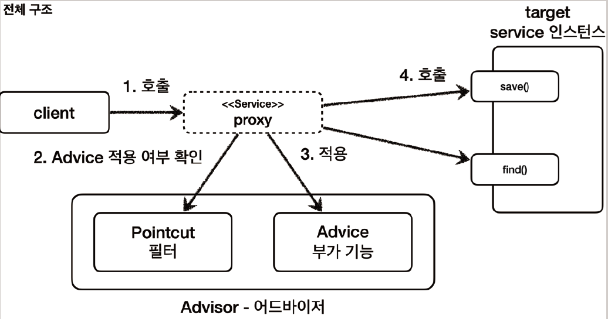

# <a href = "../README.md" target="_blank">스프링 핵심 원리 - 고급편</a>
## Chapter 06. 스프링이 지원하는 프록시
### 6.04 포인트컷, 어드바이스, 어드바이저 - 소개
1) 포인트컷(Pointcut) : 어디에?
2) 어드바이스(Advice) : 어떤 로직을?
3) 어드바이저(Advisor) : 어디에(Pointcut) + 어떤 로직을(Advice)?
4) 포인트컷, 어드바이스, 어드바이저 전체 구조

---

# 6.04 포인트컷, 어드바이스, 어드바이저 - 소개

---

## 1) 포인트컷(Pointcut) : 어디에?
- 어디에 부가 기능을 적용할지, 어디에 부가 기능을 적용하지 않을지 판단하는 필터링 로직
- 주로 클래스와 메서드 이름으로 필터링 한다. 이름 그대로 어떤 포인트(Point)에 기능을
적용할지 하지 않을지 잘라서(cut) 구분하는 것이다.

---

## 2) 어드바이스(Advice) : 어떤 로직을?
- 이전에 본 것 처럼 프록시가 호출하는 부가 기능이다.
- 단순하게 프록시 로직이라 생각하면 된다.

---

## 3) 어드바이저(Advisor) : 어디에(Pointcut) + 어떤 로직을(Advice)?
- 단순하게 하나의 포인트컷과 하나의 어드바이스를 가지고 있는 것이다.
- 쉽게 이야기해서 포인트컷1 + 어드바이스1이다.

---

## 4) 포인트컷, 어드바이스, 어드바이저 전체 구조

### 4.1 한 마디로
- 포인트컷으로 어디에? 적용할지 선택한다.
- 어드바이스로 어떤 로직을 적용할지 선택한다.
- 그리고 어디에? 어떤 로직?을 모두 알고 있는 것이 어드바이저이다.
- 참고
  - 해당 단어들에 대한 정의는 지금은 문맥상 이해를 돕기 위해 프록시에 맞추어서 설명하지만, 이후에 AOP
  부분에서 다시 한번 AOP에 맞추어 정리하겠다. 그림은 이해를 돕기 위한 것이고, 실제 구현은 약간 다를 수
  있다.

### 4.2 쉽게 기억 하는 방법
- 조언( `Advice` )을 어디( `Pointcut`)에 할 것인가?
- 조언자( `Advisor` )는 어디( `Pointcut` )에 조언( `Advice` )을 해야할지 알고 있다.

### 4.3 역할과 책임의 분리
- 이렇게 구분한 것은 역할과 책임을 명확하게 분리한 것이다.
- 포인트컷은 대상 여부를 확인하는 필터 역할만 담당한다.
- 어드바이스는 깔끔하게 부가 기능 로직만 담당한다.
- 둘을 합치면 어드바이저가 된다. 스프링의 어드바이저는 하나의 포인트컷 + 하나의 어드바이스로 구성된다.

---
