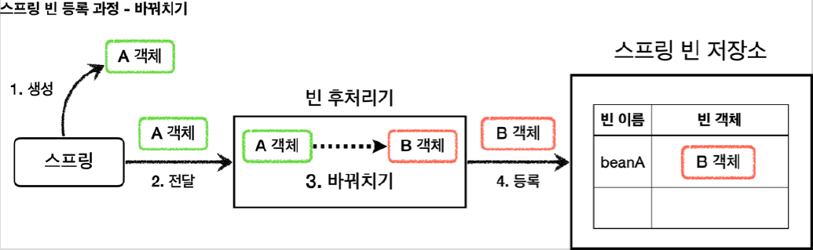

# <a href = "../README.md" target="_blank">스프링 핵심 원리 - 고급편</a>
## Chapter 07. 빈 후처리기
### 7.1 빈 후처리기 - 소개
1) 일반적인 스프링 빈 등록 : 생성한 그대로 등록
2) 빈 후처리기(BeanPostProcessor) : 등록 직전 조작/바꿔치기

---

# 7.1 빈 후처리기 - 소개

---

## 1) 일반적인 스프링 빈 등록 : 생성한 그대로 등록

- `@Bean` 이나 컴포넌트 스캔으로 스프링 빈을 등록하면, 스프링은 대상 객체를 생성하고 스프링 컨테이너
내부의 빈 저장소에 등록한다.
- 그리고 이후에는 스프링 컨테이너를 통해 등록한 스프링 빈을 조회해서 사용하면 된다.

---

## 2) 빈 후처리기(BeanPostProcessor) : 등록 직전 조작/바꿔치기

### 2.1 빈 후처리기란?
- 스프링이 빈 저장소에 등록할 목적으로 생성한 객체를 빈 저장소에 등록하기 직전에 조작하고 싶다면 빈
후처리기를 사용하면 된다.
- 빈 포스트 프로세서( `BeanPostProcessor` )는 번역하면 빈 후처리기인데, 이름 그대로 빈을 생성한 후에
무언가를 처리하는 용도로 사용한다.

### 2.2 빈 후처리기의 기능
- 객체를 조작할 수도 있고, 완전히 다른 객체로 바꿔치기 하는 것도 가능하다.
- 이 기능을 이용하여 원본 객체를 기반으로 프록시로 바꿔치기 할 수 있는 것이다.

### 2.3 빈 후처리기 흐름

1. 생성: 스프링 빈 대상이 되는 객체를 생성한다. ( @Bean , 컴포넌트 스캔 모두 포함)
2. 전달: 생성된 객체를 빈 저장소에 등록하기 직전에 빈 후처리기에 전달한다.
3. 후 처리 작업: 빈 후처리기는 전달된 스프링 빈 객체를 조작하거나 다른 객체로 바뀌치기 할 수 있다.
4. 등록: 빈 후처리기는 빈을 반환한다. 전달 된 빈을 그대로 반환하면 해당 빈이 등록되고, 바꿔치기 하면
다른 객체가 빈 저장소에 등록된다.

### 2.4 빈 후처리기를 통해 다른 객체로 바꿔치기

---
