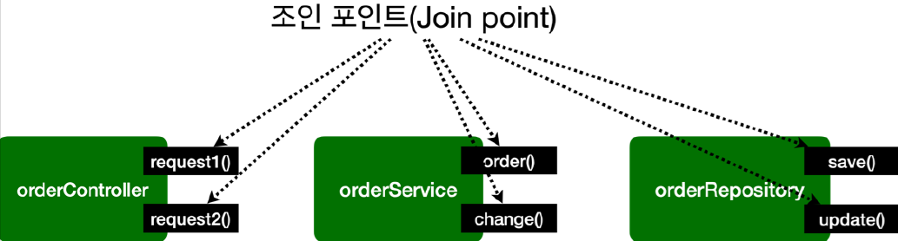

# <a href = "../README.md" target="_blank">스프링 핵심 원리 - 고급편</a>
## Chapter 09. 스프링 AOP 개념
### 9.4 AOP 용어 정리
1) 조인 포인트(Join point) : AOP를 적용할 수 있는 모든 지점
2) 포인트컷(Pointcut) : 어드바이스가 적용될 위치를 지정
3) 타겟(Target) : 어드바이스를 받는 객체
4) 어드바이스(Advice) : 부가 기능
5) 애스펙트(Aspect) : 어드바이스 + 포인트컷 모듈화
6) 어드바이저(Advisor) : 어드바이스 1 + 포인트 컷 1
7) 위빙(Weaving) : 포인트컷으로 결정한 타켓의 조인 포인트에 어드바이스를 적용하는 것
8) AOP 프록시 : AOP를 구현하기 위해 만든 프록시 객체

---

# 9.4 AOP 용어 정리

---

## 1) 조인 포인트(Join point) : AOP를 적용할 수 있는 모든 지점
- 어드바이스가 적용될 수 있는 위치, 메소드 실행, 생성자 호출, 필드 값 접근, static 메서드 접근 같은
- 프로그램 실행 중 지점
- 조인 포인트는 추상적인 개념이다. AOP를 적용할 수 있는 모든 지점이라 생각하면 된다.
- 스프링 AOP는 프록시 방식을 사용하므로 조인 포인트는 항상 메소드 실행 지점으로 제한된다.

---

## 2) 포인트컷(Pointcut) : 어드바이스가 적용될 위치를 지정
- 조인 포인트 중에서 어드바이스가 적용될 위치를 선별하는 기능
- 주로 AspectJ 표현식을 사용해서 지정
- 프록시를 사용하는 스프링 AOP는 메서드 실행 지점만 포인트컷으로 선별 가능

---

## 3) 타겟(Target) : 어드바이스를 받는 객체
- 어드바이스를 받는 객체, 포인트컷으로 결정된다.

---

## 4) 어드바이스(Advice) : 부가 기능
- 부가 기능
- 특정 조인 포인트에서 Aspect에 의해 취해지는 조치
- `Around(주변)`, `Before(전)`, `After(후)`와 같은 다양한 종류의 어드바이스가 있음

---

## 5) 애스펙트(Aspect) : 어드바이스 + 포인트컷 모듈화
- 어드바이스 + 포인트컷을 모듈화 한 것
- `@Aspect` 를 생각하면 됨.
- 여러 어드바이스와 포인트 컷이 함께 존재

---

## 6) 어드바이저(Advisor) : 어드바이스 1 + 포인트 컷 1
- 하나의 어드바이스와 하나의 포인트 컷으로 구성
- 스프링 AOP에서만 사용되는 특별한 용어

---

## 7) 위빙(Weaving) : 포인트컷으로 결정한 타켓의 조인 포인트에 어드바이스를 적용하는 것
- 포인트컷으로 결정한 타켓의 조인 포인트에 어드바이스를 적용하는 것
- 위빙을 통해 핵심 기능 코드에 영향을 주지 않고 부가 기능을 추가 할 수 있음
- AOP 적용을 위해 애스펙트를 객체에 연결한 상태
- 위빙 방법
  - 컴파일 타임(AspectJ compiler)
  - 로드 타임
  - 런타임, 스프링 AOP는 런타임, 프록시 방식

---

## 8) AOP 프록시 : AOP를 구현하기 위해 만든 프록시 객체
- AOP 기능을 구현하기 위해 만든 프록시 객체.
- 스프링에서 AOP 프록시는 JDK 동적 프록시 또는 CGLIB 프록시이다.

---
