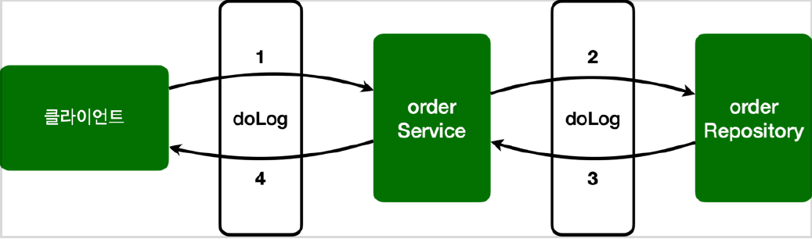

# <a href = "../README.md" target="_blank">스프링 핵심 원리 - 고급편</a>
## Chapter 10. 스프링 AOP 구현
### 10.3 스프링 AOP 구현1 - 시작
1) `@Aspect`를 이용한 AOP 구현 - 기본
2) 애스펙트를 스프링 빈으로 개발자가 등록해야한다.
3) 실행 및 로그 확인

---

# 10.3 스프링 AOP 구현1 - 시작

---

## 1) `@Aspect`를 이용한 AOP 구현 - 기본

### 1.1 AspectV1
```java
@Slf4j
@Aspect
public class AspectV1 {

    @Around("execution(* com.ttasjwi.aop.order..*(..))")
    public Object doLog(ProceedingJoinPoint joinPoint) throws Throwable {
        log.info("[log] {}", joinPoint.getSignature()); // join poin 시그니처
        return joinPoint.proceed();
    }
}
```
- 포인트 컷 : `@Around` 어노테이션의 값인 `execution(* hello.aop.order..*(..))` 는 포인트컷이 된다.
  - `execution(* hello.aop.order..*(..))` 는 hello.aop.order 패키지와 그 하위 패키지( .. )를
  지정하는 AspectJ 포인트컷 표현식이다. 앞으로는 간단히 포인트컷 표현식이라 하겠다. 참고로 표인트컷
  표현식은 뒤에서 자세히 설명하겠다.
- 어드바이스 : `@Around` 어노테이션의 메서드인 doLog 는 어드바이스(`Advice`)가 된다.
- 이제 `OrderService` , `OrderRepository` 의 모든 메서드는 AOP 적용의 대상이 된다. 참고로 스프링은
프록시 방식의 AOP를 사용하므로 프록시를 통하는 메서드만 적용 대상이 된다.

### 1.2 참고1 : AspectJ를 직접 사용하는 것이 아님
- 스프링 AOP는 AspectJ의 문법을 차용하고, 프록시 방식의 AOP를 제공한다. AspectJ를 직접 사용하는
것이 아니다.
- 스프링 AOP를 사용할 때는 @Aspect 애노테이션을 주로 사용하는데, 이 애노테이션도 AspectJ가
제공하는 애노테이션이다.

### 1.3 참고2 : `aspectjweaver.jar`
- `@Aspect` 를 포함한 org.aspectj 패키지 관련 기능은 aspectjweaver.jar 라이브러리가 제공하는
기능이다. 앞서 build.gradle 에 spring-boot-starter-aop 를 포함했는데, 이렇게 하면 스프링의
AOP 관련 기능과 함께 aspectjweaver.jar 도 함께 사용할 수 있게 의존 관계에 포함된다.
- 그런데 스프링에서는 AspectJ가 제공하는 애노테이션이나 관련 인터페이스만 사용하는 것이고, 실제
AspectJ가 제공하는 컴파일, 로드타임 위버 등을 사용하는 것은 아니다. 스프링은 지금까지 우리가 학습한
것 처럼 프록시 방식의 AOP를 사용한다.

---

## 2) 애스펙트를 스프링 빈으로 개발자가 등록해야한다.

### 2.1 애스펙트를 스프링 빈으로 등록
```java
@Slf4j
@SpringBootTest
@Import(AspectV1.class)
public class AopTest {
```
- `@Aspect` 는 애스펙트라는 표식이지 컴포넌트 스캔이 되는 것은 아니다. 따라서 AspectV1 를 AOP로
사용하려면 스프링 빈으로 등록해야 한다.
- `AopTest` 에 `@Import(AspectV1.class)` 로 스프링 빈을 추가했다.

### 2.2 스프링 빈 등록 방법
- `@Bean` 을 사용해서 직접 등록
- `@Component` 컴포넌트 스캔을 사용해서 자동 등록
- `@Import` 주로 설정 파일을 추가할 때 사용(`@Configuration`)
  - `@Import` 는 주로 설정 파일을 추가할 때 사용하지만, 이 기능으로 스프링 빈도 등록할 수 있다.
  - 테스트에서는 버전을 올려가면서 변경할 예정이어서 간단하게 `@Import` 기능을 사용하자.

---

## 3) 실행 및 로그 확인
### 3.1 isAopProxy
- `AopUtils.isAopProxy(...)` 도 프록시가 적용되었으므로 true 를 반환한다.

### 3.2 로그 확인

```shell
[log] void hello.aop.order.OrderService.orderItem(String)
[orderService] 실행
[log] String hello.aop.order.OrderRepository.save(String)
[orderRepository] 실행
```
- 테스트를 실행해보면 다음과 같이 로그가 잘 출력되는 것을 확인할 수 있다.

---
