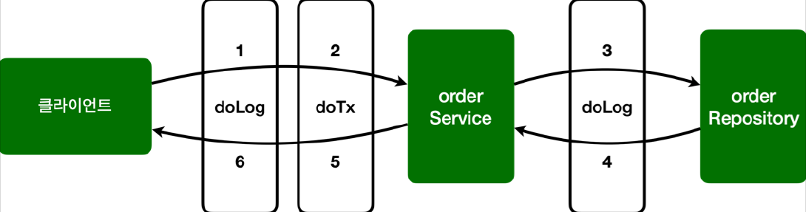

# <a href = "../README.md" target="_blank">스프링 핵심 원리 - 고급편</a>
## Chapter 10. 스프링 AOP 구현
### 10.5 스프링 AOP 구현3 - 어드바이스 추가
1) 어드바이스 추가 : 애스펙트 메서드를 더 만들면 됨
2) 한계 : 어드바이스 적용 순서를 지정할 수 없을까?
---

# 10.5 스프링 AOP 구현3 - 어드바이스 추가

## 1) 어드바이스 추가 : 애스펙트 메서드를 더 만들면 됨

### 1.1 요구사항 : 트랜잭션 기능 추가
다음 부가기능을 새로 추가한다. (실제 구현은 아니고, 로그로만 형식적으로 만듬)
- 핵심 로직 실행 직전에 트랜잭션을 시작
- 핵심 로직 실행
- 핵심 로직 실행에 문제가 없으면 커밋
- 핵심 로직 실행에 예외가 발생하면 롤백

### 1.2 AspectV3
```java
@Slf4j
@Aspect
public class AspectV3 {

    @Around("allOrder()")
    public Object doLog(ProceedingJoinPoint joinPoint) throws Throwable {
        log.info("[log] {}", joinPoint.getSignature()); // join poin 시그니처
        return joinPoint.proceed();
    }

    // com.ttasjwi.aop.order 패키지와 하위 패키지
    @Pointcut("execution(* com.ttasjwi.aop.order..*(..))")
    private void allOrder() {} // pointcut signature

    // 클래스 이름 패턴이 *Service 인 것들
    @Pointcut("execution(* *..*Service.*(..))")
    private void allService() {}


    // com.ttasjwi.aop.order 패키지와 하위 패키지 이면서 클래스 이름이 *Service
    @Around("allOrder() && allService()")
    public Object doTransaction(ProceedingJoinPoint joinPoint) throws Throwable {
        try {
            log.info("[트랜잭션 시작] {}", joinPoint.getSignature());

            Object result = joinPoint.proceed();

            log.info("[트랜잭션 커밋] {}", joinPoint.getSignature());
            return result;
        } catch (Exception e) {
            log.error("[트랜잭션 롤백] {}", joinPoint.getSignature());
            throw e;
        } finally {
            log.info("[리소스 릴리즈] {}", joinPoint.getSignature());
        }
    }
}
```

### 1.3 포인트컷
- `allOrder()` 포인트컷은 `hello.aop.order` 패키지와 하위 패키지를 대상으로 한다.
- `allService()` 포인트컷은 타입 이름 패턴이 `*Service` 를 대상으로 하는데 쉽게 이야기해서
`XxxService` 처럼 `Service` 로 끝나는 것을 대상으로 한다. `*Servi*` 과 같은 패턴도 가능하다.
  - 여기서 타입 이름 패턴이라고 한 이유는 클래스, 인터페이스에 모두 적용되기 때문이다.

### 1.4 포인트컷 조합
`@Around("allOrder() && allService()")`
- 포인트컷은 이렇게 조합할 수 있다. `&& (AND)`, `|| (OR)`, `! (NOT)` 3가지 조합이 가능하다.
- `hello.aop.order` 패키지와 하위 패키지 이면서 타입 이름 패턴이 `*Service` 인 것을 대상으로 한다.
- 결과적으로 `doTransaction()` 어드바이스는 `OrderService` 에만 적용된다.
- `doLog()` 어드바이스는 `OrderService` , `OrderRepository` 에 모두 적용된다.
- 포인트컷이 적용된 AOP 결과는 다음과 같다.
  - `orderService` : `doLog()` , `doTransaction()` 어드바이스 적용
  - `orderRepository` : `doLog()` 어드바이스 적용

### 1.5 AopTest 수정
```java
//@Import(AspectV2.class)
@Import(AspectV3.class)
public class AopTest {
```
AspectV3 를 실행하기 위해서 다음 처리를 하자.
- `@Import(AspectV2.class)` 주석 처리
- `@Import(AspectV3.class)` 추가

### 1.6 `success()`

```shell
[log] void hello.aop.order.OrderService.orderItem(String)
[트랜잭션 시작] void hello.aop.order.OrderService.orderItem(String)
[orderService] 실행
[log] String hello.aop.order.OrderRepository.save(String)
[orderRepository] 실행
[트랜잭션 커밋] void hello.aop.order.OrderService.orderItem(String)
[리소스 릴리즈] void hello.aop.order.OrderService.orderItem(String)
```
`orderService` 에는 `doLog()` , `doTransaction()` 두가지 어드바이스가 적용되어 있고,  
`orderRepository` 에는 `doLog()` 하나의 어드바이스만 적용된 것을 확인할 수 있다.

- AOP 적용 전
  - 클라이언트 → `orderService.orderItem()` → `orderRepository.save()`
- AOP 적용 후
  - 클라이언트 → `doLog()` → `doTransaction()` → `orderService.orderItem()`
  → `doLog()` → `orderRepository.save()`


### 1.7 `exception()`
```shell
[log] void hello.aop.order.OrderService.orderItem(String)
[트랜잭션 시작] void hello.aop.order.OrderService.orderItem(String)
[orderService] 실행
[log] String hello.aop.order.OrderRepository.save(String)
[orderRepository] 실행
[트랜잭션 롤백] void hello.aop.order.OrderService.orderItem(String)
[리소스 릴리즈] void hello.aop.order.OrderService.orderItem(String)
```
예외 상황에서는 트랜잭션 커밋 대신에 트랜잭션 롤백이 호출되는 것을 확인할 수 있다.

---

## 2) 한계 : 어드바이스 적용 순서를 지정할 수 없을까?
- 여기에서는 로그를 남기는 순서가 `doLog()` → `doTransaction()` 순서로 작동한다.
- 만약 어드바이스가 적용되는 순서를 변경하고 싶으면 어떻게 하면 될까?
- 예를 들어서 실행 시간을 측정해야 하는데 트랜잭션과 관련된 시간을 제외하고 측정하고 싶다면 `doTransaction()` → `doLog()` 이렇게
트랜잭션 이후에 로그를 남겨야 할 것이다.
- 이 방법은 `Order(...)`을 사용해야하는데 이 부분은 뒤에서 다루도록 하겠다.

---
