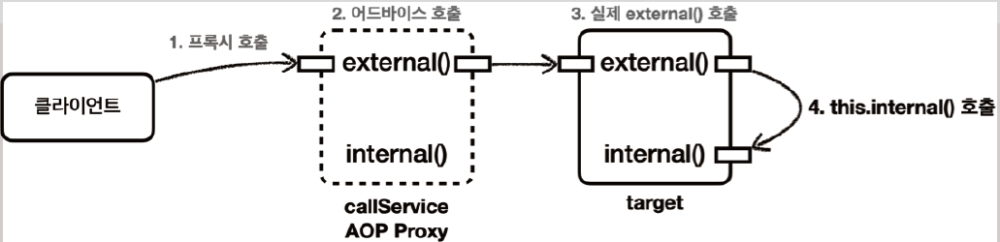
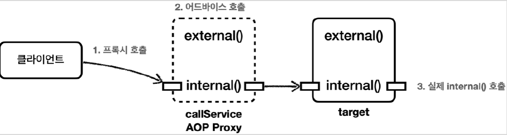

# <a href = "../README.md" target="_blank">스프링 핵심 원리 - 고급편</a>
## Chapter 13. 스프링 AOP - 실무 주의사항
### 13.1 프록시와 내부 호출 - 문제
1) 개요 : 프록시와 내부호출 문제
2) 예제 - 내부 호출하는 메서드가 있을 때
3) 실행 - external을 호출한 경우 (내부적으로 internal 호출)
4) 실행 - internal을 직접 호출한 경우
5) 프록시 방식 AOP의 한계 : 내부 호출에 프록시 적용 불가

---

# 13.1 프록시와 내부 호출 - 문제

---

## 1) 개요 : 프록시와 내부호출 문제

### 1.1 스프링은 프록시 방식의 AOP
- 스프링은 프록시 방식의 AOP를 사용한다.
- 따라서 AOP를 적용하려면 항상 프록시를 통해서 대상 객체(Target)을 호출해야 한다.
- 이렇게 해야 프록시에서 먼저 어드바이스를 호출하고, 이후에 대상 객체를 호출한다.
- 만약 프록시를 거치지 않고 대상 객체를 직접 호출하게 되면 AOP가 적용되지 않고, 어드바이스도 호출되지
않는다.

### 1.2 스프링은 런타임에 프록시 객체가 빈으로 주입되어 호출된다.
AOP를 적용하면 스프링은 대상 객체 대신에 프록시를 스프링 빈으로 등록한다. 따라서 스프링은 의존관계
주입시에 항상 프록시 객체를 주입한다. 프록시 객체가 주입되기 때문에 대상 객체를 직접 호출하는 문제는
일반적으로 발생하지 않는다.

### 1.3 target에서 내부 메서드를 호출할 때
- 하지만 대상 객체의 내부에서 메서드 호출이 발생하면 프록시를 거치지 않고 대상 객체를 직접 호출하는 문제가 발생한다.
- 실무에서 반드시 한번은 만나서 고생하는 문제이기 때문에 꼭 이해하고 넘어가자.

---

## 2) 예제 - 내부 호출하는 메서드가 있을 때

### 2.1 CallServiceV0
```java
@Slf4j
@Component
public class CallServiceV0 {

    public void external() {
        log.info("call external");
        internal(); // 내부 메서드 호출(this.internal())
    }

    public void internal() {
        log.info("call internal");
    }
}
```
- `CallServiceV0.external()` 을 호출하면 내부에서 `internal()` 이라는 자기 자신의 메서드를 호출한다.
  - 자바 언어에서 메서드를 호출할 때 대상을 지정하지 않으면 앞에 자기 자신의 인스턴스를 뜻하는 `this` 가
  붙게 된다.
  - 그러니까 여기서는 `this.internal()` 이라고 이해하면 된다.


### 2.2 `CallLogAspect`
```java
@Slf4j
@Aspect
public class CallLogAspect {
    @Before("execution(* com.ttasjwi.aop.internalcall..*.*(..))")
    public void doLog(JoinPoint joinPoint) {
        log.info("aop={}", joinPoint.getSignature());
    }
}
```
- `CallServiceV0` 에 AOP를 적용하기 위해서 간단한 `Aspect` 를 하나 만들자.
- 포인트컷을 확인해보면, `com.ttasjwi.aop.interanl` 하위의 모든 타입의 모든 메서드에 대하여 aop가 적용됨을 알 수 있다.

### 2.3 CallServiceV0Test
```java
@Slf4j
@Import(CallLogAspect.class)
@SpringBootTest
class CallServiceV0Test {

    @Autowired CallServiceV0 callServiceV0;

    @Test
    void external() {
        callServiceV0.external();
    }

    @Test
    void internal() {
        callServiceV0.internal();
    }
}
```
- 앞서 만든 `CallServiceV0` 을 실행할 수 있는 테스트 코드를 만들었다.
- `@Import(CallLogAspect.class)` : 앞서 만든 간단한 Aspect 를 스프링 빈으로 등록한다. 이렇게 해서
`CallServiceV0` 에 AOP 프록시를 적용한다.
- `@SpringBootTest` : 내부에 컴포넌트 스캔을 포함하고 있다. `CallServiceV0` 에 `@Component` 가
붙어있으므로 스프링 빈 등록 대상이 된다.

---

## 3) 실행 - external을 호출한 경우 (내부적으로 internal 호출)

### 3.1 로그 확인
```shell
1. //프록시 호출
2. CallLogAspect : aop=void com.ttasjwi.aop.internalcall.CallServiceV0.external()
3. CallServiceV0 : call external
4. CallServiceV0 : call internal
```

- 실행 결과를 보면 `callServiceV0.external()` 을 실행할 때는 프록시를 호출한다. 따라서
`CallLogAspect` 어드바이스가 호출된 것을 확인할 수 있다.
- 그리고 AOP Proxy는 `target.external()` 을 호출한다.
- 그런데 여기서 문제는 `callServiceV0.external()` 안에서 `internal()` 을 호출할 때 발생한다. 이때는
`CallLogAspect` 어드바이스가 호출되지 않는다.

### 3.2 `this.internal()` : 대상 객체 스스로를 호출
- 자바 언어에서 메서드 앞에 별도의 참조가 없으면 this 라는 뜻으로 자기 자신의 인스턴스를 가리킨다.
- 결과적으로 자기 자신의 내부 메서드를 호출하는 `this.internal()` 이 되는데, 여기서 `this` 는 실제 대상
객체(target)의 인스턴스를 뜻한다. 결과적으로 이러한 내부 호출은 프록시를 거치지 않는다. 따라서 어드바이스도 적용할 수 없다.

---

## 4) 실행 - internal을 직접 호출한 경우
```shell
CallLogAspect : aop=void com.ttasjwi.aop.internalcall.CallServiceV0.internal()
CallServiceV0 : call internal
```


외부에서 호출하는 경우 프록시를 거치기 때문에 internal() 도 CallLogAspect 어드바이스가 적용된
것을 확인할 수 있다.

---

## 5) 프록시 방식 AOP의 한계 : 내부 호출에 프록시 적용 불가

### 5.1 프록시 방식 AOP의 한계
- 스프링은 프록시 방식의 AOP를 사용한다.
- 프록시 방식의 AOP는 메서드 내부 호출에 프록시를 적용할 수 없다.

### 5.2 AspectJ : 내부 호출에도 AOP를 직접 적용하는 방법
- 실제 코드에 AOP를 직접 적용하는 AspectJ를 사용하면 이런 문제가 발생하지 않는다.
- 프록시를 통하는 것이 아니라 해당 코드에 직접 AOP 적용 코드가 붙어 있기 때문에 내부 호출과 무관하게 AOP를 적용할 수
있다.

### 5.3 AspectJ의 문제점
- 하지만 로드 타임 위빙 등을 사용해야 하는데, 설정이 복잡하고 JVM 옵션을 주어야 하는 부담이 있다.
그리고 지금부터 설명할 프록시 방식의 AOP에서 내부 호출에 대응할 수 있는 대안들도 있다.
- 이런 이유로 AspectJ를 직접 사용하는 방법은 실무에서는 거의 사용하지 않는다.
- 스프링 애플리케이션과 함께 직접 AspectJ 사용하는 방법은 스프링 공식 메뉴얼을 참고하자.
- https://docs.spring.io/spring-framework/docs/current/reference/html/core.html#aopusing-aspectj

---
