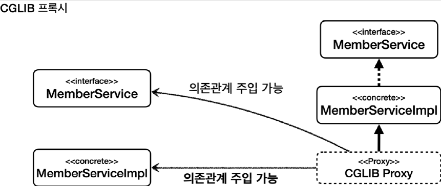

# <a href = "../README.md" target="_blank">스프링 핵심 원리 - 고급편</a>
## Chapter 13. 스프링 AOP - 실무 주의사항
### 13.6 프록시 기술과 한계 - 의존관계 주입
1) (실습) 실습환경 준비
2) JDK 동적 프록시를 구체 클래스 타입 의존관계에 주입
3) CGLIB 프록시를 구체 클래스 타입 의존관계에 주입
4) CGLIB를 주로 사용하는 이유 : 타입 캐스팅, 의존관계 주입 안정성

---

# 13.6 프록시 기술과 한계 - 의존관계 주입

---

## 1) (실습) 실습환경 준비

### 1.1 실험용 Aspect
```java
@Slf4j
@Aspect
public class ProxyDIAspect {

    @Before("execution(* com.ttasjwi.aop..*.*(..))")
    public void doTrace(JoinPoint joinPoint) {
        log.info("[proxyDIAdvice] {}", joinPoint.getSignature());
    }
}

```
AOP 프록시 생성을 위해 간단한 Aspect 를 생성했다.

### 1.2 실행 코드
```java

@Slf4j
@SpringBootTest(properties = {"spring.aop.proxy-target-class=false"}) // JDK 동적 프록시
//@SpringBootTest(properties = {"spring.aop.proxy-target-class=true"}) // CGLIB 동적 프록시
@Import(ProxyDIAspect.class)
public class ProxyDITest {

    @Autowired
    MemberService memberService; //JDK 동적 프록시 OK, CGLIB OK

    @Autowired
    MemberServiceImpl memberServiceImpl; //JDK 동적 프록시 X, CGLIB OKㅌ

    @Test
    void go() {
        log.info("memberService class={}", memberService.getClass());
        log.info("memberServiceImpl class={}", memberServiceImpl.getClass());
        memberServiceImpl.hello("hello");
    }
}
```
- `@SpringBootTest` : 내부에 컴포넌트 스캔을 포함하고 있다. `MemberServiceImpl` 에 `@Component` 가
붙어있으므로 스프링 빈 등록 대상이 된다.
- `properties = {"spring.aop.proxy-target-class=false"}`
  - application.properties 에 설정하는 대신에 해당 테스트에서만 설정을 임시로 적용한다.
  - 이렇게 하면 각 테스트마다 다른 설정을 손쉽게 적용할 수 있다.
- `spring.aop.proxy-target-class=false`
  - 스프링이 AOP 프록시를 생성할 때 JDK 동적 프록시를 우선 생성한다.
  - 물론 인터페이스가 없다면 CGLIB를 사용한다.
- `@Import(ProxyDIAspect.class)` : 앞서 만든 Aspect를 스프링 빈으로 등록한다.

---

## 2) JDK 동적 프록시를 구체 클래스 타입 의존관계에 주입
JDK 동적 프록시를 구체 클래스 타입 의존관계에 주입할 때 어떤 문제가 발생하는지 지금부터 확인해보자.

### 2.1 실행
```java
@SpringBootTest(properties = {"spring.aop.proxy-target-class=false"}) // JDK 동적 프록시
//@SpringBootTest(properties = {"spring.aop.proxy-target-class=true"}) // CGLIB 동적 프록시
```
- `spring.aop.proxy-target-class=false` 설정을 사용해서 스프링 AOP가 JDK 동적 프록시를
사용하도록 했다. 이렇게 실행하면 다음과 같이 오류가 발생한다.

### 2.2 실행 결과
```shell
BeanNotOfRequiredTypeException:
Bean named 'memberServiceImpl' is expected to be of type 'com.ttasjwi.aop.member.MemberServiceImpl'
but was actually of type 'com.sun.proxy.$Proxy53'
```
- 타입과 관련된 예외가 발생한다.
- 자세히 읽어보면 memberServiceImpl 에 주입되길 기대하는 타입은
`com.ttasjwi.aop.member.MemberServiceImpl` 이지만
실제 넘어온 타입은 com.sun.proxy.$Proxy54 이다. 따라서 타입 예외가 발생한다고 한다.

### 2.3 의존관계 주입

- `@Autowired MemberService memberService`
  - 이 부분은 문제가 없다. JDK Proxy는 MemberService 인터페이스를 기반으로 만들어진다.
  - 따라서 해당 타입으로 캐스팅 할 수 있다. `MemberService = JDK Proxy` 가 가능하다.
- `@Autowired MemberServiceImpl memberServiceImpl`
  - 문제는 여기다. JDK Proxy는 MemberService 인터페이스를 기반으로 만들어진다.
  - 따라서 MemberServiceImpl 타입이 뭔지 전혀 모른다. 그래서 해당 타입에 주입할 수 없다.
  `MemberServiceImpl = JDK Proxy` 가 불가능하다.

---

## 3) CGLIB 프록시를 구체 클래스 타입 의존관계에 주입

### 3.1 실행
```java
//@SpringBootTest(properties = {"spring.aop.proxy-target-class=false"}) // JDK 동적 프록시
@SpringBootTest(properties = {"spring.aop.proxy-target-class=true"}) // CGLIB 동적 프록시
```
- 이번에는 JDK 동적 프록시 대신에 CGLIB를 사용해서 프록시를 적용해보자. 위와 같이 주석을 반대로
걸어보자.

### 3.2 실행 결과
```shell
memberService class=class com.ttasjwi.aop.member.MemberServiceImpl$$EnhancerBySpringCGLIB$$d44f7320
memberServiceImpl class=class com.ttasjwi.aop.member.MemberServiceImpl$$EnhancerBySpringCGLIB$$d44f7320
[proxyDIAdvice] String com.ttasjwi.aop.member.MemberServiceImpl.hello(String)
```
실행해보면 정상 동작하는 것을 확인할 수 있다.

### 3.3 의존관계 주입

- `@Autowired MemberService memberService`
  - CGLIB Proxy는 `MemberServiceImpl` 구체 클래스를 기반으로 만들어진다.
  - `MemberServiceImpl` 은 `MemberService` 인터페이스를 구현했기 때문에 해당 타입으로 캐스팅 할 수 있다.
  - `MemberService = CGLIB Proxy` 가 가능하다.
- `@Autowired MemberServiceImpl memberServiceImpl`
  - CGLIB Proxy는 `MemberServiceImpl` 구체 클래스를 기반으로 만들어진다.
  - 따라서 해당 타입으로 캐스팅 할 수 있다.
  - `MemberServiceImpl = CGLIB Proxy` 가 가능하다.

---

## 4) CGLIB를 주로 사용하는 이유 : 타입 캐스팅, 의존관계 주입 안정성

### 4.1 JDK 동적 프록시 vs CGLIB
- JDK 동적 프록시는 대상 객체인 MemberServiceImpl 타입에 의존관계를 주입할 수 없다.
- CGLIB 프록시는 대상 객체인 MemberServiceImpl 타입에 의존관계 주입을 할 수 있다.

비교해보면 CGLIB 동적 프록시를 사용하면 구체 클래스 타입 캐스팅, 의존관계 주입에 있어서 더 안전하다.

### 4.2 구체 클래스를 DI한다면, 의존하는 설계가 잘못됐을 가능성이 높음.
- 개발할 때는 인터페이스가 있으면 인터페이스를 기반으로 의존관계 주입을 받는 것이 맞다.
- DI의 장점이 무엇인가? DI 받는 클라이언트 코드의 변경 없이 구현 클래스를 변경할 수 있는 것이다.
- 이렇게 하려면 인터페이스를 기반으로 의존관계를 주입 받아야 한다. MemberServiceImpl 타입으로 의존관계
주입을 받는 것 처럼 구현 클래스에 의존관계를 주입하면 향후 구현 클래스를 변경할 때 의존관계 주입을
받는 클라이언트의 코드도 함께 변경해야 한다.
- 따라서 올바르게 잘 설계된 애플리케이션이라면 이런 문제가 자주 발생하지는 않는다.

### 4.2 물론 구체 클래스 의존이 필요한 경우가 있을 수 있음.
- 그럼에도 불구하고 테스트, 또는 여러가지 이유로 AOP 프록시가 적용된 구체 클래스를 직접 의존관계 주입
받아야 하는 경우가 있을 수 있다.
- 이때는 CGLIB를 통해 구체 클래스 기반으로 AOP 프록시를 적용하면 된다.

여기까지 듣고보면 CGLIB를 사용하는 것이 좋아보인다. CGLIB를 사용하면 사실 이런 고민 자체를 하지
않아도 된다. 하지만 단점도 있긴 있는데, 이건 뒤에서 다룰 것이다.

---
