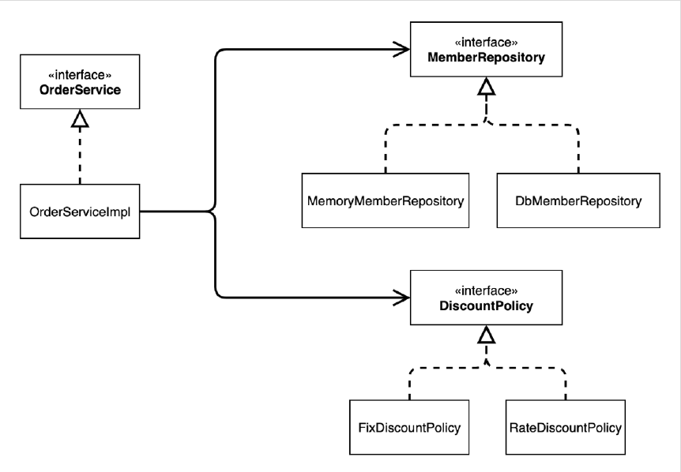
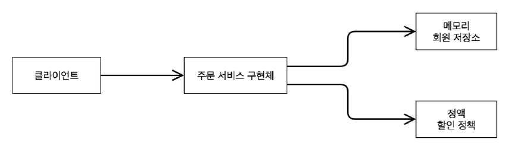

# <a href = "../README.md" target="_blank">스프링 핵심 원리 - 기본편</a>
## Chapter 03. 스프링 핵심 원리 이해2 - 객체 지향 원리 적용
### 3.8 IoC, DI, 그리고 컨테이너
1) IoC (Inversion of Control, 제어의 역전) : 프로그램의 제어 흐름을 외부에서 관리
2) DI (Dependency Injection, 의존관계 주입) : 런타임에 의존관계 결정
3) DI 컨테이너(IoC 컨테이너) : 객체 생성, 관리, 의존관계 연결

---

# 3.8 IoC, DI, 그리고 컨테이너

---

## 1) IoC (Inversion of Control, 제어의 역전) : 프로그램의 제어 흐름을 외부에서 관리
**프로그램의 제어 흐름을 외부에서 관리하는 것**을 제어의 역전(IoC)이라 한다. 개발자의 코드로 직접 제어하지 않는다.

### 1.1 기존 방식 : 주도권을 내가 작성한 구현 객체가 흐름을 제어함
- 기존 프로그램은 클라이언트 구현 객체가 스스로 필요한 서버 구현 객체를 생성하고, 연결하고, 실행했다.
- 한마디로 구현 객체가 프로그램의 제어 흐름을 스스로 조종했다. 개발자 입장에서는 자연스러운 흐름이다.

### 1.2 주도권을 AppConfig이 가져감.
`AppConfig`이 등장한 이후에 프로그램의 제어 흐름은 이제 `AppConfig`이 가져간다. 구현 객체는 자신의 로직을 실행하는 역할만 담당한다. 
- `OrderServiceImpl` 은 필요한 인터페이스들을 호출하지만 어떤 구현 객체들이 실행될지 모른다.
  - 심지어 `OrderServiceImpl` 도 `AppConfig`가 생성한다. 
- `AppConfig`는 `OrderServiceImpl` 이 아닌 `OrderService` 인터페이스의 다른 구현 객체를 생성하고 실행할 수도 있다. 
  - 그런 사실도 모른체 `OrderServiceImpl` 은 묵묵히 자신의 로직을 실행할 뿐이다.

### 1.3 프레임워크 vs 라이브러리
- 프레임워크가 내가 작성한 코드를 제어하고, 대신 실행하면 그것은 프레임워크가 맞다. (JUnit)
- 반면에 내가 작성한 코드가 직접 제어의 흐름을 담당한다면 그것은 프레임워크가 아니라 라이브러리다.

---

## 2) DI (Dependency Injection, 의존관계 주입) : 런타임에 의존관계 결정

### 2.1 의존관계 주입
**애플리케이션 실행 시점(런타임)에 외부에서 실제 구현 객체를 생성하고 클라이언트에 전달**해서, 클라이언트와 서버의 **실제 의존관계가 연결** 되는 것
- 런타임에 객체 인스턴스를 생성하고, 그 참조값을 전달해서 연결된다.
- 의존관계 주입을 사용하면 클라이언트 코드를 변경하지 않고, 클라이언트가 호출하는 대상의 타입 인스턴스를 변경할 수 있다.
- 의존관계 주입을 사용하면 정적인 클래스 의존관계를 변경하지 않고, 동적인 객체 인스턴스 의존관계를 쉽게 변경할 수 있다.

### 2.2 정적인 클래스 의존관계

- 클래스가 사용하는 import 코드만 보고 의존관계를 쉽게 판단할 수 있다.
- 정적인 의존관계는 애플리케이션을 실행하지 않아도 분석할 수 있다.
- 위 그림을 보면 `OrderServiceImpl` 은 `MemberRepository` , `DiscountPolicy` 에 의존한다는 것을 알 수 있다.
- 그런데 이러한 클래스 의존관계 만으로는 실제 어떤 객체가 `OrderServiceImpl` 에 주입 될지 알 수 없다.

### 2.3 동적인 객체 인스턴스 의존 관계

- 애플리케이션 실행 시점에 실제 생성된 객체 인스턴스의 참조가 연결된 의존 관계다.

---

## 3) DI 컨테이너(IoC 컨테이너) : 객체 생성, 관리, 의존관계 연결
- `AppConfig` 처럼 객체를 생성하고 관리하면서 의존관계를 연결해 주는 것을 IoC 컨테이너 또는 DI 컨테이너라 한다.
- 의존관계 주입에 초점을 맞추어 최근에는 주로 DI 컨테이너라 한다.
- 또는 어샘블러, 오브젝트 팩토리 등으로 불리기도 한다.

---
