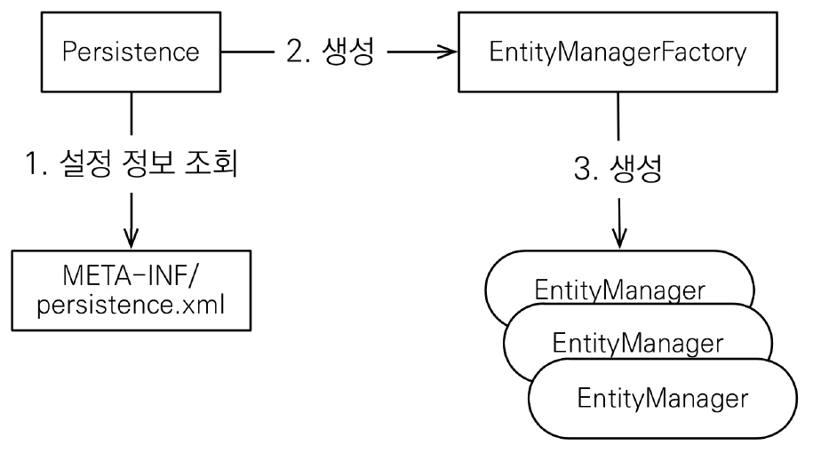

# <a href = "../README.md" target="_blank">자바 ORM 표준 JPA 프로그래밍 - 기본편</a>
## Chapter 02. JPA 시작하기
### 2.2 Hello JPA - 애플리케이션 개발
1) JPA 구동 방식 : EntityManagerFactory, EntityManager
2) 객체와 테이블을 생성하고 매핑하기
3) JPA를 통한 데이터 변경은 트랜잭션 안에서 이루어져야한다.
4) 엔티티 매니저(JPA)를 통한 비즈니스 로직 수행(등록, 수정, 삭제, 조회)
5) JPQL(Java Persistence Query Language) : 엔티티를 대상으로 한 쿼리 언어

---

# 2.2 Hello JPA - 애플리케이션 개발

---

## 1) JPA 구동 방식 : EntityManagerFactory, EntityManager


### 1.1 EntityManagerFactory 생성
```java
EntityManagerFactory emf = Persistence.createEntityManagerFactory("hello");
```
```xml
    <persistence-unit name="hello"> <!-- persistence.xml-->
        <properties>
```
- Persistence 클래스를 통해서, EntityManagerFactory를 생성한다.
   - `resources/META-INF/persistence.xml`의 설정 정보를 사용한다.
- 위와 같이 지정하면, 이름이 'hello'인 persistence-unit을 찾아서 엔티티 매니저 팩토리를 생성한다.
- 엔티티 매니저 팩토리는 애플리케이션 전체에서 단 한번 생성하고 공유해서 사용해야한다.
  - JPA를 동작시키기 위한 기반 객체 생성, 구현체에 따라서는 데이터베이스 커넥션 풀도 생성하기 때문에 매우 생성 비요잉 비싸다.

### 1.2 EntityManager 생성
```java
EntityManager em = emf.createEntityManager();
```
- 엔티티 매니저를 통해서, 엔티티 매니저를 생성한다.
- JPA의 대부분의 기능은 EntityManager가 제공한다.
- 엔티티 매니저는 내부적으로 DataSource를 유지하면서 데이터베이스와 통신할 수 있다.
- 엔티티 매니저를 통해서, 엔티티를 데이터베이스에 등록/수정/삭제/조회 할 수 있다.
- 데이터베이스 커넥션과 밀접한 관련이 있으므로, 스레드 간에 공유하거나 재사용하면 안 된다.
  - 요청이 들어올 때마다 하나씩 사용한다.

### 1.3 종료
```java
em.close(); // 엔티티 매니저 종료
emf.close(); // 엔티티 매니저 팩토리 종료
```
- 사용이 종료된 엔티티 매니저는 반드시 종료해야한다.
- 애플리케이션 종료시점에 엔티티 매니저 팩토리 역시 종료해야한다.

---

## 2) 객체와 테이블을 생성하고 매핑하기
```java
package hellojpa;

@Entity
@Table(name = "book")
@Getter
@NoArgsConstructor(access = AccessLevel.PROTECTED)
@ToString(of = {"id", "name", "price"})
public class Book {

    @Id
    @GeneratedValue(strategy = GenerationType.IDENTITY)
    @Column(name = "book_id")
    private Long id;

    @Column(name = "name")
    private String name;

    @Column(name = "price")
    private int price;

    @Builder(access = AccessLevel.PUBLIC)
    private Book(Long id, String name, int price) {
        this.id = id;
        this.name = name;
        this.price = price;
    }

    public Book(String name, int price) {
        this(null, name, price);
    }

    public void changeBookInfo(String name, int price) {
        this.name = name;
        this.price = price;
    }

}
```
JPA를 사용하려면 클래스와 테이블을 매핑해야하는데, 매핑을 위해 몇 가지 어노테이션을 통해 정보를 전달해야한다.
- `@Entity` : 이 클래스를 테이블과 매핑한다고 알려줌.
- `@Table` : 엔티티 클래스에 매핑할 테이블 정보를 알려줌
- `@Id` : 엔티티 클래스의 필드를 데이터베이스 테이블의 기본 키(PK, Primary Key)에 매핑
- `@Column` : 필드를 테이블의 지정 칼럼에 매핑한다.
  - 여기서는 Book 엔티티의 name 필드를, book 테이블의 name 칼럼에 매핑했다.
- 주의 : 엔티티는 `public` 또는 `protected` 기본 생성자가 반드시 존재해야한다.
  - `@NoArgsConstructor(access = AccessLevel.PROTECTED)`

---

## 3) JPA를 통한 데이터 변경은 트랜잭션 안에서 이루어져야한다.
```java
EntityManagerTransaction tx = em.getTransaction(); // 트랜잭션 API
try {
    tx.begin(); // 트랜잭션 시작
    logic(em); // 비즈니스 로직 실행
    tx.commit(); // 트랜잭션 커밋
} catch(Exception e) {
    tx.rollback(); // 예외 발생 시 트랜잭션 롤백
}
```
- JPA를 사용하려면 항상 트랜잭션 안에서 데이터를 변경해야한다.
- 트랜잭션 없이 데이터를 변경하면 예외가 발생한다.
- 트랜잭션을 시작하려면 EntityManager에서 트랜잭션 API를 받아와야한다.
  - `em.getTransaction()`
- 트랜잭션의 원자성을 보장하려면 비즈니스 로직이 성공하면 커밋하도록 하고, 예외가 발생하면 트랜잭션을 롤백해야한다.

---

## 4) 엔티티 매니저(JPA)를 통한 비즈니스 로직 수행(등록, 수정, 삭제, 조회)

### 4.1 실행 코드
```java
public class JpaMain {

    public static void main(String[] args) {
        EntityManagerFactory emf = Persistence.createEntityManagerFactory("hello");
        EntityManager em = emf.createEntityManager();

        EntityTransaction tx = em.getTransaction();

        try {
            tx.begin();
            logic(em);
            tx.commit();
        } catch(Exception e) {
            e.printStackTrace();
            tx.rollback();
        } finally {
            em.close();
        }
        emf.close();
    }
}
```
- `EntityManagerFactory emf = Persistence.createEntityManagerFactory("hello");`을 통해 persistence.xml에서 이름이 "hello"인 persistence-unit의 정보를 가져오고,
EntityManagerFactory를 생성한다.
- `EntityManager em = emf.createEntityManager()` : 스레드마다 EntityManager를 하나씩 생성한다.
- `EntityTransaction tx = em.getTransaction()`
  - JPA의 모든 데이터 변경은 트랜잭션 안에서 실행되어야한다.
- 트랜잭션을 시작하고 `logic()`을 호출한다.
- finally 블록을 통해, 트랜잭션이 커밋되든 롤백되든 항상 EntityManager가 종료되도록 했다.
- 애플리케이션 종료 시점에 EntityManagerFactory를 close 한다.


### 4.2 logic
```java
    private static void logic(EntityManager em) {
        Book book = Book.builder()
                .name("땃쥐의 JPA")
                .price(10000)
                .build();

        // 등록
        em.persist(book);

        // 수정
        book.changeBookInfo("상땃쥐의 JPA", 20000);

        // 단건 조회
        Book findBook = em.find(Book.class, book.getId());
        System.out.println(findBook);

        // 목록 조회
        List<Book> books = em.createQuery("SELECT b FROM Book as b", Book.class)
                .getResultList();
        System.out.println("books.size = "+books.size());

        // 삭제
        em.remove(book);
    }
```
- 등록 : `em.persist(...)`
  - INSERT 쿼리가 날아간다.
- 수정 : 엔티티 매니저에서 관리되는 엔티티를 수정하면 됨
  - UPDATE 쿼리가 날아간다.
- 삭제 : `remove(..)` 메서드에 삭제하려는 엔티티를 넘겨줌
  - DELETE 쿼리가 날아간다.
- 한건 조회 : `em.find(..)`에 조회 엔티티 타입과 `@Id`로 지정한 식별자 필드값으로 엔티티를 조회
  - SELECT 쿼리가 날아간다.

### 4.3 실행 결과
```shell
Hibernate: 
    drop table if exists book CASCADE 

Hibernate: 
    create table book (
       book_id bigint generated by default as identity,
        name varchar(255),
        price integer,
        primary key (book_id)
    )

Hibernate: 
    /* insert hellojpa.Book
        */ insert 
        into
            book
            (book_id, name, price) 
        values
            (default, ?, ?)
Book(id=1, name=상땃쥐의 JPA, price=20000)
Hibernate: 
    /* update
        hellojpa.Book */ update
            book 
        set
            name=?,
            price=? 
        where
            book_id=?
Hibernate: 
    /* SELECT
        b 
    FROM
        Book as b */ select
            book0_.book_id as book_id1_0_,
            book0_.name as name2_0_,
            book0_.price as price3_0_ 
        from
            book book0_
books.size = 1
Hibernate: 
    /* delete hellojpa.Book */ delete 
        from
            book 
        where
            book_id=?
```
- 애플리케이션 로딩 시점에 테이블이 DROP되고 다시 생성되는 것을 확인할 수 있다.
- 실제로 DB에는 SQL이 날아가는 것을 확인할 수 있다.

---

## 5) JPQL(Java Persistence Query Language) : 엔티티를 대상으로 한 쿼리 언어
```java
List<Book> books = em.createQuery("SELECT b FROM Book as b", Book.class)
        .getResultList();
```

### 5.1 엔티티 중심 개발이므로 엔티티를 대상으로 조회해야한다.
- JPA를 사용하면 엔티티 객체를 중심으로 개발하고, 데이터베이스에 대한 처리는 JPA에게 위임한다.
- 엔티티 객체를 중심으로 개발하므로, 조회를 할 때도 테이블이 아닌 엔티티 대상으로 조회해야한다.

### 5.2 결국 SQL을 작성해야한다.
- 그런데 엔티티를 대상으로 조회하려면, 검색 시 모든 DB 데이터를 가져와서 맵핑하여 객체를 생성하고, 필터링해야하는데 이는 불가능하다.
- 따라서 실질적으로 애플리케이션에 필요한 데이터만 가져오기 위해 검색 조건이 포함된 SQL을 작성해야한다.

### 5.3 JPA는 SQL을 추상화한 객체지향 쿼리언어 JPQL을 제공한다.
- JPA는 이런 문제를 해결하기 위해 SQL을 추상화한 JPQL이라는 객체지향 쿼리언어를 제공한다.
- JPQL을 통해 엔티티 중심의 쿼리를 작성하고, JPA는 JPQL을 토대로 각 DBMS별 방언에 맞게 쿼리를 작성하여 날려준다.
- JPQL 덕분에, 특정 데이터베이스 SQL에 의존하지 않는 쿼리를 작성할 수 있다.

---
