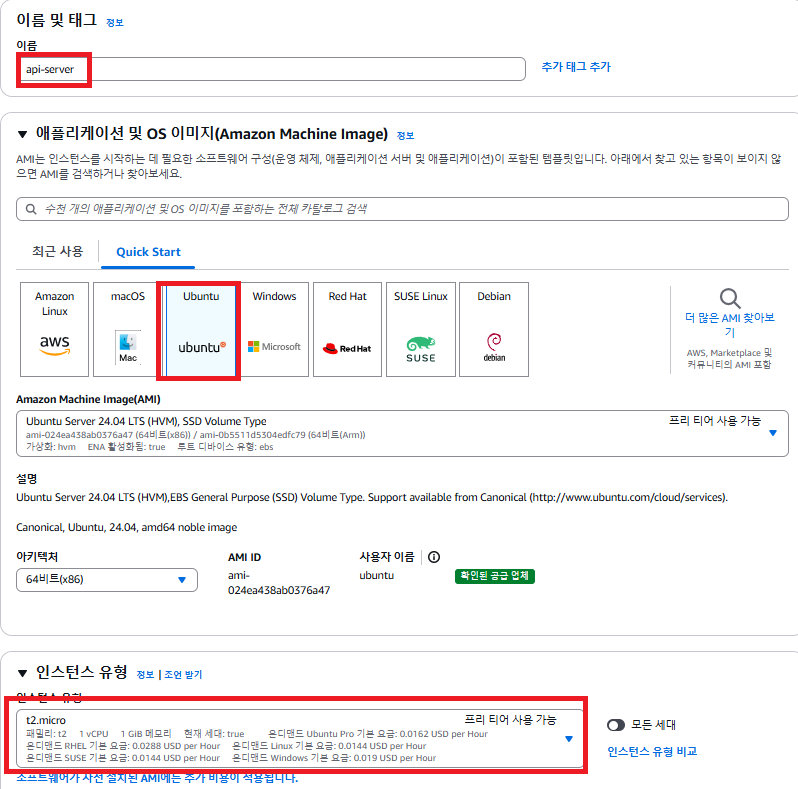
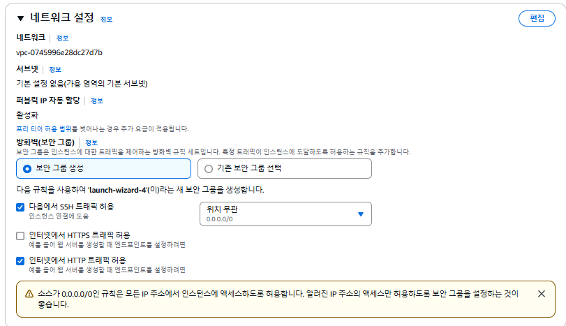
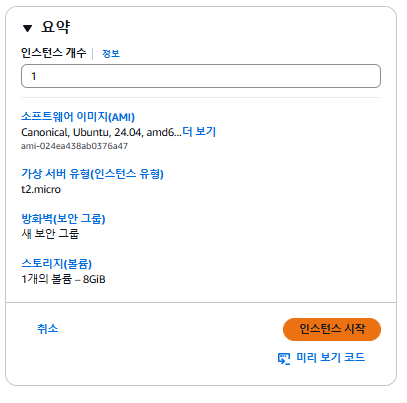
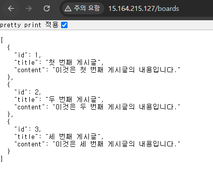

# (실습) EC2에 간단한 테스트용 API 서버 셋팅하기

---

### 1. EC2 인스턴스 셋팅


- Ubuntu
- 인스턴스 유형: t2.micro



- 인터넷에서 HTTP 트래픽 허용



- 인스턴스 생성

---

### 2. 간단한 API 서버 셋팅

#### 2.1 Node.js 설치
```shell
sudo su

apt-get update && /
apt-get install -y ca-certificates curl gnupg && /
mkdir -p /etc/apt/keyrings && /
curl -fsSL https://deb.nodesource.com/gpgkey/nodesource-repo.gpg.key | sudo gpg --dearmor -o /etc/apt/keyrings/nodesource.gpg && /
NODE_MAJOR=20 && /
echo "deb [signed-by=/etc/apt/keyrings/nodesource.gpg] https://deb.nodesource.com/node_$NODE_MAJOR.x nodistro main" | sudo tee /etc/apt/sources.list.d/nodesource.list && /
apt-get update && /
apt-get install nodejs -y

# 잘 설치됐는 지 확인하기
node -v
```
Ubuntu 환경에서 Express 서버를 실행시키려면 Node.js가 설치되어 있어야 한다.

#### 2.2 기본 프로젝트 셋팅(Express 서버)
```shell
$ mkdir my-server
$ cd my-server
$ npm init # 의존성 관리 파일 생성
$ npm i express # express 라이브러리 설치
```

#### 2.3 API 로직 작성
**app.js**
```javascript
const express = require('express');
const app = express();
const port = 80;

app.get('/boards', (req, res) => {
  res.send([
    { id: 1, title: '첫 번째 게시글', content: '이것은 첫 번째 게시글의 내용입니다.' },
    { id: 2, title: '두 번째 게시글', content: '이것은 두 번째 게시글의 내용입니다.' },
    { id: 3, title: '세 번째 게시글', content: '이것은 세 번째 게시글의 내용입니다.' }
  ]);
})

app.listen(port, () => {
  console.log(`Example app listening on port ${port}`)
})
```

#### 2.4 pm2 설치
```shell
npm i -g pm2
```
- Node 기반의 서버는 pm2를 활용해서 많이 실행시킨다. 서비스를 운영하는 데 있어서 유용한 기능들을 pm2가 많이 가지고 있기 때문이다.

#### 2.5 API 서버 실행시키기
```shell
pm2 start app.js
```

#### 2.6 HTTP 요청


- `/boards` 로 요청 시 바로 위 json 응답이 오면 성공이다.

---
