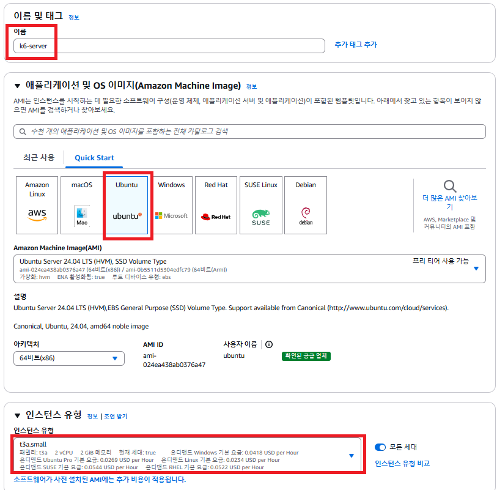
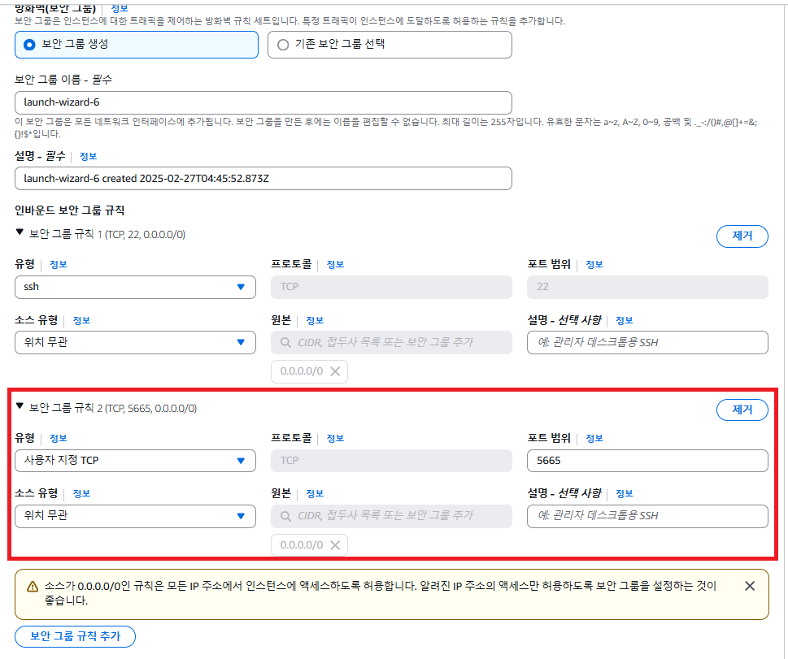
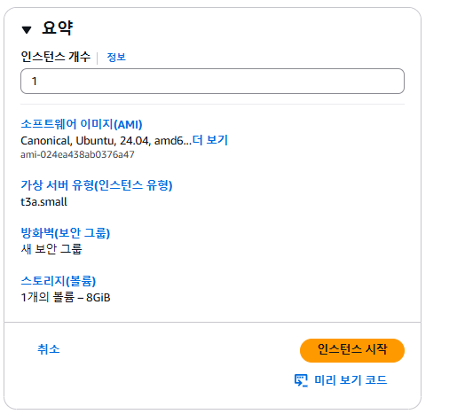
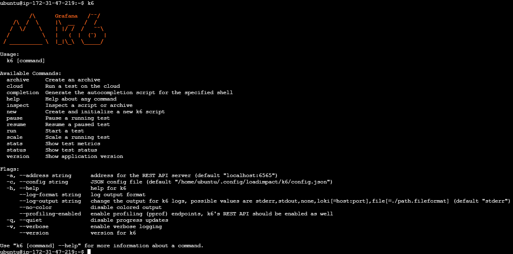

# (실습) EC2에 부하 테스트 툴 셋팅하기(k6)

---

### 1. 부하테스트 툴을 별도의 EC2에 설치하는 이유
부하테스트 툴을 별도의 EC2 환경에 구성할 예정인데 그 이유를 설명해본다.

#### 1.1 부하 테스트 환경 독립적으로 분리
- 부하 테스트 툴(k6)은 테스트하고자 하는 시스템(백엔드, DB 등)과 반드시 독립적으로 분리해서 구성해야 한다. 
- 왜냐면 부하 테스트 툴 자체도 트래픽을 만들어내면서 컴퓨팅 리소스(CPU, 메모리 등)를 사용하기 때문이다.
- 따라서, 같은 컴퓨터를 사용하기보다 별도의 컴퓨터로 분리하는 것이 변인 통제 면에서 유리하다.

#### 1.2 부하 테스트 툴을 개인 컴퓨터에 설치하지 않기
- 개인이 가지고 있는 컴퓨터는 Windows 또는 Mac OS일텐데, 컴퓨터 자체적으로 부하를 발생시킬 때 제한이 걸릴 때가 종종 있다. 
- 따라서 EC2 인스턴스를 생성해 Linux 환경에서 부하 테스트를 진행할 것을 권장한다.
- Issue
  - [K6를 이용한 서버 성능 테스트 이슈](https://san-tiger.tistory.com/entry/K6%EB%A5%BC-%EC%9D%B4%EC%9A%A9%ED%95%9C-%EC%84%9C%EB%B2%84-%EC%84%B1%EB%8A%A5-%ED%85%8C%EC%8A%A4%ED%8A%B8-%EC%9D%B4%EC%8A%88)
  - [K6는 맥에서 돌리지 마세요...... 제발(connection reset by peer)](https://kinggodgeneral.tistory.com/72)

---

### 2. EC2 인스턴스 생성


- 충분한 부하를 생성해내기 위해 인스턴스를 `t3a.small` 로 생성



- 보안그룹 규칙 추가 : 사용자 지정 TCP(포트범위: 5665, 원본: 0.0.0.0/0)



- 그 외엔 별도의 설정을 변경하지 않고 생성

---

### 3. EC2에 부하테스트 툴 셋팅하기

#### 3.1 k6 설치
```shell
sudo gpg -k && /
sudo gpg --no-default-keyring --keyring /usr/share/keyrings/k6-archive-keyring.gpg --keyserver hkp://keyserver.ubuntu.com:80 --recv-keys C5AD17C747E3415A3642D57D77C6C491D6AC1D69 && /
echo "deb [signed-by=/usr/share/keyrings/k6-archive-keyring.gpg] https://dl.k6.io/deb stable main" | sudo tee /etc/apt/sources.list.d/k6.list && /
sudo apt-get update && /
sudo apt-get install k6
```

#### 3.2 잘 설치됐는 지 확인
```shell
k6
```


---
