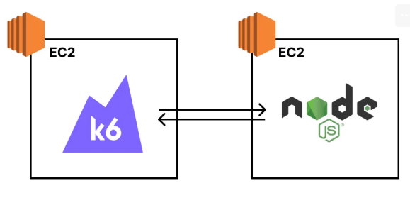
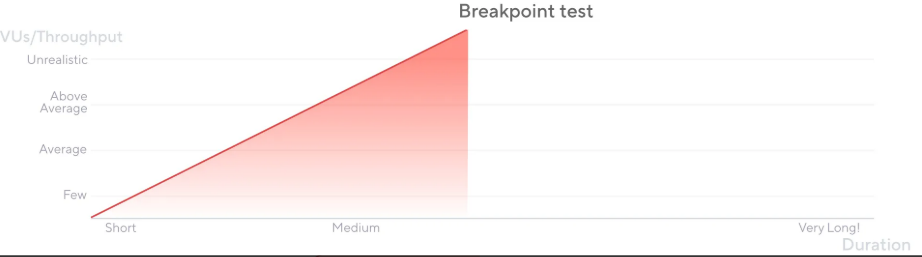
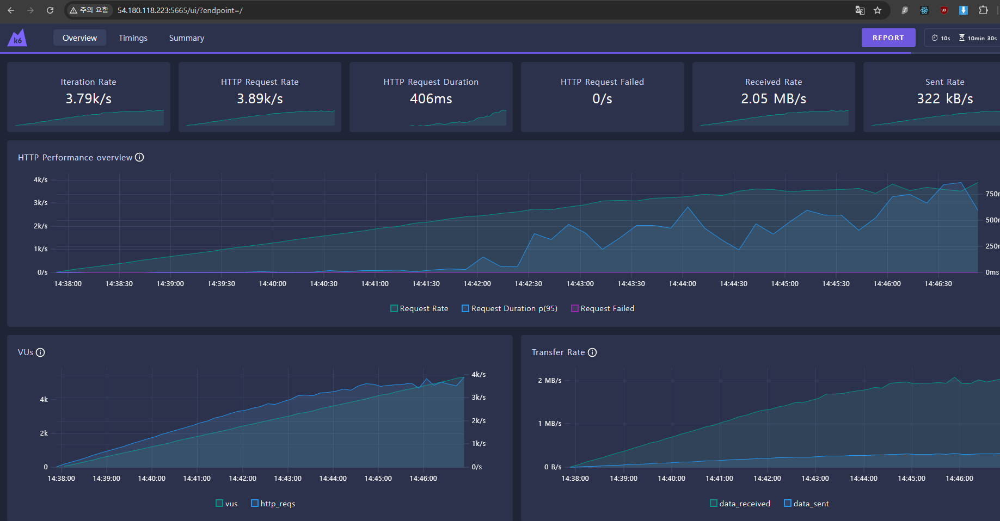
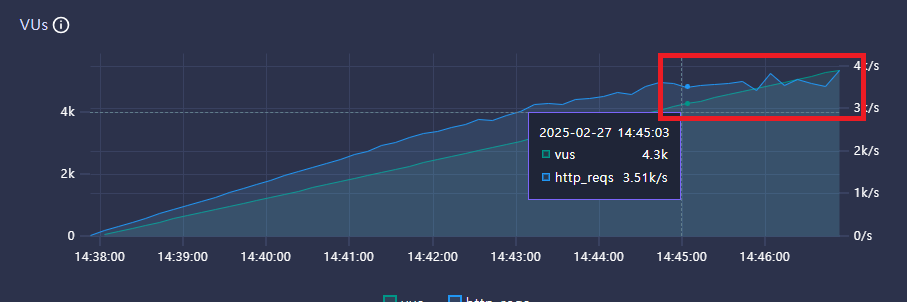
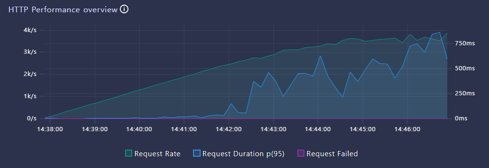
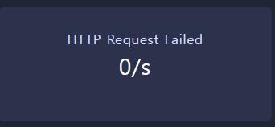
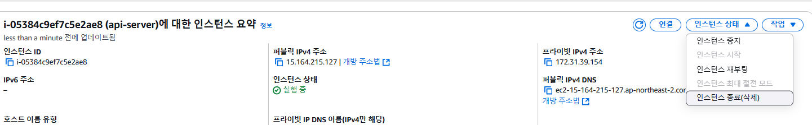

# (실습) 내가 구성한 백엔드 서버는 1초당 몇 개의 요청을 견뎌낼 수 있을까

---

### 1. 부하테스트를 할 인프라 구성


- 부하 테스트를 하기 전에 인프라의 전체 구성을 그림으로 그려놓자.
- 전체적인 트래픽의 흐름을 한 눈에 파악할 수 있어서 편리하다.

---

### 2. 테스트 방법


- 구성한 시스템이 1초당 몇 개의 요청을 견딜 수 있는 지 알아보려면, 점진적으로 트래픽을 늘려가게끔 부하 테스트를 셋팅해야 한다.
- 부하를 점진적으로 늘리다가, TPS가 더 이상 증가하지 않는 지점을 잡아내면 된다.
- 넉넉히 4000 Vus 를 경과한 시점에 전체적인 Vus-TPS(HTTP Request Rate) 관계를 살펴보면 될 듯.

---

### 3. k6 실행
```shell
mkdir scripts
cd scripts
vim script.js
```
```javascript
import http from 'k6/http';
import { sleep } from 'k6';

export const options = {
  // 부하를 생성하는 단계(stages)를 설정
  stages: [
    // 10분에 걸쳐 vus(virtual users, 가상 유저수)가 6000에 도달하도록 설정
    { duration: '10m', target: 6000 }
  ],
};

export default function () {
  // API 주소로 GET 요청
  http.get('http://{EC2 IP 주소}/boards');
  // 1초 휴식
  sleep(1);
};
```
- `/scripts` 폴더에 `script.js` 파일을 만들어둔다.
- 10분동안 부하를 계속 늘려가면서, 최종적으로는 vus가 6000 에 도달하도록 한다.
    - Vus(Virtual Users : 가상의 사용자 수)

```bash
K6_WEB_DASHBOARD=true k6 run script.js
```


---

### 4. k6 dashboard


- `http://{k6가 실행되고 있는 EC2 IP 주소}:5665` 로 접속
- 대시보드 GUI를 통해 부하테스트 상태를 시각화해서 볼 수 있다.
  - https://grafana.com/docs/k6/latest/

---

### 5. 결과 해석
이 대시보드에서 나온 수치는 많아서 어떤 것을 봐야할지 복잡해진다.
하지만 사실 여기서 집중해서 봐야할 지표는 다음 3개정도면 충분하다.

#### 5.1 **HTTP Request Rate**
- 1초당 처리한 요청수
- **Throughput(처리량)** 을 나타내는 값이다.

#### 5.2 **HTTP Request Duration**
- 요청에 대한 평균 응답 시간
- **Latency(지연 시간)** 을 나타내는 값이다.

#### 5.3 **HTTP Request Failed**
- 1초당 요청 실패 수
- 요청 실패가 발생한다면, 어느 문제로 인해 요청이 실패하는 지 체크해봐야하는 신호이다.

---

### 6. 실제 해석 순서

#### 6.1 **VUs 가 늘어나도 HTTP Request Rate 가 더 이상 증가하지 않는 구간을 찾는다.**


- 더 이상 증가하지 않는 HTTP Request Rate (Throughput, 처리량) 가 현재 시스템의 최대 Throughput 이다.
    - 증가를 멈췄다는 것은 수용 가능한 요청을 초과하였기에 대기하는 요청이 발생하게 된 것을 의미한다.
- 현재 이 시스템은 이 시스템은 1초당 1090개 요청을 처리할 수 있다.
- 이걸 보고 현재 시스템의 최대 **Throughput 은 1090 TPS** 라고 표현한다.

#### 6.2 **HTTP Request Duration 이 비정상적으로 높은 것은 아닌지 체크한다.**


- 요청 당 응답시간(Latency)이 비이상적으로 높을 경우, 문제가 있는 건 아닌 지 체크해봐야 한다.
- 여기서 말하는 비이상적의 기준은 팀이 정하기 나름이다. 해당 서비스에서 응답시간이 1초를 넘어가는 순간 사용자 이탈률이 크게 증가한다면, 정상적인 응답 시간 기준을 1초로 잡으면 될 것이다.
- (참고) Vus 가 높아짐에 따라, 서버가 처리할 수 있는 요청량이 밀리게 되고 대기하는 시간이 늘어난다. Http Request Rate(=Throughput) 은
늘어나지 않고 Request Duration(=Latency)는 늘어나는 현상을 볼 수 있다.

#### 6.3 HTTP Request Failed 가 있는건 아닌 지 체크한다


- 만약 실패한 요청이 있다면, 요청이 왜 실패했는 지 분석해야한다.

---

### 7. 자원 정리


- EC2 api-server 인스턴스는 더 이상 사용하지 않으므로 제거한다.

---
