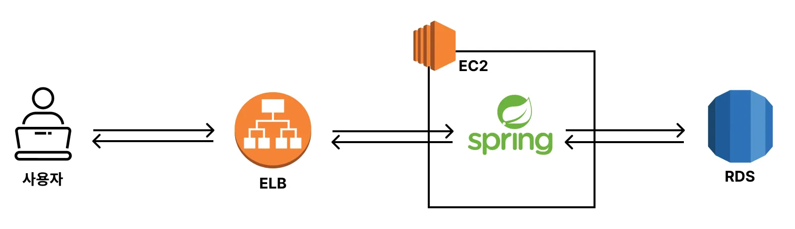
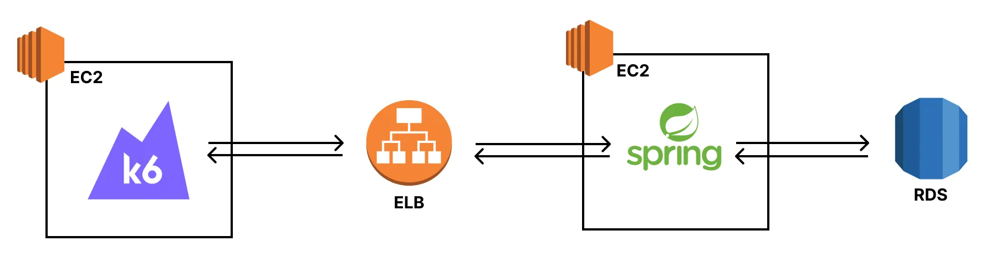

# (실습) 부하 테스트 할 인프라 구성을 그림으로 파악하기

---

### 시각화의 필요성
- 부하 테스트를 할 때 병목 지점을 찾는 게 핵심이다. 
- 병목 지점을 쉽게 찾으려면 트래픽이 거쳐가는 인프라가 어떤 것들이 있는 지 파악해야 한다. 
- 따라서 부하 테스트를 하기 전에 인프라 아키텍처에 대한 전체적인 그림을 먼저 그려보는 것이 권장된다.

---

### 인프라 아키텍처 구성

---
