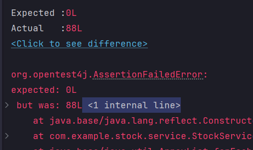
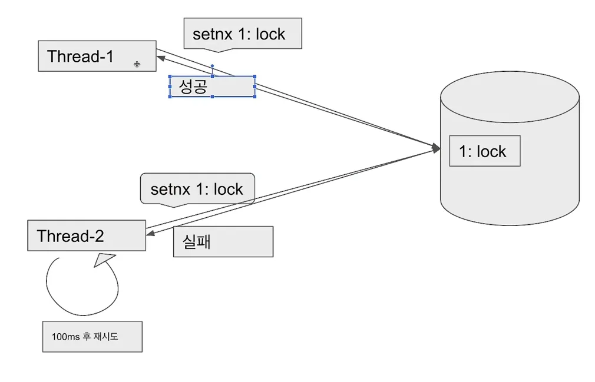
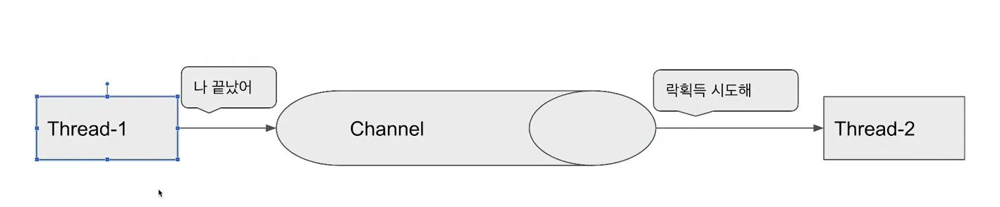

# 동시성 문제

### 목차
- [1. 재고감소 애플리케이션과 동시성 문제](#1-재고감소-애플리케이션과-동시성-문제)
- [2. 해결방법1: java 의 synchronized 키워드 사용](#2-해결방법1-java-의-synchronized-키워드-사용)
- [3. 해결방법2: 비관적 락(Pessimistic Lock)](#3-해결방법2-비관적-락pessimistic-lock)
- [4. 해결방법3: 낙관적 락(Optimistic Lock)](#4-해결방법3-낙관적-락optimistic-lock)
- [5. 해결방법4: MySQL 의 네임드 락](#5-해결방법4-mysql-의-네임드-락)
- [6. 해결방법5: Redis Lettuce 의 setnx 를 사용한 락 방식](#6-해결방법5-redis-lettuce-의-setnx-를-사용한-락-방식)
- [7. 해결방법6: Redis Redisson 을 사용한 락 방식](#7-해결방법6-redis-redisson-을-사용한-락-방식)
- [8. Lettuce vs Redisson](#8-lettuce-vs-redisson)
- [9. MySQL vs Redis](#9-mysql-vs-redis)

---

### 1. 재고감소 애플리케이션과 동시성 문제
```kotlin
    @Transactional
    fun decrease(id: Long, quantity: Long) {
        // stock 조회
        val stock = stockRepository.findByIdOrNull(id) ?: throw NoSuchElementException("Stock with id $id not found")

        // 재고 감소
        stock.decrease(quantity)

        // 갱신된 값을 저장
        stockRepository.saveAndFlush(stock)
    }
```
- 이 함수의 흐름을 보면
  - 재고 리포지토리에서 재고를 조회한다.
  - 재고를 감소시키고
  - 리포지토리에 수정된 재고를 저장한다.
- 이것만 놓고보면 잘 작동하는 것처럼 느껴지겠지만 동시에 100개, 1000개의 동시 요청이 들어왔을 때 재고가 의도한 대로 줄어들지 않을 수 있다.

```kotlin
    @Test
    @DisplayName("동시 100개 요청(실패)")
    fun decreaseWithMultiThread() {
        // given
        val savedStockId = stockRepository.saveAndFlush(Stock.create(1L, 100)).id!!

        val threadCount = 100
        val executorsService = Executors.newFixedThreadPool(32)
        val countDownLatch = CountDownLatch(threadCount)

        // when
        for (i in 1..threadCount) {
            executorsService.submit {
                try {
                    stockService.decrease(savedStockId, 1L)
                } finally {
                    countDownLatch.countDown()
                }
            }
        }
        countDownLatch.await()

        val findStock = stockRepository.findByIdOrNull(savedStockId)!!
        assertThat(findStock.quantity).isEqualTo(0L)
    }
```


- 100개의 스레드에서 동시에 재고 감소 로직을 실행했을 때 재고가 0이 되는 지 확인하는 테스트코드다.
- 하지만 이 테스트는 실패한다.
  - 최초 사용자가 접근했을 때 재고는 100이다. 재고를 99로 줄이고 DB에 커밋한다.
  - 그런데 이 아주 짧은 사이 다른 사용자가 조회했을 때 재고는 100일 수 있다. 이 사용자 입장에서도 재고를 99로 줄이고 DB에 커밋한다.
  - 재고를 99로 조회하고 98로 줄여야하는데, 100으로 조회하고 99로 줄여서 커밋해버린 것이다.
  - 이후 사용자들도 비슷한 문제를 겪으면서 0으로 줄어들지 않고, 0과 100 사이의 어딘가의 재고가 남게 될 수 있다.
- 이렇게 두 개 이상의 비동기 작업이 동시에 실행되면서 예상치 못한 결과를 초래하는 상황을 레이스 컨디션(race-condition)이라 한다.

---

### 2. 해결방법1: java 의 synchronized 키워드 사용
```kotlin
@Synchronized
fun decrease(id: Long, quantity: Long) {
    // stock 조회
    val stock = stockRepository.findByIdOrNull(id) ?: throw NoSuchElementException("Stock with id $id not found")

    // 재고 감소
    stock.decrease(quantity)

    // 갱신된 값을 저장
    stockRepository.saveAndFlush(stock)
}
```
- java 의 synchronized 키워드는 메서드, 블록에 걸려있을 시 해당 영역을 임계 영역으로 간주하고, 락을 획득한 스레드만 접근할 수 있도록 한다.
- 메서드에 synchronized 를 걸었을 경우 해당 메서드는 한번에 한 스레드만 접근이 가능해진다.
- 문제점
  - synchronized 와 `@Transactional` 을 함께 사용할 수 없다.
    - 트랜잭션 시작(proxy) - 실제 메서드 호출(target: 여기에 동기화가 걸림) - 트랜잭션 종료(proxy)
    - 트랜잭션 종료(proxy) 를 대기하는 사이 다른 요청에 의해 decrease 실제 메서드가 호출되어, 정합성이 안 맞게 되는 문제가 발생할 수 있다.
  - synchronized 는 1대의 애플리케이션 내부에 국한된 동기화 처리기법이다. 애플리케이션이 2대, 3대 이상... 의 형태로 분산되어 있을 경우
  synchronized 방식은 동시성 문제를 해결할 수 없다.

---

### 3. 해결방법2: 비관적 락(Pessimistic Lock)
```kotlin
interface StockRepository : JpaRepository<Stock, Long> {
    @Lock(LockModeType.PESSIMISTIC_WRITE)
    @Query("SELECT s FROM Stock s WHERE s.id = :id")
    fun findByIdWithPessimisticLock(@Param("id")id: Long): Stock?
}
```
```kotlin
@Service
class PessimisticLockStockService(
    private val stockRepository: StockRepository
) {

    @Transactional
    fun decrease(id: Long, quantity: Long) {
        // stock 조회
        val stock = stockRepository.findByIdWithPessimisticLock(id)
            ?: throw NoSuchElementException("Stock with id $id not found")

        // 재고 감소
        stock.decrease(quantity)

        // 갱신된 값을 저장
        stockRepository.saveAndFlush(stock)
    }
}
```
- 조회 시점에 `for update` 키워드를 붙이면, 해당 행을 수정을 위해 조회한다고 DB에 명시하고, 다른 커넥션에서의 접근을 막을 수 있다.
  - JPA 를 사용할 경우, 조회 메서드 위에 `@Lock(LockModeType.PESSIMISTIC_WRITE)` 을 두어, 이 방식을 사용할 수 있다.
- 수정대상이 되는 행에 대한 다른 커넥션의 접근 자체를 막는다. 다른 커넥션에서는 락을 획득할 때까지 기다려야한다. 이 락 방식을, 비관적 락(Pessimistic Lock)이라고 한다.
- 화장실로 비유를 하면 화장실 사용 전에 열쇠를 획득하고, 화장실 열쇠로 화장실 문을 연뒤 화장실로 들어가, 화장실을 잠궈서 다른 사용자가 이용하지 못 하게한다.
화장실 사용에 대한 접근 자체를 막는 것이라 할 수 있다.

---

### 4. 해결방법3: 낙관적 락(Optimistic Lock)
```kotlin
@Entity
@Table(name = "stocks")
class Stock(
    // 생략
    
    @Version
    var version: Long,
) {
```
- 변경 대상이 되는 테이블에 버전에 해당하는 필드를 추가한다.
- JPA를 사용한다면 엔티티에 버전 필드를 추가하고, `@Version`을 걸어 이 기법을 사용할 수 있다.
```kotlin
interface StockRepository : JpaRepository<Stock, Long> {

    @Lock(LockModeType.OPTIMISTIC)
    @Query("SELECT s FROM Stock s WHERE s.id = :id")
    fun findByIdWithOptimisticLock(@Param("id")id: Long): Stock?
}
```
- 조회 메서드에 `@Lock(LockModeType.OPTIMISTIC)` 를 두어 낙관적 락 기법을 적용할 수 있다.

```kotlin
    @Transactional
    fun decrease(id: Long, quantity: Long) {
        // stock 조회
        val stock = stockRepository.findByIdWithOptimisticLock(id)
            ?: throw NoSuchElementException("Stock with id $id not found")

        // 재고 감소
        stock.decrease(quantity)

        // 갱신된 값을 저장
        stockRepository.saveAndFlush(stock)
    }
```
- 저장 로직에서는 optimisticLock 방식 조회기법으로 조회하고, 변경하여 수정한다.
  - 수정 시점에는 쿼리에 조건을 추가하여 `version=xxx` 인 행을 수정하는 것을 시도할 것이다.
- 이 때, 저장시점과 조회시점의 버전이 다를 경우 `ObjectOptimisticLockingFailureException` 이 발생한다.

```kotlin
@Component
class OptimisticLockStockFacade(
    private val optimisticLockStockService: OptimisticLockStockService
) {

    fun decrease(id: Long, quantity: Long) {
        while(true) {
            try {
                optimisticLockStockService.decrease(id, quantity)
                break
            } catch (e: ObjectOptimisticLockingFailureException) {
                Thread.sleep(50)
            }
        }
    }
}
```
- 바깥의 퍼사드에서는 try-catch 문을 통해 감싸서, 성공할 때까지 무한 반복(계속 반복하면 부하가 있을 수 있으므로 일정 시간차를 두고 반복한다.)한다.
이 기법을 낙관적 락(Optimistic Lock) 이라 한다.
- 별도의 락을 잡지 않으므로, 충돌이 빈번하지 않다면, 차라리 비관적 락보다 성능상 이점이 있다.
- 하지만 충돌이 빈번하다면 락을 걸더라도 비관적 락을 사용하는 것이 낫다.

---

### 5. 해결방법4: MySQL 의 네임드 락
```kotlin
interface LockRepository : JpaRepository<Stock, Long> {

    @Query("SELECT get_lock(:key, 3000)", nativeQuery = true)
    fun getLock(@Param("key") key: String)

    @Query("SELECT release_lock(:key)", nativeQuery = true)
    fun releaseLock(@Param("key") key: String)
}
```
- 이 기법은 MySQL 에서만 사용할 수 있는 기법이다.
- 실제 대상이 되는 행에 락을 거는 것이 아닌, 별도의 이름을 가진 락을 만들어 사용하는 기법이다.

```kotlin
@Service
class PlainStockService(
    private val stockRepository: StockRepository,
) {

    @Transactional(propagation = Propagation.REQUIRES_NEW)
    fun decrease(id: Long, quantity: Long) {
        // stock 조회
        val stock = stockRepository.findByIdOrNull(id) ?: throw NoSuchElementException("Stock with id $id not found")

        // 재고 감소
        stock.decrease(quantity)

        // 갱신된 값을 저장
        stockRepository.saveAndFlush(stock)
    }
}
```
```kotlin
@Component
class NamedLockStockFacade(
    private val lockRepository: LockRepository,
    private val plainStockService: PlainStockService
) {

    @Transactional
    fun decrease(id: Long, quantity: Long) {
        try {
            lockRepository.getLock(id.toString())
            plainStockService.decrease(id, quantity)
        } finally {
            lockRepository.releaseLock(id.toString())
        }
    }
}
```
- 바깥쪽 퍼사드에서는 락 획득, 재고감소, 락 반환을 처리한다.
- 내부 메서드에서는 재고 감소 로직을 처리한다. 여기에 `@Transactional(propagation=Propagation.REQUIRES_NEW)`을 건다. (다른 트랜잭션)
  - 같은 트랜잭션으로 묶어서 처리할 경우, DB에 커밋이 되기전에 Lock 이 release 될 수 있다.
  - 락 반환 시점에 이미 DB 작업이 반드시 커밋 되어야함을 보장해야한다.
- 문제점
  - MySQL 을 사용해야한다.
  - 데이터베이스 측에서 락을 별도로 관리해야하므로 부하가 증가한다.
  - 커넥션을 2배로 소모하므로 커넥션 고갈 문제가 발생할 수 있다.

---

### 6. 해결방법5: Redis Lettuce 의 setnx 를 사용한 락 방식


```bash
127.0.0.1:6379> setnx 1 lock
(integer) 1
127.0.0.1:6379> setnx 1 locky
(integer) 0
127.0.0.1:6379> del 1
(integer) 1
127.0.0.1:6379> setnx 1 lock
(integer) 1
```
- setnx(set if not exist) : 기존 key 가 없을 때 set 하는 명령
- setnx 명령은 최초 set 시에는 성공하지만 key가 있을 경우 set이 되지 않는다.  
- 활용법
  - 최초 락 획득 자는 set이 성공하고
  - 그 이후 락 접근자는 set 이 실패하므로 최초 사용자가 락을 반환(del)할 때까지 무한 반복을 통해 락 획득을 시도하면 된다.

```kotlin
@Component
class RedisLockRepository(
    private val redisTemplate: RedisTemplate<String, String>
) {

    fun lock(key: Long): Boolean? {
        return redisTemplate
            .opsForValue()
            .setIfAbsent(makeKey(key), "lock", Duration.ofMillis(3_000))
    }

    fun unlock(key: Long): Boolean {
        return redisTemplate
            .delete(makeKey(key))
    }

    private fun makeKey(key: Long): String {
        return key.toString()
    }
}
```
- Spring 의 `redisTemplate.opsForValue().setIfAbsent(...)` 를 사용하면 내부적으로 setnx 를 사용한다.
  - (spring-boot-starter-data-redis 의존성이 필요하다.)
- lock 획득 메서드와 lock 반환 메서드를 만들었다.

```kotlin
@Component
class LettuceLockStockFacade(
    private val redisLockRepository: RedisLockRepository,
    private val plainStockService: PlainStockService,
) {

    fun decrease(id: Long, quantity: Long) {
        while((redisLockRepository.lock(id)) != true) {
            Thread.sleep(100)
        }

        try {
            plainStockService.decrease(id, quantity)
        } finally {
            redisLockRepository.unlock(id)
        }
    }
}
```
- 실제 로직에서는 락을 획득할 때까지 무한시도한다.(Spin Lock)
- 대기시간 없이 무한히 반복하면 redis 측 부하가 커지므로 어느 정도 지연시간을 둬야한다.
- 락 획득에 성공하면 로직을 실행하고, finally 문에서 락을 반환한다.

---

### 7. 해결방법6: Redis Redisson 을 사용한 락 방식


```bash
subscribe ch1

>> 3) hello
```
```bash
publish ch1 hello
```
- publish, subscribe 명령을 사용하여 channel 기반 락 구현이 가능하다.
- 채널을 생성하고, 락을 점유한 스레드가 락을 획득하려는 스레드에게 안내한다.
- 안내받은 스레드가 락을 획득한다.
- 이 과정은 lettuce 의 setnx 방식과 다르게 별도의 무한 반복 retry 로직을 작성하지 않아도 되는 장점이 있다.

```kotlin
@Component
class RedissonLockStockFacade(
    private val redissonClient: RedissonClient,
    private val plainStockService: PlainStockService,
) {

    fun decrease(id: Long, quantity: Long) {
        val lock = redissonClient.getLock(id.toString())

        try {
            val available = lock.tryLock(
                15, //  몇 초동안 락 획득 시도?
                1, // 몇초동안 락 점유?
                TimeUnit.SECONDS
            )
            if (!available) {
                println("lock 획득 실패")
                return
            }
            plainStockService.decrease(id, quantity)
        } finally {
            lock.unlock()
        }
    }
}
```
- Redisson 라이브러리를 통해 pub-sub 구조의 락 방식을 사용할 수 있다.
  - Redisson 은 Spring Data Redis 에 포함되어 있지 않아서 별도 의존성이 필요하다.
  - `org.redisson:redisson-spring-boot-starter` 의존성
- Spin Lock 방식과 다르게 pub-sub 구조는 redis 측 부하가 적어지는 장점이 있고 개발자가 retry 로직을 작성하지 않아도 되는 장점이 생긴다.

---

### 8. Lettuce vs Redisson
- Lettuce
  - 구현이 간단하다
  - spring data redis 를 이용하면 lettuce 가 기본이기때문에 별도의 라이브러리를 사용하지 않아도 된다.
  - spin lock 방식이기때문에 동시에 많은 스레드가 lock 획득 대기 상태라면 redis 에 부하가 갈 수 있다. (락 획득을 위한 시간 지연을 줘서 이 부하를 줄이는게 가능하긴 하다)
- Redisson
  - 락 획득 재시도를 기본으로 제공한다.
  - pub-sub 방식으로 구현이 되어있기 때문에 lettuce 와 비교했을 때 redis 에 부하가 덜 간다.
  - 별도의 라이브러리를 사용해야한다.
  - lock 을 라이브러리 차원에서 제공해주기 떄문에 사용법을 공부해야 한다.
- 실무에서는?
  - 재시도가 필요하지 않은 lock 은 lettuce 활용(실패하면 거기서 끝내버리기)
  - 재시도가 필요한 경우에는 redisson 를 활용(부하가 적다)

---

### 9. MySQL vs Redis
- Mysql
  - 이미 Mysql 을 사용하고 있다면 별도의 비용없이 사용가능하다.
  - 어느정도의 트래픽까지는 문제없이 활용이 가능하다.
  - Redis 보다는 성능이 좋지않다.
- Redis
  - 활용중인 Redis 가 없다면 별도의 구축비용과 인프라 관리비용이 발생한다.
  - Mysql 보다 성능이 좋다.

---

- Reference: [재고시스템으로 알아보는 동시성이슈 해결방법](https://www.inflearn.com/course/%EB%8F%99%EC%8B%9C%EC%84%B1%EC%9D%B4%EC%8A%88-%EC%9E%AC%EA%B3%A0%EC%8B%9C%EC%8A%A4%ED%85%9C)
