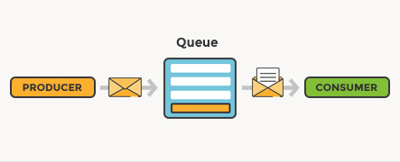
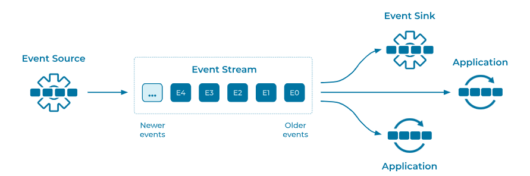

# 메시지 큐, 이벤트 스트림

---

## 1. 메시지 큐

- 생산자(Producer)가 메시지를 큐에 넣고 소비자(Consumer)가 이를 소비하는 모델
- 메시지는 소비자가 처리한 후 큐에서 삭제됨
- 메시지의 "일회성 전달"에 초점
- 데이터 보존보다는 "실시간 전달"이 중요
- 전달방식 : Point to Point
  - 하나의 메시지는 하나의 소비자만 처리 가능.
  - 작업이 완료되면 메시지가 큐에서 사라짐.
- 대표 제품군: RabbitMQ, Amazon SQS.

---

## 2. 이벤트 스트림

- 생산자가 이벤트를 스트림에 기록하고 소비자가 스트림에서 데이터를 구독(Subscribing)하여 처리
- 이벤트는 기본적으로 제거되지 않고 일정 기간 동안 유지됨(예: Kafka의 로그 기반 저장 방식)
- "다수 소비자와의 데이터 공유" 및 "이벤트 재처리"에 초점
- 전달방식: Publish-Subscribe(pub-sub)
  - 하나의 이벤트는 여러 소비자가 독립적으로 처리 가능
  - 이벤트는 스트림에 기록되며, 각 소비자가 자신의 오프셋을 기준으로 처리된다
- 대표 제품군: Apache Kafka, AWS Kinesis, Pulsar

---

## 3. 현대 웹 서비스의 특징
- 분산 시스템
  - 단순히 한 개의 웹 애플리케이션으로 구성되는 것이 아닌 여러 독립적인 서비스(마이크로서비스, 서버리스)로 구성된다.
  - 각 서비스는 특정 기능(예: 사용자 관리, 인증, 결제, 알림, ...)을 담당하며, 서로 독립적으로 배포, 확장이 가능하다.
- 데이터 처리량 증가
  - IoT, 빅데이터, AI 등으로 인해 처리해야 할 데이터가 기하급수적으로 증가했다.
  - 대규모 데이터를 효율적으로 수집, 처리, 전달하기 위해 이벤트 스트림과 메시지 큐 같은 기술이 필요하다.
- 실시간성과 유연성의 필요성
  - 사용자 경험을 개선하기 위해 실시간 데이터 처리(예: 실시간 알림, 주문 상태 업데이트)가 필수적이다.
  - 서비스간 직접적 동기 호출(REST API)은 병목 현상 및 복잡한 서비스간 의존성을 야기하므로 비동기/간접적으로 통신하도록 해야한다. 
    - 동기 호출의 병목 현상: 한 서비스가 응답을 기다리며 블록될 수 있어 전체 시스템의 처리 속도가 느려질 수 있다.
    - 복잡한 서비스 간 의존성: 서비스 간 직접 통신 인터페이스가 많아지면 의존성 관리가 어려워지고, 유지보수 비용이 증가한다.

---

## 4. 메시지 큐, 이벤트 스트림이 중요한 이유
- 서비스간 통합
  - 서로 다른 서비스 간에 데이터를 안전하고 효율적으로 전달하려면 느슨한 결합이 필요하다.
  - 이벤트 스트림과 메시지 큐는 서비스 간 통신에서 결합도를 낮추고 확장성을 높이는 역할을 한다.
- 비동기 처리와 확장성
  - 메시지 큐와 이벤트 스트림은 작업을 비동기로 처리하므로, 서비스가 과부하 없이 확장 가능하도록 한다.
  - 예) 결제 요청이 들어오면 즉시 확인 응답을 보낸 후 결제 처리 작업을 백그라운드에서 실행.
- 장애 복원력
  - 분산된 환경에서는 네트워크 장애나 서비스 다운타임이 빈번하다.
  - 메시지 큐와 이벤트 스트림은 데이터를 안정적으로 보관하고, 서비스 복구 후 작업을 재처리할 수 있도록 돕는다.
- 이벤트 중심 설계
  - 현대 시스템은 이벤트 중심(Event-Driven)으로 설계되는 경우가 많다.
  - 이벤트는 시스템 상태의 변화를 나타내며, 다른 서비스가 이를 실시간으로 처리하거나 기록할 수 있다.
  - 예) 전자상거래 사이트에서 "주문 생성" 이벤트가 발생하면 결제 서비스, 재고 서비스, 알림 서비스가 이를 처리

---
