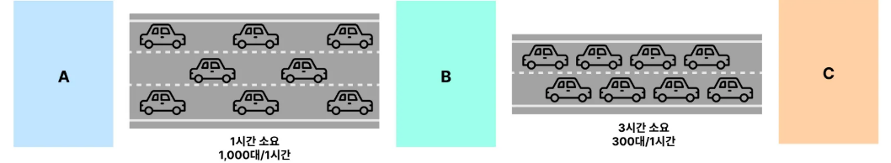
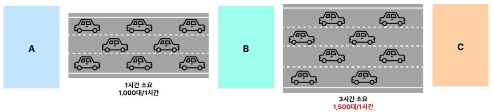

# 병목 지점(Bottleneck Point)

---

### 병목 지점(Bottleneck Point)

- 전체 시스템에서 특정 서버 자원(CPU, Memory 등)이 한계에 도달해 전체 성능이 저하되는 구간
- 고속도로로 비유하면?
  - 3차선 구간에서 2차선 구간으로 좁아지면 차가 확 막히는 경우가 발생한다.
  - 이런 2차선 구간에서 발생한 정체를 보고 병목 지점이라고 한다.
  - 해결방안
    - 3차선 구간을 아무리 더 넓혀봐야 2차선 도로구간의 정체가 나아지지 않는다.
    - 정체가 발생한 2차선 도로 구간을 해결해야 전체적인 고속 도로 정체가 해결된다.
    - **시스템의 성능을 개선하려면 '병목 지점'을 개선해야한다.**

---

### 병목 지점의 Throughput 이 전체 Throughput 이다.

- 위의 도로 상황을 보면 `A-B-C` 구간을 한 시간에 통과할 수 있는 자동차의 대수는 300대이다.
  - `A-B` 구간은 1시간에 1000대의 차량을 통과시킬 수 있다.
  - `B-C` 구간은 1시간에 300대의 차량을 통과시킬 수 있다.
  - 아무리 `A-B` 구간이 많은 차량을 통과시킬 수 있다 하더라도, 병목 지점인 `B-C` 에서 모든 차량을 그만큼 통과시킬 수 없기 때문이다.
- 시스템에서도 동일하게 적용된다. `사용자-백엔드 서버-DB` 구조로 예시를 바꿔보자.
  - `사용자-백엔드 서버` 가 1초에 1000개의 요청을 처리할 수 있다.
  - `백엔드 서버-DB` 에서 1초에 300개 요청을 처리할 수 있다고 하자.
  - 아무리 백엔드 서버에서 1000개 요청을 동시에 처리할 수 있다 하더라도, 병목 지점인 DB에서 초당 300개 요청만을 처리할 수 있기 때문에
  전체적인 시스템 관점에서, 1초당 처리할 수 있는 요청량은 300개이다.
- **결국 병목 지점의 Throughput 이 전체 시스템의 Throughput 이다.**

---

### 특정 병목 지점을 해소하면 다른 곳에서 새로운 병목 지점이 발생한다. 

- `A~B~C` 구간에서 통과할 수 있는 자동차의 대수는 시간당 300대이다.
- `A~B~C` 구간을 통과할 수 있는 자동차 대수를 늘리기 위해 병목 지점인 `B~C` 구간의 통과 가능 자동차 대수를 늘려보자.

- `A~B~C` 구간에서 통과할 수 있는 자동차의 대수는 시간당 1,000대 이다.
- `B~C` 구간에서는 시간당 1,500대의 자동차가 지나갈 수 있을지라도, `A~B` 구간에서는 시간당 1,000대의 자동차만 지나갈 수 있기 때문이다.
- 위 예를 통해, **특정 병목 지점을 해소하면 다른 곳에서 새로운 병목 지점이 발생한다는 점**을 알 수 있다. 

---
