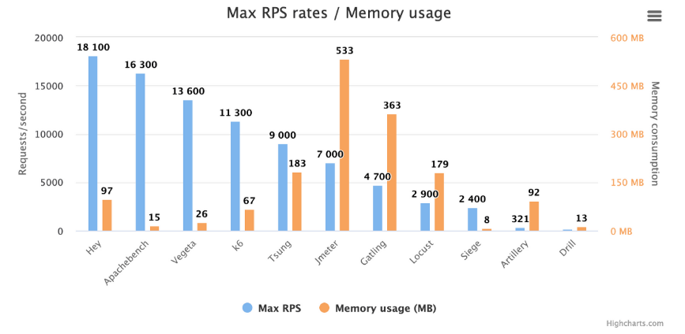

# 부하 테스트 툴

---

## 부하 테스트 툴 종류
- ngrinder, jmeter, ab, locust, …

---

### K6

- 메모리를 적게 사용하면서 비교적 많은 요청 수를 보낼 수 있는 부하 테스트 툴
    - 그림을 보면 메모리 사용은 67MB 로 매우 적은 반면 초당 생성 가능한 요청 수(RPS)는 11300건까지 가능하다.
- 사용법이 간단해 쉽게 테스트 해볼 수 있다.
- k6도 높은 정확도와 많은 트래픽을 발생시킬 수 있는 부하테스트 툴
- 현업에서도 많이 쓰니까 걱정하지 말고 사용해도 됨

---

### 어떤 부하 테스트 툴을 쓰더라도 상관 없다
- 취업이나 이직을 할 때 Spring Boot를 쓸 줄 아는 지 Node.js를 쓸 줄 아는 지는 중요하다.
- 하지만 부하 테스트 툴에서 k6을 쓸 줄 아는 지 ngrinder를 쓸 줄 아는 지는 하나도 안 중요하다.
- 실제 부하 테스트를 하면서 결과 데이터를 정확하게 해석할 수 있는 지와, 결과 데이터를 바탕으로 적절한 방식으로 성능 개선을 할 수 있는 지의 역량을 가지고 있는 지가 중요하다.
- 따라서 아무 부하 테스트 툴이나 딱 하나만 골라서 익히면 충분하다. 다른 부하 테스트 툴을 써보면 알겠지만 사용법이나 결과 해석하는 방법이 다 거기서 거기다.

---
