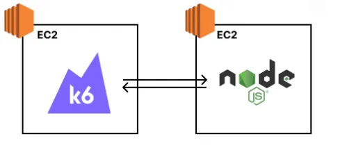
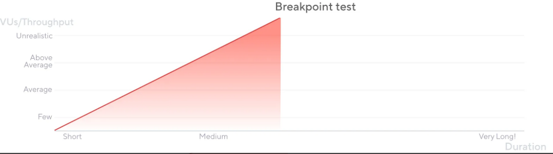
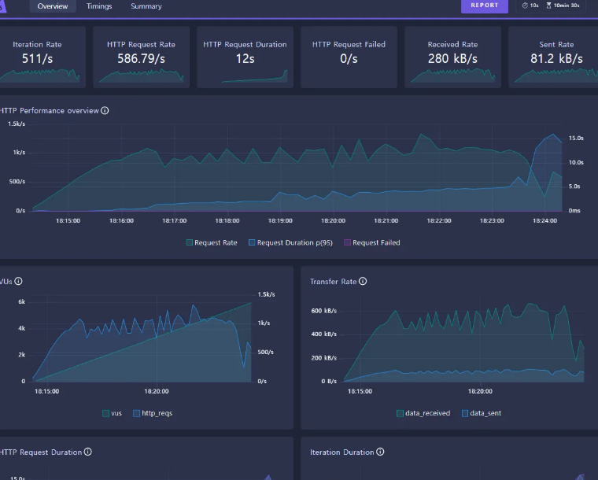
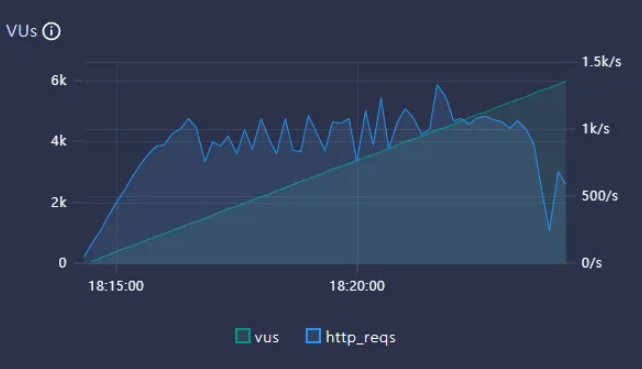
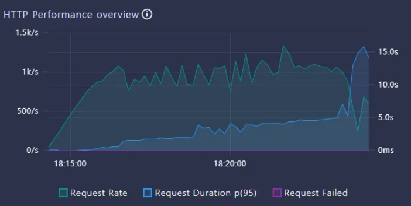
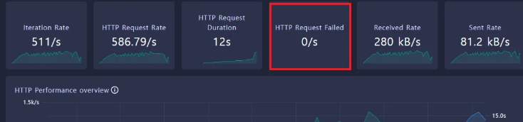

# 부하테스트 툴 실습(k6)

---

### 1. 개요


- nodejs 서버 한 대, k6 서버 한 대를 구성하고 k6 서버에서 부하를 계속 발생시켜서 부하테스트를 수행한다.

---

### 2. API 서버 셋팅
<details>
<summary>접기/펼치기</summary>

#### 2.1 node.js 환경 구성

- windows 환경: https://nodejs.org/en/download
- 설치 확인

    ```bash
    > node -v
    v20.12.
    > npm -v
    10.5.0
    ```


#### 2.2 디렉토리 생성

```bash
mkdir ~/docker/node-compose
cd ~/docker/node-compose
```

#### 2.3 package.json

```json
{
  "name": "my-server",
  "version": "1.0.0",
  "description": "Express server example",
  "main": "app.js",
  "scripts": {
    "start": "node app.js"
  },
  "author": "",
  "license": "ISC",
  "dependencies": {
    "express": "^4.21.2"
  }
}
```

```bash
npm install
```

- package.json 을 기반으로 의존성을 설정하고 npm install 명령을 실행
- 이 과정을 거치면 package-lock.json 이 함께 생성된다.

#### 2.4 app.js

```jsx
const express = require('express');
const app = express();
const port = 3000;
app.get('/boards', (req, res) => {
    res.send([
        { id: 1, title: '첫 번째 게시글', content: '이것은 첫 번째 게시글의 내용입니다.'},
        { id: 2, title: '두 번째 게시글', content: '이것은 두 번째 게시글의 내용입니다.'},
        { id: 3, title: '세 번째 게시글', content: '이것은 세 번째 게시글의 내용입니다.'},
    ]);
});

app.listen(port, '0.0.0.0', () => {
    console.log(`Example app listening on port ${port}`);
});

```

- Express 애플리케이션을 간단하게 구성
- `/boards` 로 요청시 json 을 응답으로 내려준다.

#### 2.5 Dockerfile
```Dockerfile
FROM node:latest

# 작업 디렉토리 설정
WORKDIR /usr/src/app

# package manifest 복사
COPY package*.json ./

# npm 의존성 설치
RUN npm install

# 현재 경로의 app.js 를 워킹 디렉토리에 복사 
COPY app.js .

# 3000번 포트 노출 (컨테이너 내부 포트 3000 개방)
EXPOSE 3000

# pm2 설치 및 실행
RUN npm install -g pm2
CMD ["pm2-runtime", "app.js"]
```

- Node 기반의 서버는 `pm2`를 활용해서 많이 실행시킨다.
- 서비스를 운영하는 데 있어서 유용한 기능들을 `pm2`가 많이 가지고 있기 때문이다.

#### 2.6 Docker-Compose(docker-compose.yml)
```yaml
services:
  nodejs:
    build:
      context: .
      dockerfile: ./Dockerfile
    container_name: nodejs
    ports:
      - "3000:3000"
    volumes:
      - .:/usr/src/app # 로컬 파일 변경 사항을 컨테이너에 반영
```
```yaml
docker-compose -f docker-compose.yml up -d
```

#### 2.7 HTTP 요청

```json
[
  {
    "id": 1,
    "title": "첫 번째 게시글",
    "content": "이것은 첫 번째 게시글의 내용입니다."
  },
  {
    "id": 2,
    "title": "두 번째 게시글",
    "content": "이것은 두 번째 게시글의 내용입니다."
  },
  {
    "id": 3,
    "title": "세 번째 게시글",
    "content": "이것은 세 번째 게시글의 내용입니다."
  }
]
```
- [`localhost:3000/boards`](http://localhost:3000/boards) 로 요청 시 바로 위 json 응답이 오면 성공이다.
</details>

---

### 3. K6 작동 확인
```shell
> docker run -it --name k6 grafana/k6:latest

         /\      Grafana   /‾‾/
    /\  /  \     |\  __   /  /
   /  \/    \    | |/ /  /   ‾‾\
  /          \   |   (  |  (‾)  |
 / __________ \  |_|\_\  \_____/

Usage:
  k6 [command]

Available Commands:
  archive     Create an archive
  cloud       Run a test on the cloud
  completion  Generate the autocompletion script for the specified shell
  help        Help about any command
  inspect     Inspect a script or archive
  new         Create and initialize a new k6 script
  pause       Pause a running test
  resume      Resume a paused test
```
- `grafana/k6` 이미지를 통해 k6 를 실행시켜보고, 위 텍스트가 잘 나온다면 성공이다.

---

### 4. 테스트 방법


- 구성한 시스템이 1초당 몇 개의 요청을 견딜 수 있는 지 알아보려면, 점진적으로 트래픽을 늘려가게끔 부하 테스트를 셋팅해야 한다.
- 부하를 점진적으로 늘리다가, TPS가 더 이상 증가하지 않는 지점을 잡아내면 된다.
- 넉넉히 4000 Vus 를 경과한 시점에 전체적인 Vus-TPS(HTTP Request Rate) 관계를 살펴보면 될 듯.

---

### 5. k6 설정(별도의 컴퓨터에서 하도록 하기)
```jsx
import http from 'k6/http';
import { sleep } from 'k6';

export const options = {
  // 부하를 생성하는 단계(stages)를 설정
  stages: [
    // 10분에 걸쳐 vus(virtual users, 가상 유저수)가 6000에 도달하도록 설정
    { duration: '10m', target: 6000 }
  ],
};

export default function () {
  // API 주소로 GET 요청
  http.get('http://{IP 주소:포트}/boards');
  // 1초 휴식
  sleep(1);
};
```

- `/scripts` 폴더에 `script.js` 파일을 만들어둔다.
- 10분동안 부하를 계속 늘려가면서, 최종적으로는 vus가 6000 에 도달하도록 한다.
    - Vus(Virtual Users : 가상의 사용자 수)

```yaml
services:
  k6:
    image: grafana/k6:latest
    container_name: k6
    volumes:
      - ./scripts:/scripts
    ports:
      - "5665:5665"
    environment:
      - K6_WEB_DASHBOARD=true
    entrypoint: ["k6", "run", "/scripts/script.js"]
```

```bash
docker-compose -f ~/docker/k6-compose/docker-compose.yml up
```

### 6. k6 dashboard

- `http://localhost:5665`
- 대시보드 GUI를 통해 부하테스트 상태를 시각화해서 볼 수 있다.
- https://grafana.com/docs/k6/latest/

---

### 7. 결과 해석
이 대시보드에서 나온 수치는 많아서 어떤 것을 봐야할지 복잡해진다.
하지만 사실 여기서 집중해서 봐야할 지표는 다음 3개정도면 충분하다.

#### 7.1 **HTTP Request Rate**
- 1초당 처리한 요청수
- **Throughput(처리량)** 을 나타내는 값이다.

#### 7.2 **HTTP Request Duration**
- 요청에 대한 평균 응답 시간
- **Latency(지연 시간)** 을 나타내는 값이다.

#### 7.3 **HTTP Request Failed**
- 1초당 요청 실패 수
- 요청 실패가 발생한다면, 어느 문제로 인해 요청이 실패하는 지 체크해봐야하는 신호이다.

---

### 8. 실제 해석 순서

#### 8.1 **VUs 가 늘어나도 HTTP Request Rate 가 더 이상 증가하지 않는 구간을 찾는다.**


- 더 이상 증가하지 않는 HTTP Request Rate (Throughput, 처리량) 가 현재 시스템의 최대 Throughput 이다.
  - 증가를 멈췄다는 것은 수용 가능한 요청을 초과하였기에 대기하는 요청이 발생하게 된 것을 의미한다.
- 현재 이 시스템은 이 시스템은 1초당 1090개 요청을 처리할 수 있다.
- 이걸 보고 현재 시스템의 최대 **Throughput 은 1090 TPS** 라고 표현한다.

#### 8.2 **HTTP Request Duration 이 비정상적으로 높은 것은 아닌지 체크한다.**


- 요청 당 응답시간(Latency)이 비이상적으로 높을 경우, 문제가 있는 건 아닌 지 체크해봐야 한다.
- 여기서 말하는 비이상적의 기준은 팀이 정하기 나름이다. 해당 서비스에서 응답시간이 1초를 넘어가는 순간 사용자 이탈률이 크게 증가한다면, 정상적인 응답 시간 기준을 1초로 잡으면 될 것이다.
- (참고) 어느 기점에서 Vus 가 증가함에 따라서, 서버가 처리할 수 있는 요청이 밀리게 되고 그 요청밀림으로 인해 대기하는 시간이 늘어난다. 이 기점부터 하여, Http Request Rate(=Throughput) 은 늘어나지 않고 Request Duration(=Latency)는 늘어나는 현상을 볼 수 있다.

#### 8.3 HTTP Request Failed 가 있는건 아닌 지 체크한다


- 만약 실패한 요청이 있다면, 요청이 왜 실패했는 지 분석해야한다.

---
