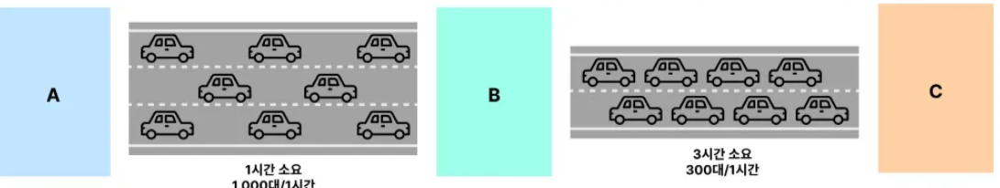

# 처리량(Throughput), 지연 시간(Latency)

---

### 처리량(Throughput)
- 보통 단위 시간 당(1초) 처리할 수 있는 트래픽의 양을 처리량(Throughput) 이라고 한다.
    - 보통 현업에서는 처리량이라는 단어보다는 쓰루풋(Throughput) 을 많이 활용한다.
- TPS (Transaction Per Seconds : 1초당 처리한 트랜잭션 수)
    - 예) 1초당 최대 100개의 API 요청 처리 ⇒ “Throughput 은 100 TPS 다.”
- RPS(Request Per Seconds) : TPS와 같은 단위로 봐도 무방하다.

---

### 지연 시간(Latency)
- 요청에 대한 응답 시간
- 한 API 에 요청을 보냈을 때 응답받기까지의 시간
- 평균 응답 시간이 2.5초일 경우, 평균 Latency 가 2.5초 라고 이야기한다.
- 현업에서는 지연시간이란 용어보다는 레이턴시(Latency) 라고 많이 이야기 한다.

---

### 고속도로로 비유하면

- 자동차 = **트래픽(요청, 부하)**
- 고속도로 = **네트워크**
- 출발지로부터 목적지까지 걸리는 시간 = **Latency**
- 단위 시간당 목적지에 도착하는 자동차의 대수 = **Throughput**

---
