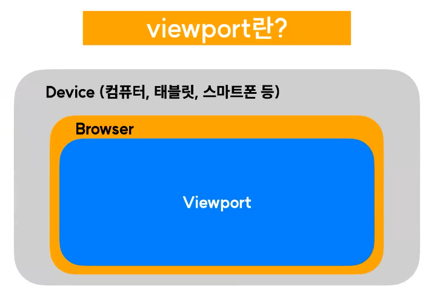

# 단위

---

### 단위의 종류
CSS 에 사용할 수 있는 단위는 크게 절대 단위와 상대 단위 로 분류된다.
- 절대단위 : 말 그대로 외부 요인의 영향을 받지 않고 절대적인 값을 지니는 단위
  - 예) px, pt, ...
- 상대단위: 외부 요인의 영향을 받아 유동적인 값을 지니는 단위이다.
  - 예) %, em, rem, ...

---

### 절대단위
**px = pixel = 화소**
- 화면을 구성하는 가장 기본이 되는 단위
- px은 웹에서 가장 많이 사용되는 절대 단위이며 흔히 화소라 불린다.
- 디지털 화면은 수많은 작은 네모들로 구성이 되어있으며, 이 네모 한 칸이 1px이다.

**pt(포인트) = 1/72 inch(인치)**
- 인쇄를 위한 단위
- pt는 인쇄를 위한 단위이기 때문에 웹에서는 잘 사용하지 않는다.
- 보통 워드 프로세서 등 문서 편집 프로그램에서 pt를 많이 사용한다.

---

### 상대단위
**%**
- 부모 요소의 해당 속성 값에 비례하여 지정한 비율의 값을 적용한다.

**em**
- 스타일 지정 요소의 font-size 속성값에 비례하여 값을 결정한다.
- 예) font-size: 16px인 경우
  - 1em => 16 * 1 = 16px
  - 0.8em => 16 * 0.8 = 12.8px
  - 3em => 16 * 3 = 48px

**rem**
- 최상위 html 요소의 font-size속성 값에 비례하여 값을 결정함

**vw/vh**  

- 요소의 규격을 viewport의 너비값과 높이값에 비례하여 결정
  - viewport란?: 브라우저 상에서 실제 화면에 그려지는 영역
- 예) viewport가 1200(px)*920(px)인 경우
  - 10vw => 1200*0.1 = 120px
  - 50vh => 920*0.5 = 460px
  - 100px => 1200*1 = 1200px

---
