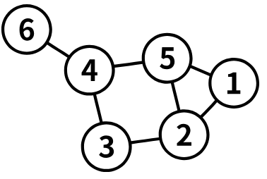
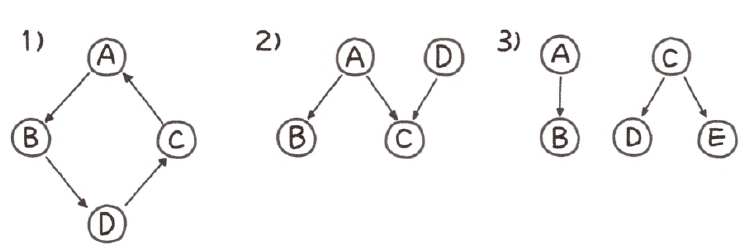
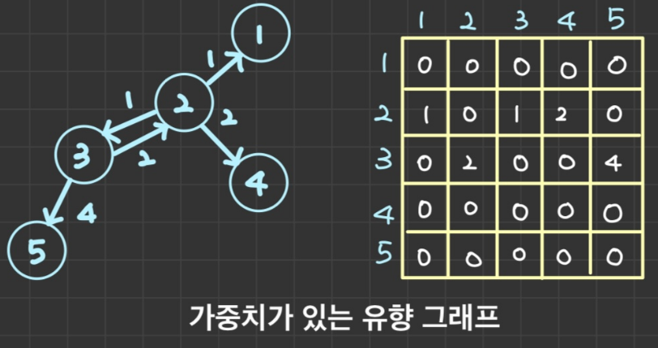
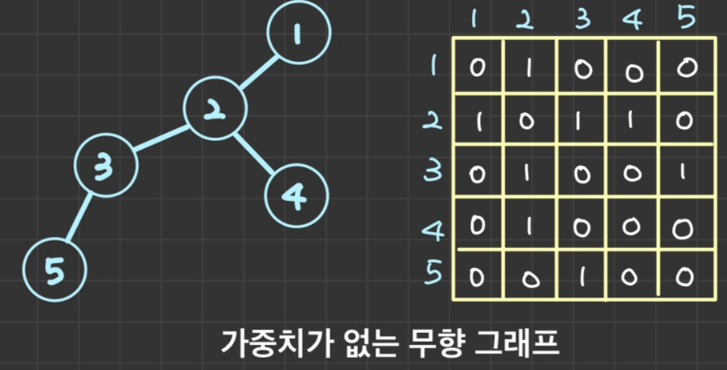
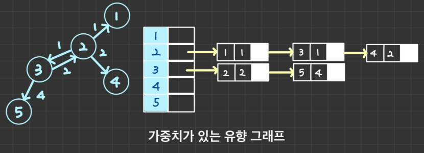
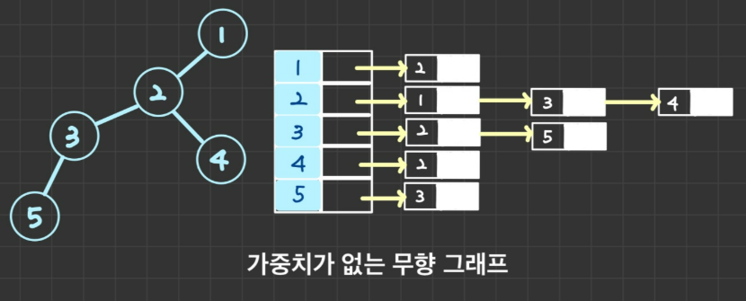
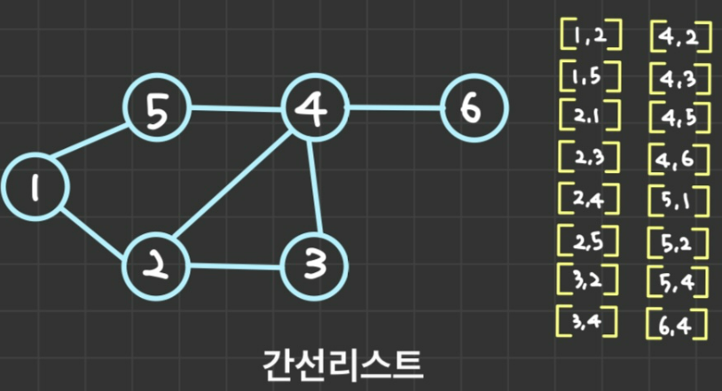

# 그래프(Graph)

---

## 그래프(Graph)

- 연결되어 있는 정점과 정점간의 관계를 표현할 수 있는 자료구조
- 용어
  - 노드(Node): 연결 관계를 가진 각 데이터(=정점(Vertex))
  - 간선(Edge): 노드 간의 관계를 표시한 선
  - 인접 노드(Adjacent Node): 간선으로 직접 연결된 노드(=정점)
- 종료
  - 단방향 그래프 : 방향이 있는 간선. 간선 각각은 단방향 관계를 나타내며, 한 방향으로만 진행할 수 있다.
  - 양방향 그래프 : 방향이 없는 간선. 간선 각각은 양방향 관계를 나타내며, 양 방향으로 진행할 수 있다.

---

## 트리와 차이점

- 트리도 엄연히는 그래프의 일종이라 할 수 있다.
- 트리는 부모-> 자식 방향으로 단방향 관계로 구성되어 있고, 순환구조를 갖지 않는 그래프라 할 수 있다.
- 그래프는 단방향 - 양방향 모두를 가리킬 수 있고, 순환구조를 가질 수 있다.
- 그림에서 (1), (2), (3) 모두 그래프라 할 수 있지만, 트리는 (3) 만 해당된다.

---

## 그래프의 표현 방법
### 인접 행렬(Adjacent Matrix)

- 그래프의 연결 관계를 행렬로 표현하여 이차원 배열로 나타내는 방식
- `adj[i][j]` : 노드 i에서 j로 가는 간선이 존재할 경우 1, 아니면 0
- 장점
  - 구현이 쉽다
  - 노드 i와 노드 j가 연결되어 있는지 확인하고 싶을 때, indexing 으로 접근하기 때문에 `O(1)`의 시간 복잡도를 가진다. 공간복잡도의 부담이 없다면
  인접행렬 방식이 빠르다.
- 단점
  - 전체 노드의 개수를 v개, 간선의 개수를 E개라고 하면, 노드 i에 연결된 모든 노드들에 방문하고 싶은 경우 `adj[i][1]`부터 `adj[i][V]`를 모두 확인해봐야 하기 때문에 총 `O(V)`의 시간이 걸린다.
  - 연결되지 않은 간선에 대한 정보까지도 포함해야하기 때문에 공간복잡도가 크다.
  - 노드의 수에 비해 간선의 개수가 훨씬 적은 그래프면 적절하지 않다.

### 인접 리스트(Adjacent List)

- 각각의 노드에 연결된 노드들을 원소로 갖는 리스트들의 배열
- `adj[i]` : i번째 노드에 연결된 노드들을 원소로 갖는 리스트
- 무방향 그래프의 경우에는 본인 노드 인덱스의 리스트 내에 서로를 원소로 가지게 된다.
- 장점
  - 실제 연결된 노드에 대한 정보만 저장하기 때문에, 모든 원소의 개수의 합이 간선의 개수와 동일하다.
  - 간선의 개수에 비례하는 메모리만 차지하여 구현이 가능하다.
  - 각 노드에 연결된 모든 노드들을 방문해 보아야 하는 경우, 인접 리스트로 연결 관계를 저장하는 것이 시간상 큰 이점을 가진다.
- 단점
  - 노드 i와 j의 연결 여부를 알고 싶을 때, `adj[i]` 리스트를 순회하며 j 원소가 존재하는지 확인해야 한다 → 시간 복잡도 O(V)
  - 연결관계 확인 시 시간 복잡도가 인접 행렬보다 크다. 인접 행렬은 `adj[i][j]`가 1인지 0인지만 확인하면 i와 v 노드의 연결 여부를 O(1)로 확인 가능하다.

### 간선 리스트(Edge List)

- 그래프를 구성하는 모든 간선(Edge)들의 리스트
- 장점
  - 구현이 가장 간단하다.
  - 모든 간선을 탐색할 때 유리하다 (ex) 벨만-포드 알고리즘
- 단점
  - 특정 두 노드가 이웃한지 알아보려면 모든 간선을 탐색해야 한다.
  - 특정 노드에 연결된 간선을 알아보려면 모든 간선을 탐색해야 한다.

---
