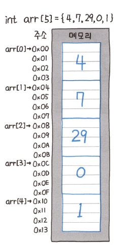
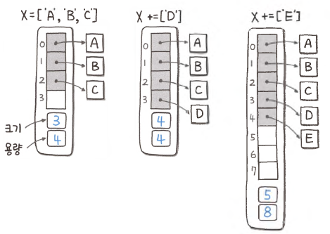

# 배열

---

#### 배열

- 크기를 지정하고, 해당 크기만큼의 연속된 메모리 공간을 할당받는 작업을 수행하는 자료형
- 크기가 고정되어 있으므로, 한번 생성한 배열은 크기를 변경하는 것이 불가능하다.
- 특징
  - 빠른 조회: 특정 위치의 요소 주소를 즉시 계산하고 언제든 해당 메모리 주소에 있는 값을 O(1)에 조회 가능하다.
  - 느린 중간 삽입: 데이터의 중간 삽입을 하기 좋은 구조는 아니다. 맨 앞 또는 중간에 데이터를 중간삽입할 경우, 그 위치 뒤의 요소를 모두 뒤에
  순서대로 복사하고(`O(N)`) 새로운 데이터를 삽입해야하기 때문이다.

---

#### 동적 배열

- 크키를 지정하지 않고 자동으로 리사이징하는 배열
- 원리
  - 미리 초깃값을 작게 잡아 배열을 생성한다.
  - 데이터가 추가되면서 꽉 채워질 경우, 더 용량이 큰 새로운 배열을 만들어서 복사하는 방식으로 동작(더블링)
  - 더블링 과정에서 `O(n)`의 시간복잡도 비용이 일어나지만, 자주 일어나는 일은 아니다.
- 구현체
  - C++ : `std:vector`
  - Java : `ArrayList`
  - Python : `리스트`

---
