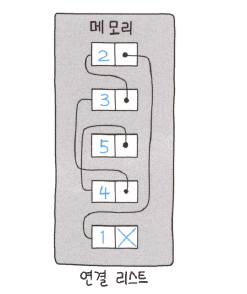

# 연결 리스트(Linked List)

---

### 연결 리스트(Linked List)



```text
HEAD => Node(data, next) => Node(data, next) => ...
```
- '노드' 라는 구조체를 통해 데이터를 관리하는 리스트
- 노드는 데이터 값과, 다음 노드에 대한 참조를 가진다.
- 동적으로 새로운 데이터를 삽입하거나 삭제하기 특화됨
- 특징
  - 조회 성능 : `O(N)`
    - HEAD부터 시작해서 next를 타고 조회해나간다.
  - 삽입 성능 : `O(1)` (노드에 접근하는 비용은 제외)
    - 맨 앞 삽입: 노드를 새로 만들고 HEAD 의 참조를 바꿔주면 된다.
    - 중간, 맨뒤 삽입: 노드를 새로 만들고 중간 지점의 노드의 next를 참조를 바꿔주면 된다.

---

### 이중 연결 리스트(Doubly Linked List)
```text
HEAD => Node(prev, data, next) <=> Node(prev, data, next) <=> ... <=> Node(prev, data, next) <= TAIL
```
- 자료구조 자체가 제일 앞 노드, 제일 뒤 노드에 대한 정보를 가짐
- 각 노드는 앞 노드, 뒷노드 정보를 함께 가짐
- size 정보를 가지고 관리한다면, k번째 노드에 접근할 때 HEAD 또는 TAIL 중 가까운 곳에서 접근할 수 있는 성능상 이점이 생김
- 실제 Java 의 LinkedList 는 이중 연결리스트 구조로 구현되어 있음

---
