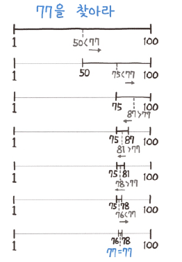

# 이진 탐색(Binary Search)

---

### 이진 탐색
- 정렬된 배열에서 대상(target)을 찾는 알고리즘
- 시간복잡도 : O(log N)

---

### 흐름


- 배열이 정렬되어 있어야한다. (여기서는 오름차순으로 정렬된 배열을 기준으로 이야기하겠다.)
- 시작점(lt), 끝점(rt)을 지정한다.
- 두 종점의 중간지점(mid) 를 찾고, 중간지점(mid) 와 대상(target)의 대소관계를 비교하여 mid 를 계속 변경한다.
  - mid 와 target 이 같으면 찾았다는 것이다.
  - mid 가 target 크면, rt 를 mid 보다 1 작은 곳에 둔다.
  - mid 가 target 보다 작으면 ,lt 를 mid 보다 1 큰 곳에 둔다.
- 시작점이 끝점보다 작거나 같은 동안 반복하고, 반복이 종료되면 찾지 못 했다는 것이다.

---

### 코드 스니펫
```python
# array : 정렬된 배열
# target : 찾고자 하는 값
def binary_search(array, target):
    lt = 0
    rt = len(array) - 1
    
    while lt <= rt:
        mid = (lt + rt) >> 1
        if mid > target:
            rt = mid - 1
        elif mid < target:
            lt = mid + 1
        else:
            return True
    return False 
```

---
