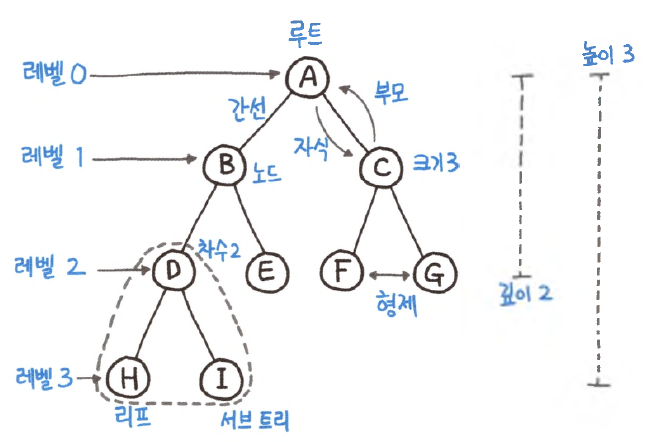
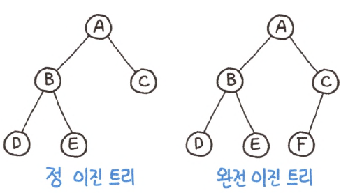

# 트리(Tree)

---

### 트리


- 뿌리와 가지로 구성되어 거꾸로 세워놓은 나무처럼 보이는 계층형 비선형 자료 구조.
- 각 노드는 0개 이상의 자식을 가질 수 있다.

---

### 이진트리
```text
      o      Level 0 
    o o o    Level 1
   o  o  o   Level 2 # 이진 트리(X)

      o      Level 0 
    o   o    Level 1
   o o o     Level 2 # 이진 트리(O)
```
- 각 노드가 2개 이하의 자식을 가진 트리
- 각 노드는 1개 이하의 부모(1개의 부모를 가진 경우 루트노드이다.)와 2개 이하의 자식을 가진다.

---

### 완전 이진트리


```text
      o      Level 0
    o   o    Level 1
     o o     Level 2  # -> 이진 트리 O 완전 이진 트리 X

      o      Level 0
    o   o    Level 1
   o o o     Level 2  # -> 이진 트리 O 완전 이진 트리 O
```
- 마지막 레벨을 제외하고 모든 레벨이 채워져 있으며, 마지막 레벨의 모든 노드는 왼쪽부터 채워진다.

---
