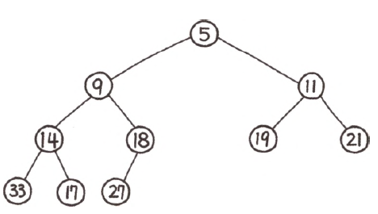
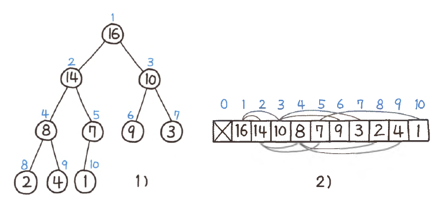
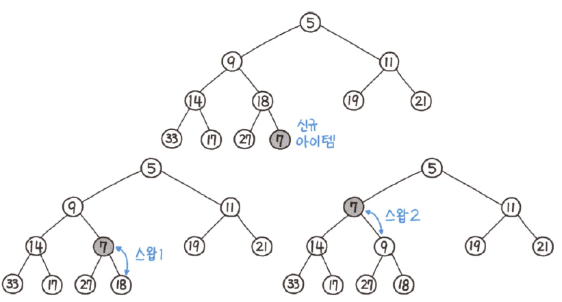
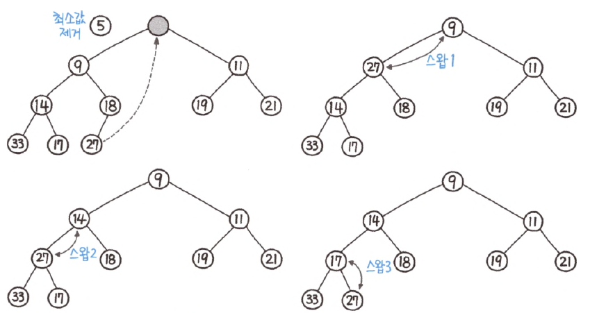

# 힙(Heap)

---

### 힙(Heap)


- 특정 조건(최소힙, 최대힙 조건)을 만족하는 특수한 완전트리
  - 완전 트리 : 마지막 레벨을 제외하고 모든 레벨이 채워져 있으며, 마지막 레벨의 노드는 왼쪽부터 채워진다.
- 종류
  - 최대힙 : 부모가 항상 자식보다 크다 => 루트가 항상 가장 큰 값
  - 최소힙 : 부모가 항상 자식보다 작다 => 루트가 항상 가장 작은 값
- 활용
  - 우선순위 큐
  - 다익스트라 알고리즘

---

### 이진힙의 배열 표현



```python
class MaxHeap:
    def __init__(self):
        self.items = [None] # 0번 인덱스 비우기
        self.size = 0
```

- 이진힙은 배열로 표현하는 것이 가능하다.
- 0번 인덱스를 비우고, 1번 인덱스부터 순서대로 각 레벨의 요소들이 추가된다.
- 자식-부모관계
  - 왼쪽 자식노드 인덱스 : 부모 노드의 인덱스 * 2
  - 오른쪽 자식노드 인덱스 : 부모 노드의 인덱스 * 2 + 1
  - 부모노드 인덱스 : 자식 노드 인덱스 // 2

---

### 이진 힙에서의 요소 삽입 과정


```python
    # 삽입
    def insert(self, value):
        self.items.append(value)
        self.size += 1
        i = self.size
        parent = i >> 1
        while parent > 0:
            if self.items[parent] < self.items[i]:
                self.items[i], self.items[parent] = self.items[parent], self.items[i]
                i = parent
                parent = i >> 1
            else:
                break
```

- 새로운 요소는 마지막 레벨의 왼쪽부터 순서대로 채운다.
- 추가한 자식에 대해서 루트까지 부모와 비교하면서 서로 최대힙/최소힙 조건에 맞게 스왑(swap)한다.
- 시간복잡도 : O(logN)

---

### 이진힙에서의 요소 추출 과정


```python
    def pop(self):
        if self.size == 0:
            raise IndexError("Heap is empty")
        extracted = self.items[1]
        self.items[1] = self.items[self.size]
        self.items.pop()
        self.size -= 1

        i = 1
        lt = i << 1
        rt = lt + 1
        big = i

        while True:
            if lt <= self.size and self.items[big] < self.items[lt]:
                big = lt
            if rt <= self.size and self.items[big] < self.items[rt]:
                big = rt
            if big == i:
                break

            self.items[i], self.items[big] = self.items[big], self.items[i]
            i = big
            lt = i << 1
            rt = lt + 1
            big = i
        return extracted
```

- 기본적으로 추출을 하지 않고 최대/최소를 확인하는 과정의 시간복잡도는 `O(1)` 이다.
- 추출을 하는 경우, 다시 최대힙/최소힙 규칙에 맞게 재배치를 하는 작업이 필요하다.
- 과정은 다음과 같다. (최소힙 기준)
  - 루트 요소의 값을 미리 빼둔다.
  - 가장 마지막 레벨의 가장 오른쪽 값을 루트 노드로 옮긴다.
  - 루트를 시작으로 하여 루트, 왼쪽 자식, 오른쪽 자식을 비교하여 가장 작은 값을 위로 올린다.
  - 스왑된 쪽으로 계속 파고들어 계속 작은 값을 위로 올린다.
- 시간복잡도 : O(logN)

---
