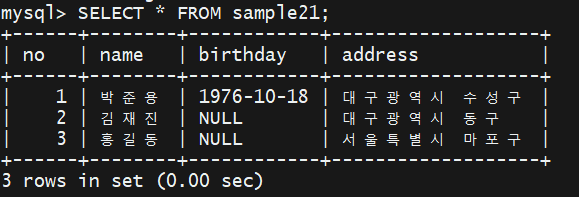

# <a href = "../README.md" target="_blank">SQL 첫걸음</a>
## Chapter 02. 테이블에서의 데이터 검색
### 04강. Hello World 실행하기
1) SELECT 명령 구문
2) 예약어, 데이터베이스 객체
3) 테이블, 데이터 타입
4) NULL == 값이 정해지지 않음

---

## 1) SELECT 명령 구문
```sql
SELECT -- 명령의 종류
       * -- 모든 열
FROM sample21 -- 테이블 명
; -- 명령의 마지막
```
- SELECT 구 : 가져올 열을 지정
  - `*` : 모든 열
- FROM 구 : 질의할 테이블 지정
- `;` : 명령의 끝

---

## 2) 예약어, 데이터베이스 객체
- 예약어 : 프로그래밍 언어에서 사용되고 있거나 사용될 예정인 단어들
  - 예) SELECT, FROM, INSERT, ...
- 데이터베이스 객체 : 데이터베이스에서 다양한 데이터를 저장하거나 관리하는 '어떤 것'
  - 예) 테이블, 뷰, ...
- 예약어와 데이터베이스 객체명은 대소문자를 구분하지 않는다.

---

## 3) 테이블, 데이터 타입
```sql
SELECT * FROM sample21;
```

일반적으로 SELECT ~ 문을 실행하면 표 형태의 데이터가 출력된다.
- 테이블 : 행과 열로 구성된 표 형식의 테이터
  - 행 : 각각의 레코드
  - 열 : 칼럼, 필드
- 데이터 타입 : 데이터는 자료형으로 분류할 수 있고, 각각의 열은 하나의 자료형만 가질 수 있다.
  - 수치형 데이터 : 숫자
  - 문자열형 데이터 : 문자열
  - 날짜 시간형 데이터 : 날짜, 시간
    - 예) '1976-10-18'

---

## 4) NULL == 값이 정해지지 않음
- null : 데이터가 들어있지 않음. 값이 정해지지 아니함

---
