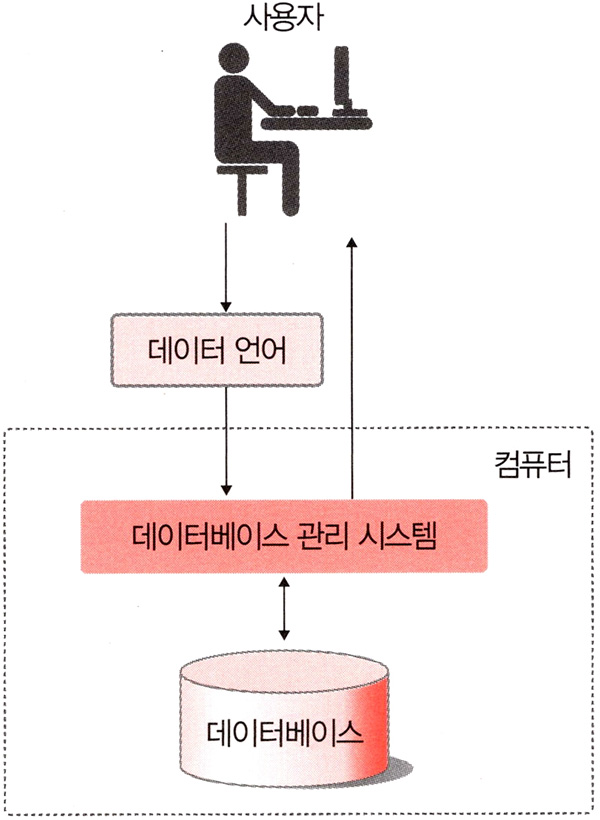

# <a href = "../README.md" target="_blank">데이터베이스 개론</a>
## Chapter 03. 데이터베이스 시스템의 정의
### 3.1 데이터베이스 시스템의 정의
1) 데이터베이스 시스템

---

# 3.1 데이터베이스 시스템의 정의

## 1) 데이터베이스 시스템
데이터를 데이터베이스에 저장하고, 저장된 데이터를 관리하여(데이터베이스 관리 시스템) 필요한 정보를 생성해주는 시스템

- 데이터베이스 : 특정 조직의 여러 사용자가 공유하여 사용할 수 있도록 통합해서 저장한 운영데이터의 집합
- 데이터베이스 관리 시스템 : 데이터베이스에 데이터가 일관되고 무결한 상태로 유지되도록 관리
- 사용자
- 데이터 언어 : 데이터베이스에 접근할 때 사용하는 언어
- 컴퓨터 : 데이터베이스와 데이터 베이스 관리 시스템을 설치하고, 데이터 처리 연산을 담당

---