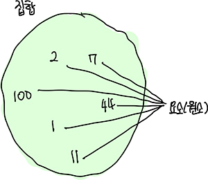
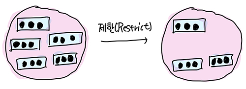
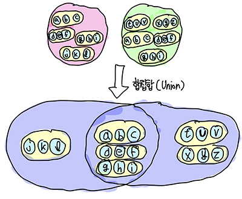
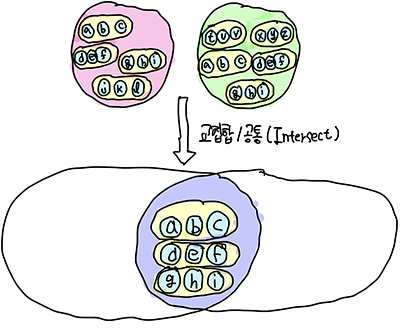

# <a href = "../README.md" target="_blank">원리부터 배우는 관계형 데이터베이스 실전 입문</a>
## Chapter 01. SQL과 관계형 모델
### 1.2 관계형 모델
1) 관계형 모델
2) 릴레이션
3) 집합과 관계형 모델
4) 릴레이션 연산 원리 이해를 기반으로 한 SQL을 작성해야한다.
5) 여러가지 릴레이션 연산
6) 클로저(closure) : 릴레이션 연산의 결과는 릴레이션이라는 성질
7) 관계형 모델의 데이터 형식

---

# 1.2 관계형 모델

---

## 1) 관계형 모델

### 1.1 관계형 모델
- '관계(릴레이션)' 개념을 사용해 표현한 논리적 데이터 모델
- 아래에서 후술하겠지만, 릴레이션 단위로 다양한 연산을 사용해, 질의를 수행할 수 있는 데이터 모델이다.

### 1.2 논리적 데이터 모델
- 데이터를 어떤 방식으로 표현할 것인가
- 논리적 데이터 모델링의 결과물
- 사용자가 생각하는 데이터베이스의 모습, 구조

---

## 2) 릴레이션

제목(Title)과 본체(Body)로 구성되어 있다.

### 2.1 제목(Title)
- 속성(Attribute)이 n개 모인 **집합**. -> 데이터베이스 스키마
- 속성은 이름과 데이터 형으로 구성되어 있다.

### 2.2 본체(Body)
- 제목(Title)에서 정의한 규칙에 따라 구성된 튜플의 집합

### 2.3 관계형 모델과 SQL 비교

관계형 모델과 SQL은 기본적인 개념은 같지만, 성질이 다르기 때문에 각각의 용어들을 다른 이름으로 부른다.
- 릴레이션 -> 테이블(table)
- 튜플 -> 행(row)
- 속성 -> 열(column)

---

## 3) 집합과 관계형 모델

### 3.1 집합
- 중복 없이 서로 다른, 구분할 수 있는 요소(element)의 모임

### 3.2 집합이 충족해야할 조건, 성질
- 어떤 요소가 집합에 포함돼 있는지 불확정한 요소 없이 판정할 수 있어야한다.
- 집합의 요소는 정해진 순서가 존재하지 않는다.
- 집합에서 각 요소 및 특정 부분집합의 정보를 얻어오는 작업은 다음의 연산 결과에 영향을 끼쳐선 안 된다.
- 집합의 요소가 중복돼서는 안 된다.
- 집합의 요소 각각은 더 분해될 수 없다. 요소 각각은 원소 하나로서 의미가 있는 값이다.

### 3.3 집합과 NULL
- NULL은 정해지지 않은, 무엇인지 모르는 값을 의미.
- 값이 무엇인지 알수 없다는 개념은 위의 '불확정한 요소 없이 판정할 수 있어야한다' 라는 조건에 위배된다.
- **관계형 모델을 올바르게 구현하려면 NULL을 최대한 배제해야한다.**
- 아래에서 후술할 릴레이션 연산이 불분명해지는 문제를 야기한다.

### 3.4 유한집합과 무한집합
- 유한집합 : 요소의 갯수가 유한인 집합(예 : XXX 동물원의 코끼리 집합, 대한민국의 국민, ...)
- 무한집합 : 요소의 갯수가 무한인 집합(예 : 자연수, 실수, ...)
- 관계형 모델이 다루는 것은 유한집합 뿐이다.

---

## 4) 릴레이션 연산 원리 이해를 기반으로 한 SQL을 작성해야한다.

### 4.1 릴레이션 연산
관계형 모델은 릴레이션 단위로 다양한 연산을 사용해, 질의를 수행할 수 있는 데이터 모델이다.
- 데이터 : 릴레이션 -> 튜플의 집합
- 연산 : 쿼리(질의)

### 4.2 집합론을 기반으로 함
- 릴레이션의 본체는 결국 튜플의 집합이고, 본질적으로 릴레이션에 대한 연산도 집합론을 기반으로 하고 있다.
- 집합 중에서도 특이하게, 각각의 튜플이 같은 구조, 같은 이름, 같은 데이터형을 가지고 있으므로 일반적인 집합에 없는
관계형 모델의 특유 연산들이 많이 존재하고 있다.
- 집합을 베이스로 한 릴레이션 연산을 기반으로, 릴레이션으로부터 필요한 정보를 추출할 수 있으며 이것이 쿼리(질의)의 본질이다.
- 릴레이션 연산 원리를 응용해 만들어진 것이 관계형 데이터베이스(RDB)이며,
RDB가 최대한의 성능을 발휘하려면 이에 대한 이해를 기반으로 SQL을 작성해야한다.

---

## 5) 여러가지 릴레이션 연산

### 5.1 제한(Restrict)

- 특정 조건에 맞는 튜플을 포함한 릴레이션을 반환
- 제한 연산을 실행한 결과는 원래 릴레이션의 부분집합이다.
- 제한을 실행한 결과가 공집합이거나(조건에 맞는 튜플이 하나도 없을 때), 원래 릴레이션과 같은 결과가 나올 수 있다(모든 튜플이 조건에 맞을 때).

### 5.2 프로젝션(Projection)

- 특정 속성만 포함하는 릴레이션을 반환
- 속성이 적어지면 튜플의 중복이 발생할 수 있다. 집합은 중복되는 요소를 포함할 수 없으므로, 관계형 모델에서는 중복이 발생한 경우 같은 튜플로 간주해야한다.(SELECT DISTINCT...)

### 5.3 확장(Extend)

- 속성을 늘리는 동작
- 대부분, 새로운 속성값을 만들 때는 기존의 속성값들로부터 유도하여 계산해 만든다.
  - (예) 인구, 면적 속성을 기반으로 인구 밀도 속성 추가

### 5.4 속성명 변경(Rename)

- 단순히 속성의 이름을 변경
- 기존 속성명을 변경하는 용도 또는 확장한 속성에 대해 명칭을 부여할 때 주로 사용

### 5.4 합집합(Union)

- 두 릴레이션에 포함된 모든 튜플로 구성된 릴레이션(합집합)을 반환
- 두 릴레이션에 공통된 속성값이 포함됐다면 중복이 제거된 상태가 됨

### 5.5 교집합(Intersect)

- 두 릴레이션에 모두 포함된 부분(공통 부분) 릴레이션 반환

### 5.6 차집합(Difference)

- 두 릴레이션 중 한 쪽에 릴레이션에만 포함되어 있는 튜플로 구성된 릴레이션 반환
- 어느 쪽을 기준으로 하느냐에 따라 연산 결과가 다르다.

### 5.7 곱집합(Product)

- 두 릴레이션에 있는 튜플을 각각 조합한 릴레이션을 반환
- 결과 릴레이션의 제목은 두 릴레이션이 가진 제목을 모두 포함한다.

### 5.8 결합(Join)

- 공통된 속성을 가진 두 릴레이션에서 공통된 속성값이 같은 튜플끼리 조합한 릴레이션 반환
- 반환되는 튜플은 공통된 속성값에 대해서, 같은 값이 존재하는 것들 뿐이다. 일치하는 값이 존재하지 않는 경우는 결과에서 제외된다.
  - SQL에서는 이런 결합을 내부 조인(Inner Join)이라 한다.
  - 외부 조인은 결과에 NULL이 포함될 가능성이 있으므로, 릴레이션의 연산으로 부적합하다.
- 교집합은 결합의 일종이다. 두 릴레이션에 포함되는 속성이 모두 공통인 특이한 경우에 해당한다.
- 곱집합 역시 결합의 일종이다. 두 릴레이션에 공통된 속성이 존재하지 않는 특이한 경우에 해당한다.

---

## 6) 클로저(closure) : 릴레이션 연산의 결과는 릴레이션이라는 성질

### 6.1 클로저
- 입력과 출력이 같은 데이터 구조를 가진 성질을 클로저(clousure)라고 한다.
- 주의) 여기서의 클로저는 람다식이나 익명함수 등을 의미하지 않는다.

### 6.2 닫혀있다
- 정수 : 정수 1과 1을 더한 결과는 역시 정수이다. 이 결과값을 이용해 다시 다른 정수와 연산을 수행할 수 있다. 이런 성질이 클로저이다.
- 릴레이션 : 릴레이션 연산 결과가 릴레이션이면, 릴레이션 연산의 결과 역시 다른 릴레이션과 조합해 연산할 수 있다.
합집합에 다른 릴레이션을 결합한다거나, 제한을 적용한다거나, 프로젝션을 적용한다거나, 합집합을 연산한다거나, ... 할 수 있는 것이다.

### 6.3 관계형 모델과 클로저
- 이렇게 관계형 모델은 '클로저'라는 성질을 가짐으로서 릴레이션의 연산만을 이용해 복잡한 연산을 표현할 수 있다.

---

## 7) 관계형 모델의 데이터 형식

### 7.1 데이터 타입에 대한 결정 책임은 관계형 모델에 있지 않다.
- 테이블을 설계할 때 데이터 타입을 고려한 설계를 해야한다.
- 그런데, 관계형 모델은 '모델'이므로 어떻게 사용해야할 지가 정해져있을 뿐 그 자체로 어떤 데이터 타입을 사용할 것인지를 결정하지 않는다.
- 어떤 데이터 타입을 사용할 지 결정하는 것은, 관계형 모델을 사용하는 응용 프로그램에 달려 있다.

### 7.2 변수와 데이터 타입
- 변수는 값을 대입할 수 있는 그릇
- 변수에 다른 값을 대입하여 내용이 변경될 수 있지만, 대입된 값의 의미와 양에는 변화가 없다.
- 컴퓨터 세계에서 변수에 대입할 수 있는 값은 무한정한 값이 아니며, 사용할 수 있는 범위가 한정돼 있다. 이를 위해 필요한 것이 데이터 타입이다.

### 7.3 도메인
- 데이터 타입은 변수에 대입할 수 있는 값의 유한집합이다. 그리고 이를 관계형 모델에서는 이를 도메인이라고 한다.

### 7.4 릴레이션의 집합적 관점
- 도메인, 즉 속성의 데이터 타입이 유한집합이라 함은 튜플이 취득할 수 있는 값을 유한집합의 곱집합으로 나타낼 수 있음을 의미한다.
- 튜플은 제목(Title)에 정의된 속성들의 곱집합 중 한 개의 요소이다.
- 릴레이션은 속성의 도메인 곱집합에서 특정 튜플만 선택해서 구성한 집합이다.

---
