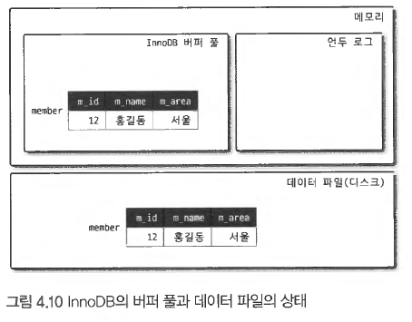
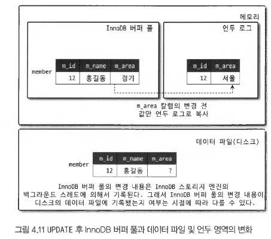

# 언두 로그와 MVCC (Multi Version Concurrency Control)

---

#### 언두 로그

- InnoDB 스토리지 엔진은 트랜잭션과 격리 수준을 보장하기 위해 DML(INSERT, UPDATE, DELETE) 로 변경되기 이전의 데이터를 별도로 백업한다.
- 이렇게 백업한 데이터를 언두로그라고 한다.
- 목적
  - 트랜잭션의 격리수준 유지 및 높은 동시성 제공
  - 트랜잭션 롤백 대비
- 커밋되면
  - InnoDB 는 더 이상의 변경 없이, 현재 상태를 영구적인 데이터로 만든다
- 롤백되면
  - 언두 영역의 백업된 내용을 InnoDB 버퍼풀로 다시 복구
  - 언두 영역의 백업 데이터를 삭제
---

#### 언두 테이블 스페이스
- 언두로그가 저장되는 공간을 언두 테이블 스페이스라고 한다.

---

#### MVCC(Multi Version Concurrency Control)
- 별도의 잠금을 사용하지 않고 일관된 읽기를 제공하기 위함
- 트랜잭션 중간에 데이터의 변경이 일어나고 커밋/롤백 되지 않은 상태일 때, 동시에 다른 트랜잭션에서 조회를 하면?
- 트랜잭션 격리 수준에 따라 조회 결과가 다르다.(Multi Version Concurrency Control)
  - Isolation Level 이 READ_UNCOMMITTED 일 때: InnoDB 버퍼풀이 현재 가지고 있는 변경된 데이터를 반환한다.
  - Isolation Level 이 READ_COMMITTED 혹은 그 이상: 언두 영역의 데이터를 반환한다.

---
