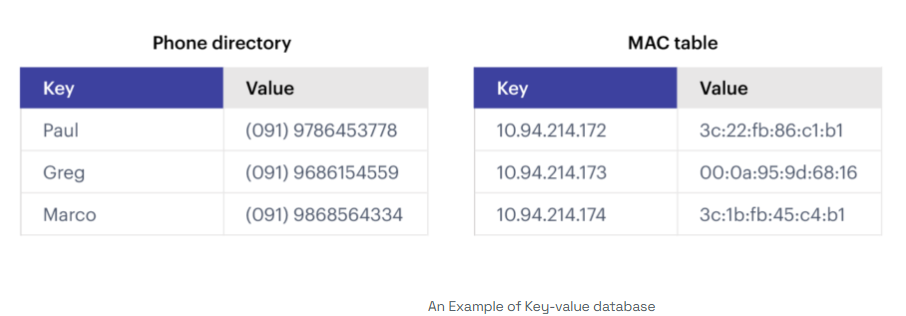

# 레디스(Redis)

---

### Redis 란?
> Remote Dictionary Server의 약자로서, "키-값" 구조의 비정형 데이터를 저장하고 관리하기 위한
> 오픈 소스 기반의 비관계형 데이터베이스 관리 시스템(DBMS)이다. (위키백과)

- **데이터 처리 속도가 엄청 빠른 NoSQL 데이터베이스**
- Key-Value 형태로 데이터를 저장하는 데이터베이스
  
  
---

### Redis 의 장점
Redis는 다양한 장점을 가지고 있다. 여러 특징 중 딱 1가지만 확실하게 기억하라.

> 레디스(Redis)는 인메모리(in-memory)에 모든 데이터를 저장한다.
그래서 데이터의 처리 성능이 굉장히 빠르다.

- MySQL과 같은 RDBMS의 데이터베이스는 대부분 디스크(Disk)에 데이터를 저장한다. 
- 하지만 Redis는 메모리(RAM)에 데이터를 저장한다. 디스크(Disk)보다 메모리(RAM)에서의 데이터 처리속도가 월등하게 빠르다. 
- 이 때문에 Redis의 데이터 처리 속도가 RDBMS에 비해 훨씬 빠르다.

---

### Redis 의 사용 사례
Redis 는 내장된 기능이 다양하다보니 여러 용도로 사용된다. 
- **캐싱 (Caching)**
- 세션 관리 (Session Management)
- 실시간 분석 및 통계 (Real-time Analystics)
- 메시지 큐 (Message Queue)
- 지리공간 인덱싱 (Geospatial Indexing)
- 속도 제한 (Rate Limiting)
- 실시간 채팅 및 메시징 (Real-time Chat And Messaging)

---

### 처음은 일단 '캐싱'부터
- 모든 사례를 처음부터 이해하려 하기엔 막막할 수밖에 없다. 
- ‘캐싱(데이터 조회 성능 향상)’의 사례를 학습하다보면 자연스럽게 레디스의 기본 기능들이 익혀진다. 이렇게 배우면 레디스를 정말 빨리
익힐 수 있다. 그런 뒤에 레디스의 다른 사례에 대해서도 조금씩 학습하면서 살을 붙여나가면 된다.

---

### Redis 를 학습하는 목적: 최근 백엔드 개발자 채용 공고에 자주 등장하는 스펙이다.
백엔드 개발자 채용 공고를 살펴보면 ‘**대용량 트래픽**’에 관한 얘기와 ‘**NoSQL**’에 관한 얘기가 자주 나온다.  
이 역량이 서비스가 점점 고도화 될 수록 빼놓을 수 없는 역량이기 때문이다.  
이 2가지 역량을 채울 수 있는 방법 중 하나가 Redis이다.  

대용량 트래픽을 처리하기 위해서 필수적으로 사용되는 기능이 Redis의 캐싱(Caching) 기능이다.  
또한 Redis는 NoSQL의 일종이다. 따라서 Redis를 학습함으로써 최근 회사에서 요구하는 자격 요건을 맞출 수 있도록 노력해보자.  

---
