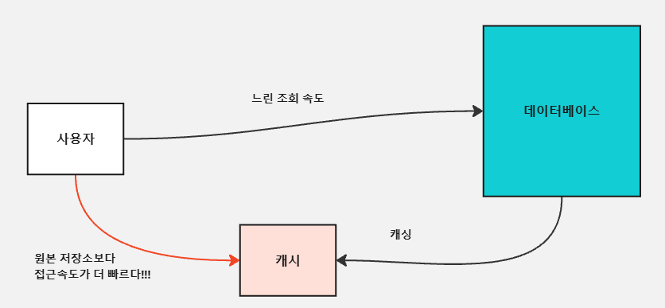
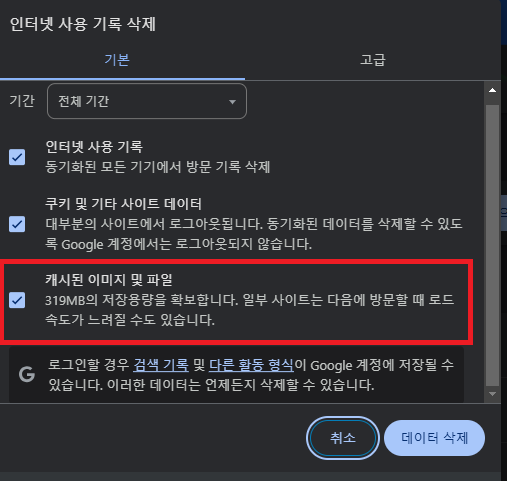

# 캐시(Cache), 캐싱(Caching)이란

---

### 캐시(Cache)란?

- 캐시(Cache)란, 원본 저장소보다 빠르게 가져올 수 있는 임시 데이터 저장소를 의미한다.
- 참고로 캐시(Cache)라는 단어는 Redis에서만 쓰이는 용어는 아니고 전반적인 개발 분야에서 통용돼서 쓰인다.  
  **[예시]**  
  

---

### 캐싱(Caching)이란?
**캐싱(Caching)** 이란 **캐시(Cache, 임시 데이터 저장소)에 접근해서 데이터를 빠르게 가져오는 방식**을 의미한다.

현업에서는 아래와 같이 얘기하는 편이다.

> "이 API는 응답 속도가 너무 느린데? 이 응답 데이터는 **캐싱(Cahing)** 해두고 쓰는 게 어때?"

이 말을 풀어서 설명하자면 **"API 응답 결과를 원본 저장소보다 빠르게 가져올 수 있는 임시 데이터 저장소에 저장해두고,
빠르게 조회할 수 있게 만드는 게 어때?"** 라는 의미이다.

---
