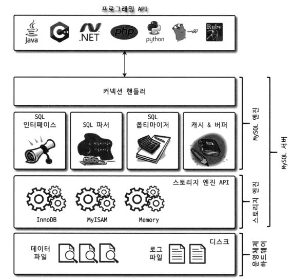

# 데이터베이스 아키텍처와 SQL 튜닝

---

### 대부분 데이터베이스의 구조

- (여기서는 RDBMS 의 대표적인 구현체중 하나인 MySQL 로 예시를 들 것이다.)
- MySQL 서버는 크게 2가지 영역으로 구성된다.
    - MySQL 엔진
    - 스토리지 엔진
- 클라이언트는 DB 에 SQL 요청을 보낸다.
- MySQL 엔진의 옵티마이저가 SQL 문을 분석하고 빠르고 효율적으로 데이터를 가져올 수 있는 계획을 세운다.
    - 어떤 순서로 테이블에 접근할 지
    - 인덱스를 사용할 지, 어떤 인덱스를 사용할 지 등
- 옵티마이저가 세운 계획을 바탕으로 스토리지 엔진에서 데이터를 가져온다.
    - **DB 성능에 문제가 생기는 대부분의 원인은 스토리지 엔진으로부터 데이터를 가져올 때 발생**
    - **데이터를 찾기가 어려워서 오래 걸리거나, 가져올 데이터가 너무 많아서 오래 걸린다.**
    - **SQL 튜닝의 핵심은 스토리지 엔진으로부터 되도록이면 데이터를 찾기 쉽게 바꾸고, 적은 데이터를 가져오도록 바꾸는 것을 말한다.**
- MySQL 엔진에서 정렬, 필터링 등의 마지막 처리를 한 뒤에 클라이언트에게 SQL 결과를 응답한다.

---

### SQL 튜닝의 핵심
- 스토리지 엔진에서 데이터를 찾기 쉽게 바꾸기
- 스토리지 엔진으로부터 가져오는 데이터의 양 줄이기
- 실전적 해결방안 : 인덱스
    - 제일 많이 사용되는 방법이다. 그렇다고 이게 모든 문제의 정답은 아니다.
    - 단순히 인덱스만 적용한다고 해서 무조건 해결되는 것은 아니다.
    - 인덱스를 적절히 사용하는 것이 중요하다

---
