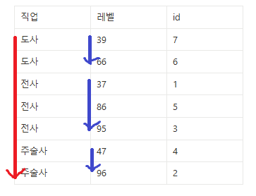

# 멀티 칼럼 인덱스 생성 시 주의점

---

### 멀티 칼럼 인덱스를 만들어두면 일반 인덱스처럼 활용할 수 있다. 


- 위의 `users` 테이블은 `부서` 를 기준으로 먼저 정렬되어 있고, 그 다음 같은 `부서` 내에서 `이름`을 기준으로 정렬되어 있다.
- `부서` 칼럼만 놓고 봤을 때는 `부서` 인덱스와 동일한 정렬 상태를 가지고 있다.
- 즉 위와 같이 멀티 칼럼 인덱스의 구조를 활용하면 `부서`의 인덱스를 활용하듯이 쓸 수도 있다.
  

---

### 멀티 칼럼 인덱스를 일반 인덱스처럼 활용하지 못하는 경우도 있다.
하지만, 위에서 예시로 든 인덱스는 `이름` 컬럼 인덱스처럼 활용할 수는 없다.


`이름`으로 정렬되어 있지 않다. 같은 `부서`를 가진 데이터끼리 정렬시켰기 때문이다.

```mysql
SELECT * FROM users
WHERE 이름 = '이재현';
```
- 실제로 위 sql 은 실행 시, 인덱스를 활용하지 못 한다.
- **멀티 칼럼 인덱스에서 일반 인덱스처럼 활용할 수 있는 건 처음에 배치된 칼럼들뿐이다.**

---

### 멀티 칼럼 인덱스를 구성할 때 `소분류 → 중분류 → 대분류` 컬럼순으로 구성하기
멀티칼럼 인덱스를 생성 시, 순서에 주의해야한다. 순서를 어떻게 하느냐에 따라서 성능 차이가 나기 때문이다.


먼저 직관적으로 이해해보자. 대기업에서 `회계 부서`의 `박미나`를 찾아야 한다고 가정하자. `회계 부서`의 모든 인원을 만나본 뒤에
`박미나`를 찾는게 빠를까? 아니면 `박미나`라는 이름을 가진 동명이인 사람들한테 직접 찾아가서 `회계 부서`인지를 물어보는 게 빠를까?  
일반적으로 `회계 부서`의 인원보다 `박미나`라는 이름을 가진 인원이 훨씬 적기 때문에,
`박미나`를 먼저 찾은 뒤에 `회계 부서`인지를 물어보는게 빠를 것이다.
이를 일반화해서 표현하자면 ‘**소분류를 먼저 탐색한 뒤, 대분류를 탐색하는 게 빠르다.**’라고 할 수 있다. 컴퓨터도 이 특성이 동일하게 적용된다.


멀티 컬럼 인덱스에서도 배치한 컬럼의 순서대로 데이터를 탐색한다. `(이름, 부서)`의 순서대로 멀티 컬럼 인덱스를 구성했다면
먼저 일치하는 `이름`을 찾은 뒤, 일치하는 `이름`에서 `부서`를 찾는 식으로 처리한다.

  
따라서 멀티 컬럼 인덱스를 구성할 때는 데이터 중복도가 낮은(≒ 카디널리티가 높은) 컬럼이 앞쪽으로 오는 게 좋은 경우가 많다.
*(항상 그런 건 아니니 실행 계획과 SQL문 실행 속도를 측정해서 판단하도록 하자.)*

---
