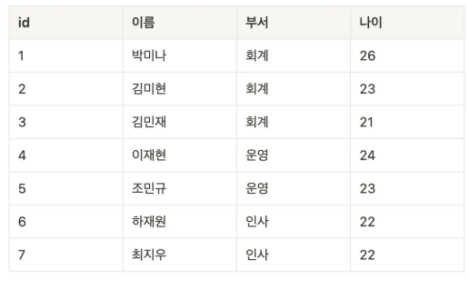
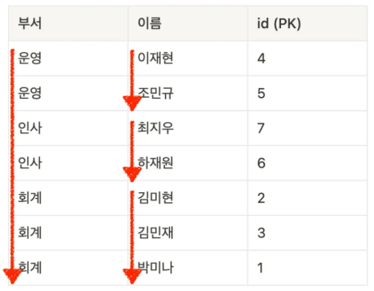

# 멀티 칼럼 인덱스(Multi-column Index)

---

## 1. 멀티 칼럼 인덱스란?


- 두개 칼럼 이상에 건 인덱스
- 순서가 중요하다. 우선 첫번째 칼럼 기준으로 정렬하고, 첫번째 칼럼이 같으면 그 다음으로 두번째 칼럼순으로 정렬한다.
- MySQL 8.0 이후부터는 오름차순, 내림차순 인덱스 정렬이 가능하다. (특별한 설정이 없으면 기본은 오름차순이다.)

---

## 2. 예시


사원들을 관리하는 `users` 테이블이 있다고 가정하자.



- 이 때 `부서`, `이름` 칼럼을 활용해 멀티칼럼 인덱스를 만들면, 위와 같은 표가 데이터베이스 시스템 내부에 생성된다.
- `부서` 를 기준으로 오름차순 정렬한 뒤, 같은 `부서` 의 값을 가진 데이터들 사이에서는 `이름` 을 기준으로 오름차순 정렬을 한다.
- 이번 예시에서는 칼럼 2개를 기준으로 인덱스를 생성했으나, 2개보다 더 많은 칼럼을 가지고도 인덱스를 생성할 수도 있다.

---

## 3. 멀티 칼럼 인덱스 실습

### 3.1 테이블 생성
```mysql
DROP TABLE IF EXISTS users;

CREATE TABLE users (
    id INT AUTO_INCREMENT PRIMARY KEY,
    name VARCHAR(100),
    department VARCHAR(100),
    age INT
);
```

### 3.2 더미 데이터 생성
```mysql
INSERT INTO users (name, department, age) VALUES
('박미나', '회계', 26),
('김미현', '회계', 23),
('김민재', '회계', 21),
('이재현', '운영', 24),
('조민규', '운영', 23),
('하재원', '인사', 22),
('최지우', '인사', 22);
```

### 3.3 멀티 칼럼 인덱스 생성
```mysql
CREATE INDEX idx_department_name ON users (department, name);
```

### 3.4 멀티 컬럼 인덱스 생성 잘 됐는 지 확인하기
```shell
mysql> SHOW INDEX FROM users;
+-------+------------+---------------------+--------------+-------------+-----------+-------------+----------+--------+------+------------+---------+---------------+---------+------------+
| Table | Non_unique | Key_name            | Seq_in_index | Column_name | Collation | Cardinality | Sub_part | Packed | Null | Index_type | Comment | Index_comment | Visible | Expression |
+-------+------------+---------------------+--------------+-------------+-----------+-------------+----------+--------+------+------------+---------+---------------+---------+------------+
| users |          0 | PRIMARY             |            1 | id          | A         |           7 |     NULL |   NULL |      | BTREE      |         |               | YES     | NULL       |
| users |          1 | idx_department_name |            1 | department  | A         |           3 |     NULL |   NULL | YES  | BTREE      |         |               | YES     | NULL       |
| users |          1 | idx_department_name |            2 | name        | A         |           7 |     NULL |   NULL | YES  | BTREE      |         |               | YES     | NULL       |
+-------+------------+---------------------+--------------+-------------+-----------+-------------+----------+--------+------+------------+---------+---------------+---------+------------+
3 rows in set (0.01 sec)
```

### 3.5 데이터 조회 시 인덱스를 어떤 식으로 활용할까?
```mysql
SELECT * FROM users
WHERE department = '인사'
ORDER BY name;
```


- `(department, name)` 순으로 인덱스를 만들어둬서, `WHERE department = '인사'` 를 만족하는 데이터들은 금방 찾을 수 있다.
- 그 뒤에, `ORDER BY name` 을 기준으로 데이터를 정렬해야 하는데, 이미 정렬되어 있다.
- 그래서 위 SQL 문을 통해 데이터를 가져오는 속도가 굉장히 빠를 수 밖에 없다.

---
