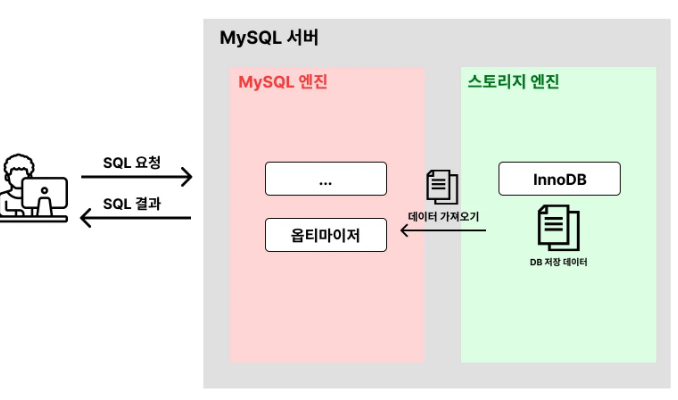

# 실행 계획(Execution plan)

---

## 1. 실행 계획(Execution plan)


- 옵티마이저가 SQL 을 어떤 방식으로 처리할 지 계획한 것
- 목적
    - 비효율적으로 처리하는 방식이 있는지 점검
    - 비효율적인 부분이 있다면 좀 더 효율적인 방법으로 SQL을 실행하도록 튜닝하는 것이 목표

---

## 2. 실행 계획 확인 방법
```mysql
# 실행계획 조회
EXPLAIN [SQL문];

# 실행계획의 자세한 정보 조회
EXPLAIN ANALYZE [SQL문];
```

---

## 3. 실행 계획 조회

### 3.1 테이블 생성
```mysql
DROP TABLE IF EXISTS users; # 기존 테이블 삭제

CREATE TABLE users (
    id INT AUTO_INCREMENT PRIMARY KEY,
    name VARCHAR(100),
    age INT
);
```

### 3.2 데이터 삽입
```mysql
INSERT INTO users (name, age) VALUES
                                  ('박미나', 26),
                                  ('김미현', 23),
                                  ('김민재', 21),
                                  ('이재현', 24),
                                  ('조민규', 23),
                                  ('하재원', 22),
                                  ('최지우', 22);
```

### 3.3 실행 계획 조회
```shell
mysql> EXPLAIN SELECT * FROM users WHERE age = 23;
+----+-------------+-------+------------+------+---------------+------+---------+------+------+----------+-------------+
| id | select_type | table | partitions | type | possible_keys | key  | key_len | ref  | rows | filtered | Extra       |
+----+-------------+-------+------------+------+---------------+------+---------+------+------+----------+-------------+
|  1 | SIMPLE      | users | NULL       | ALL  | NULL          | NULL | NULL    | NULL |    7 |    14.29 | Using where |
+----+-------------+-------+------------+------+---------------+------+---------+------+------+----------+-------------+
1 row in set, 1 warning (0.00 sec)
```
> #### 모든 칼럼을 이해하려는 생각 버리기
> - 이 모든 것을 이해하려고 하면 실행계획 학습에 지장을 준다
> - 필수적이고 핵심적인 값들만 이해하고 나중에 부가적인 옵션을 익혀도 늦지 않음
> #### 주의점
> - `rows`, `filtered` 의 값은 정확한 수치가 아닌 추정값이기 때문에 오차가 있을 수 있음
- id
    - 실행 순서
    - 복잡한 SQL은 1,2,3 여러 순서에 따라 진행되는데 그런 순서라고 생각하면 됨
- select_type
- table
    - 조회한 테이블 명
- partitions
- **type(☆☆☆)**
    - 테이블의 데이터를 어떤 식으로 조회하는 지
- possible_keys(☆)
    - 사용할 수 있는 인덱스의 목록 출력(사용 가능한 모든 인덱스 목록 출력)
- key(☆)
    - 데이터 조회 시 실제로 사용한 인덱스 값
    - 위에서 언급된 keys 중 실제 사용한 인덱스 값
- key_len
- ref
    - 테이블을 조인하는 상황에서 어떤 값을 기준으로 데이터를 조인해서 조회했는 지
- **rows(☆☆☆)**
    - SQL 수행을 위해 접근하는 데이터의 모든 행의 수 (= 데이터 액세스 수)
    - 이 값을 줄이는 게 SQL 튜닝의 핵심이다.
    - 정확한 값은 아니고 추정 값이다.
- filtered : 필터 조건에 따라 어느 정도의 비율로 데이터를 제거했는 지를 의미
    - filtered 의 값이 30이면 100개의 데이터를 불러온 뒤 30개의 데이터만 실제로 응답하는데 사용 함
    - filtered 값이 낮을 수록 쓸데 없는 데이터를 많이 불러온 것이다.
    - 정확한 값은 아니고 추정 값이다.
- extra(☆)
    - 부가적인 정보를 제공
    - 예) Using Where, Using index

---

## 4. 실행 계획 상세조회
```mysql
mysql> EXPLAIN ANALYZE SELECT * FROM users WHERE age = 23;
+----------------------------------------------------------------------------------------------------------------------------------------------------------------------------------------+
| EXPLAIN                                                                                                                                                                                |
+----------------------------------------------------------------------------------------------------------------------------------------------------------------------------------------+
| -> Filter: (users.age = 23)  (cost=0.95 rows=1) (actual time=0.0258..0.0284 rows=2 loops=1)
    -> Table scan on users  (cost=0.95 rows=7) (actual time=0.0233..0.026 rows=7 loops=1)
 |
+----------------------------------------------------------------------------------------------------------------------------------------------------------------------------------------+
1 row in set (0.00 sec)
```
- Table scan on users
    - 테이블을 풀 스캔 했다.
    - rows : 접근한 테이블의 행수
    - actual time=0.0233..0.026 (여기를 봐야한다)
        - 0.0233 (앞의 숫자) : 첫번째 데이터에 접근하기까지의 시간
        - 0.026 (뒤의 숫자) : 마지막 데이터에 접근하기까지의 시간
        - 여기서 눈여겨 볼 부분은 뒤의 숫자(마지막 데이터 접근하기까지의 시간이다. 총 0.026ms 걸렸고, 데이터 접근 갯수가 7개라는 것이다.)
- Filter: 필터링을 통해 데이터를 추출했다.
    - 필터링할 때의 조건은 `user.age = 23` 이다.
    - 이때 여기 붙은 시간부분은 밑의 하위 작업에 합한 시간값이다.
    - 예를 들어 Table Scan 은 0.026 인데, Table Scan 뒷부분 식나은 0.0284 이므로 실제 필터링 시간은 0.0024 ms 걸렸다는 것이다.
- 이 흐름을 읽으면
    - 전체 테이블의 모든 데이터(7개)에 접근함
    - 그 중 age=23 을 만족하는 데이터만 필터링해서 조회했다.

---
