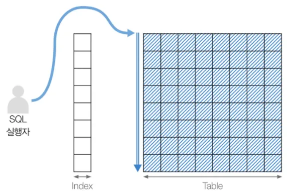
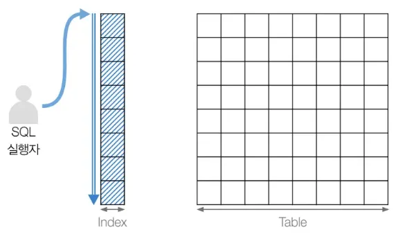
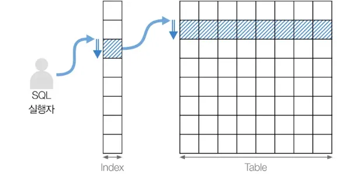
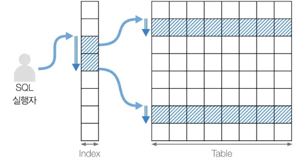

# 실행 계획에서 type의 의미

---

## 1. ALL : 풀 테이블 스캔


- 풀 테이블 스캔 방식(Full Table Scan)
- 처음부터 끝까지 테이블을 다 뒤져서 필요한 데이터를 찾는 방식
- 매우 비효율적인 방식이다.
- 만약 이 방식이 나온다면 성능 개선을 해야한다는 신호로 받아들여야 한다.

```mysql
DROP TABLE IF EXISTS users; # 기존 테이블 삭제

CREATE TABLE users (
    id INT AUTO_INCREMENT PRIMARY KEY,
    name VARCHAR(100),
    age INT
);

INSERT INTO users (name, age) VALUES 
('Alice', 30),
('Bob', 23),
('Charlie', 35);
```
```shell
mysql> EXPLAIN SELECT * FROM users WHERE age = 23; # type : ALL
+----+-------------+-------+------------+------+---------------+------+---------+------+------+----------+-------------+
| id | select_type | table | partitions | type | possible_keys | key  | key_len | ref  | rows | filtered | Extra       |
+----+-------------+-------+------------+------+---------------+------+---------+------+------+----------+-------------+
|  1 | SIMPLE      | users | NULL       | ALL  | NULL          | NULL | NULL    | NULL |    3 |    33.33 | Using where |
+----+-------------+-------+------------+------+---------------+------+---------+------+------+----------+-------------+
1 row in set, 1 warning (0.00 sec)
```

- users 테이블은 별도의 인덱스가 존재하지 않는 상황이고, PK 인덱스만 존재한다.
- 정렬되어 있지 않으므로 테이블의 모든 행을 풀스캔해서, 하나씩 `age=23` 을 확인한다.

---

## 2. index : 풀 인덱스 스캔


- 인덱스 테이블을 처음부터 끝까지 다 뒤져서 데이터를 찾는 방식
- 인덱스 테이블은 실제 테이블보다 크기가 작기 때문에 풀 테이블 스캔보다는 효율적이다.

```sql
DROP TABLE IF EXISTS users; # 기존 테이블 삭제

CREATE TABLE users (
                       id INT AUTO_INCREMENT PRIMARY KEY,
                       name VARCHAR(100),
                       age INT
);

-- 높은 재귀(반복) 횟수를 허용하도록 설정
-- (아래에서 생성할 더미 데이터의 개수와 맞춰서 작성하면 된다.)
SET SESSION cte_max_recursion_depth = 1000000;

-- 더미 데이터 삽입 쿼리
INSERT INTO users (name, age)
WITH RECURSIVE cte (n) AS
                   (
                       SELECT 1
                       UNION ALL
                       SELECT n + 1 FROM cte WHERE n < 1000000 -- 생성하고 싶은 더미 데이터의 개수
                   )
SELECT
    CONCAT('User', LPAD(n, 7, '0')),   -- 'User' 다음에 7자리 숫자로 구성된 이름 생성
    FLOOR(1 + RAND() * 1000) AS age    -- 1부터 1000 사이의 난수로 나이 생성
FROM cte;

-- name 칼럼 인덱스 생성
CREATE INDEX idx_name ON users (name);
```
```shell
mysql> EXPLAIN SELECT * FROM users
    ->         ORDER BY name
    ->         LIMIT 10;
+----+-------------+-------+------------+-------+---------------+----------+---------+------+------+----------+-------+
| id | select_type | table | partitions | type  | possible_keys | key      | key_len | ref  | rows | filtered | Extra |
+----+-------------+-------+------------+-------+---------------+----------+---------+------+------+----------+-------+
|  1 | SIMPLE      | users | NULL       | index | NULL          | idx_name | 403     | NULL |   10 |   100.00 | NULL  |
+----+-------------+-------+------------+-------+---------------+----------+---------+------+------+----------+-------+
1 row in set, 1 warning (0.00 sec)
```
```shell
mysql> EXPLAIN ANALYZE SELECT * FROM users         ORDER BY name         LIMIT 10;
+-----------------------------------------------------------------------------------------------------------------------------------------------------------------------------------------------------+
| EXPLAIN                                                                                                                                                                                             |
+-----------------------------------------------------------------------------------------------------------------------------------------------------------------------------------------------------+
| -> Limit: 10 row(s)  (cost=0.00668 rows=10) (actual time=0.129..0.132 rows=10 loops=1)
    -> Index scan on users using idx_name  (cost=0.00668 rows=10) (actual time=0.128..0.13 rows=10 loops=1)
|
+-----------------------------------------------------------------------------------------------------------------------------------------------------------------------------------------------------+
```

- name 순으로 정렬하여 상위 10개를 가져오는 쿼리에 대한 실행계획이다.
- 실행계획
    - type: index (인덱스 풀스캔)
    - key : idx_name 사용
    - rows : 실행을 위해 접근하는 모든 데이터의 수 (10건)
    - filtered : 100의 데이터를 가져와 실제 100의 데이터를 응답하는데 사용(효율적)
- 상세 실행계획
    - 인덱스 스캔
    - 10개 데이터 추출 후 반환
- 상위 n개 데이터를 조회하는 것은 인덱스 풀스캔을 사용하지만 효율이 좋은 편에 해당한다.
- 대부분의 경우 인덱스를 전체를 훑으면서 조건에 맞는 조건에 맞는 인덱스를 통해 테이블에 접근하는 방식으로 작동한다.

---

## 3. const


- PK 인덱스, 유니크 인덱스
- 유일한 속성값이기 때문에 일단 찾아지면 더 찾을 필요가 없음
- 모든 실행 유형 중 가장 빠르다

```sql
DROP TABLE IF EXISTS users; # 기존 테이블 삭제

CREATE TABLE users (
                       id INT AUTO_INCREMENT PRIMARY KEY,
                       account VARCHAR(100) UNIQUE
);

INSERT INTO users (account) VALUES
                                ('user1@example.com'),
                                ('user2@example.com'),
                                ('user3@example.com');
```

- PK 로 id
- account 속성은 유니크

```shell
# pk 인덱스
mysql> EXPLAIN SELECT * FROM users WHERE id = 3;
+----+-------------+-------+------------+-------+---------------+---------+---------+-------+------+----------+-------+
| id | select_type | table | partitions | type  | possible_keys | key     | key_len | ref   | rows | filtered | Extra |
+----+-------------+-------+------------+-------+---------------+---------+---------+-------+------+----------+-------+
|  1 | SIMPLE      | users | NULL       | const | PRIMARY       | PRIMARY | 4       | const |    1 |   100.00 | NULL  |
+----+-------------+-------+------------+-------+---------------+---------+---------+-------+------+----------+-------+
1 row in set, 1 warning (0.00 sec)
```
```shell
# 유니크 인덱스
mysql> EXPLAIN SELECT * FROM users WHERE account = 'user3@example.com';
+----+-------------+-------+------------+-------+---------------+---------+---------+-------+------+----------+-------------+
| id | select_type | table | partitions | type  | possible_keys | key     | key_len | ref   | rows | filtered | Extra       |
+----+-------------+-------+------------+-------+---------------+---------+---------+-------+------+----------+-------------+
|  1 | SIMPLE      | users | NULL       | const | account       | account | 403     | const |    1 |   100.00 | Using index |
+----+-------------+-------+------------+-------+---------------+---------+---------+-------+------+----------+-------------+
1 row in set, 1 warning (0.01 sec)
```

---

## 4. range


- 범위 조건: BETWEEN, 부등호(`<, >, ≤, ≥`), IN, LIKE
- 인덱스를 활용하기 때문에 **효율적인 방식**이다.
- 하지만 인덱스를 사용하더라도 데이터를 조회하는 범위가 클 경우 성능 저하의 원인이 된다.
  - 실제 데이터는 테이블에서 가져오는데 이 과정에서 랜덤 I/O 가 발생하기 때문이다.

```sql
DROP TABLE IF EXISTS users;

CREATE TABLE users (
                       id INT AUTO_INCREMENT PRIMARY KEY,
                       age INT
);

-- 높은 재귀(반복) 횟수를 허용하도록 설정
-- (아래에서 생성할 더미 데이터의 개수와 맞춰서 작성하면 된다.)
SET SESSION cte_max_recursion_depth = 1000000;

-- 더미 데이터 삽입 쿼리
INSERT INTO users (age)
WITH RECURSIVE cte (n) AS
                   (
                       SELECT 1
                       UNION ALL
                       SELECT n + 1 FROM cte WHERE n < 1000000 -- 생성하고 싶은 더미 데이터의 개수
                   )
SELECT
    FLOOR(1 + RAND() * 1000) AS age    -- 1부터 1000 사이의 난수로 나이 생성
FROM cte;

CREATE INDEX idx_age ON users(age);
```

- 100만 건 데이터 삽입
- age는 랜덤하게

```shell
# type: range
EXPLAIN SELECT * FROM users
        WHERE age BETWEEN 10 and 20;

+----+-------------+-------+------------+-------+---------------+---------+---------+------+-------+----------+--------------------------+
| id | select_type | table | partitions | type  | possible_keys | key     | key_len | ref  | rows  | filtered | Extra                    |
+----+-------------+-------+------------+-------+---------------+---------+---------+------+-------+----------+--------------------------+
|  1 | SIMPLE      | users | NULL       | range | idx_age       | idx_age | 5       | NULL | 11158 |   100.00 | Using where; Using index |
+----+-------------+-------+------------+-------+---------------+---------+---------+------+-------+----------+--------------------------+
1 row in set, 1 warning (0.00 sec)

EXPLAIN SELECT * FROM users
        WHERE age IN (10, 20, 30);
        
+----+-------------+-------+------------+-------+---------------+---------+---------+------+------+----------+--------------------------+
| id | select_type | table | partitions | type  | possible_keys | key     | key_len | ref  | rows | filtered | Extra                    |
+----+-------------+-------+------------+-------+---------------+---------+---------+------+------+----------+--------------------------+
|  1 | SIMPLE      | users | NULL       | range | idx_age       | idx_age | 5       | NULL | 3180 |   100.00 | Using where; Using index |
+----+-------------+-------+------------+-------+---------------+---------+---------+------+------+----------+--------------------------+
1 row in set, 1 warning (0.00 sec)

EXPLAIN SELECT * FROM users
        WHERE age < 20;
        
+----+-------------+-------+------------+-------+---------------+---------+---------+------+-------+----------+--------------------------+
| id | select_type | table | partitions | type  | possible_keys | key     | key_len | ref  | rows  | filtered | Extra                    |
+----+-------------+-------+------------+-------+---------------+---------+---------+------+-------+----------+--------------------------+
|  1 | SIMPLE      | users | NULL       | range | idx_age       | idx_age | 5       | NULL | 36944 |   100.00 | Using where; Using index |
+----+-------------+-------+------------+-------+---------------+---------+---------+------+-------+----------+--------------------------+
1 row in set, 1 warning (0.01 sec)
```
- BETWEEN, 부등호, IN 절을 통해 질의하였을 때 type: range 가 걸렸다.
- 인덱스를 사용하여 범위로 데이터를 얻어온 것이다.

---

## 5. ref


- 유니크가 아닌 인덱스(비고유 인덱스)
- 주로 동등비교에서 발생(`=`)
- 속성이 유니크하지 않으므로 같은 속성이 더 있는지 확인하는 과정을 추가로 거치게 된다.
    - 같은 속성이 나오지 않을 때까지 추가적으로 탐색한다.

```sql
DROP TABLE IF EXISTS users; # 기존 테이블 삭제

CREATE TABLE users (
                       id INT AUTO_INCREMENT PRIMARY KEY,
                       name VARCHAR(100)
);

INSERT INTO users (name) VALUES
                             ('땃쥐'),
                             ('땃고양이'),
                             ('캬루');

CREATE INDEX idx_name ON users(name);
```
- name 속성은 유니크하지 않다.

```shell
mysql> EXPLAIN SELECT * FROM users WHERE name = '땃쥐';
+----+-------------+-------+------------+------+---------------+----------+---------+-------+------+----------+-------------+
| id | select_type | table | partitions | type | possible_keys | key      | key_len | ref   | rows | filtered | Extra       |
+----+-------------+-------+------------+------+---------------+----------+---------+-------+------+----------+-------------+
|  1 | SIMPLE      | users | NULL       | ref  | idx_name      | idx_name | 403     | const |    1 |   100.00 | Using index |
+----+-------------+-------+------------+------+---------------+----------+---------+-------+------+----------+-------------+
1 row in set, 1 warning (0.00 sec)
```
- 유니크하지 않은 속성값으로 질의를 했지만 인덱스를 사용했다.
- 이 경우 type = ref

---

## 6. 그 외
- eq_ref
- index_merge
- ref_or_null

---

