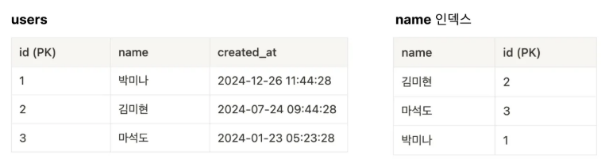

# 커버링 인덱스(Covering Index)

---

### 커버링 인덱스(Covering Index)란?
- **SQL문을 실행시킬 때 필요한 모든 컬럼을 갖고 있는 인덱스**
- 커버링 인덱스로 처리되는 쿼리는 디스크의 레코드를 읽지 않아도 되기 때문에 랜덤 읽기가 싱딩히 줄어들고 성능은 그만큼 빨라진다.
  - 랜덤 읽기(I/O): 디스크에서 데이터를 읽거나 쓸 때 디스크 헤드가 임의의 위치(랜덤한 위치)에 접근하는 과정.

---

### 예시


- `users` 테이블이 있고, `name` 인덱스가 있다고 가정하자.

```mysql
SELECT id, created_at FROM users;
SELECT id, name FROM users;
```
- 1번째 SQL 을 보면, `id`, `created_at` 라는 칼럼만 조회한다 하더라도, 실제 테이블의 데이터에 접근해야한다.
- 하지만 2번째 SQL을 보면 `id`, `name` 칼럼은 실제 테이블에 접근하지 않더라도, 인덱스의 정보만으로 얻어낼 수 있는 정보이다.
따라서 실제 테이블에 접근하지 않고 데이터를 조회할 수 있다. 실제 테이블에 접근하는 것 자체가, 인덱스에 접근하는 것보다 속도가 매우 느리다. (랜덤 I/O)
- 이 상황에서 SQL문을 실행시킬 때 필요한 모든 컬럼을 갖고 있는 인덱스를 보고 **커버링 인덱스(Covering Index)** 라고 표현한다.

---
