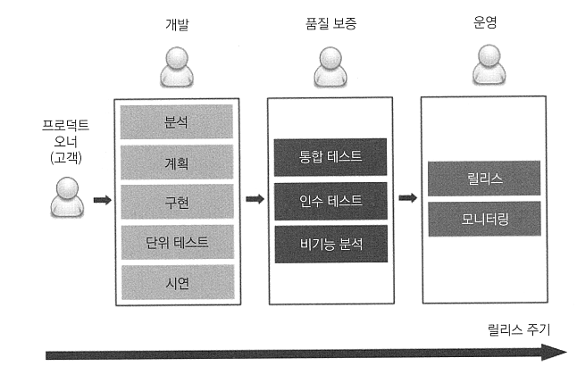

# <a href = "../README.md" target="_blank">배포 자동화와 지속적 인도</a>
## Chapter 01. 지속적 인도 소개
### 1.1 지속적 인도(CD)의 이해
1) 전통적 인도 프로세스
2) 지속적 인도(CD)
3) 성공 사례
---

# 1.1 지속적 인도(CD)의 이해
---

## 1) 전통적 인도 프로세스

### 1.1 동작 방식
- 개발단계 : 분석, 계획, 구현, 단위테스트, 시연
- 품질 보증 단계 : 통합 테스트, 인수테스트, 비기능적 분석
- 운영 단계 : 릴리스, 모니터링

### 1.2 전동적 인도 프로세스의 단점
- 느린 인도 기간 : 요구사항이 전달된 이후 한참이 지나서야 고객에게 제품이 전달됨.
- 느린 피드백 주기 : 개발자는 품질 보증 단계가 되어서야, 버그를 발견하고 이 버그를 고치는 데 오랜 시간을 허비하게 된다.
- 자동화 미비 : 릴리스 횟수가 적을 수록 자동화 필요성이 낮아지므로, 릴리스 기간을 정확히 예측할 수 없음
- 위험한 핫픽스 : 핫픽스를 긴급하게 만들어야하는 경우 시간이 걸리는 인수 테스트를 전부 수행할 수 없음. 간단한 테스트만 하거나,
아예 테스트를 안 하고 핫픽스 발행
- 스트레스 : 릴리스 주기를 예측할 수 없어서 운영 팀이 스트레스를 받음.
- 의사소통 부족 : 작업 결과물이 폭포물처럼 다른 팀으로 일방향적으로 전달되기 때문에 제품 완성보다 자기가 맡은 부분만 관심을 갖고,
문제가 발생하면 다른 팀을 비난하게 됨.
- 책임의 분산 : 어느 팀도 제품 전체의 완료를 책임지지 않음
- 낮은 업무 만족도 : 개발 단계는 재미있지만, 품질 보증 - 릴리스 단계에 이르러서는 버그 수정, 운영 지원에 초점을 맞추게 되며
개발 단계만큼 흥미를 느끼지 못 하게 됨.

---

## 2) 지속적 인도(CD)

### 2.1 지속적 인도란?
> "지속적 인도란 새로운 기능 추가나 구성의 변경, 버그 수정이나 기능 실험을 포함한 모든 유형의 변화를 통제하면서
제품이 생산하는 역량 또는 사용자에게 빠르고 안전하고 안정적으로 제공하는 역량이다."

- 전통적 인도 프로세스의 각 단계를 모두 자동화된 배포 파이프라인 또는 CD 파이프라인 스크립트로 변경
- 코드가 변경될 때마다 자동화 프로세스를 실행함으로써 사용자에게 지속적으로 제품을 인도
- 코드 변경이 적고, 자동화된 프로세스를 자주 반복함으로서 릴리스의 위험도를 낮춤

### 2.2 지속적 인도 프로세스의 장점
- 빠른 제품 인도 : 개발이 끝나자마자 바로 고객에게 전달되므로 출시 기간이 획기적으로 단축됨
- 빠른 피드백 주기 : 버그가 발생하더라도 수정이 그렇게 오래 걸리지 않음. 신속한 롤백 전략까지 추가하여,
제품 상태를 안정적으로 유지할 수 있음
- 위험도가 낮은 릴리스 : 매일 릴리스를 한다는 것 자체가 프로세스가 반복적이고 안정적이라는 뜻
- 유연한 릴리스 가능 : 릴리스를 급히 해야하는 경우에도 릴리스에 필요한 모든 것이 준비되어 있기 때문에
릴리스 여부를 결정하는데 추가 시간, 비용이 들지 않음

### 2.3 인도 프로세스가 얼마나 잘 되어있는가
- 변경 내용이 한 줄일 때 이를 배포하는 데 어느 정도의 시간이 소요되는가
- 배포 작업을 반복해서 안정적으로 수행할 수 있는가

---

## 3) 성공 사례

### 3.1 야후와 플리커 사례

- 야후는 본래 전통적 인도 프로세스 방식을 사용했다.
- 플리커는 하루에도 여러번의 릴리스를 하고, 작은 단위로 작업을 했다.
- 야후의 어떤 제품보다도 플리커의 서비스 중단 시간이 낮았다.
- 이후 야후 개발자들도 CD를 점차 확대했다.

### 3.2 그 외의 사례
- 아마존, 페이스북, 구글, 넷플릭스 등의 주요 테크 리더 기업들은 하루에도 수천 개의 릴리스를 배포함

---
