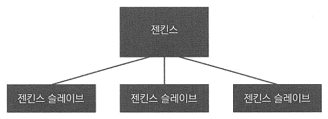
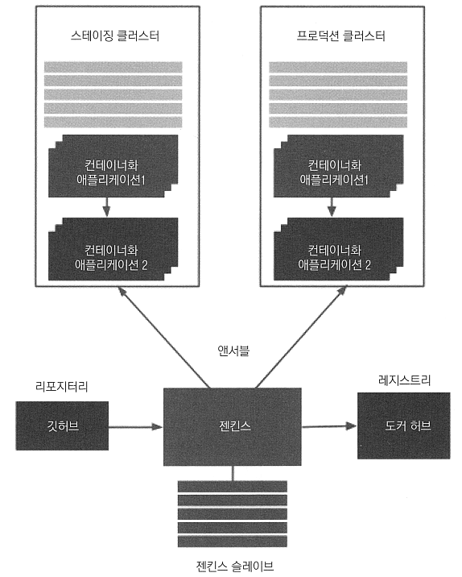

# <a href = "../README.md" target="_blank">배포 자동화와 지속적 인도</a>
## Chapter 01. 지속적 인도 소개
### 1.5 완벽한 CD 시스템 생성하기
1) 도커 : 애플리케이션을 이미지로 패키징
2) 젠킨스 구성하기
3) 지속적 통합(CI) 파이프라인
4) 자동 인수 테스트
5) 쿠버네티스 클러스터링
6) 앤서블로 하는 구성 관리
7) 지속적 인도 파이프라인/지속적 인도 - 고급편

---

# 1.5 완벽한 CD 시스템 생성하기

---

## 1) 도커 : 애플리케이션을 이미지로 패키징

- 2장 : 실행 가능한 애플리케이션을 도커 이미지로 패키징
- 도커 애플리케이션은 도커 호스트 위에서 컨테이너로 실행되며, 호스트 컴퓨터에 직접 실행되는 것처럼
동작한다. 이는 포트 포워딩 덕분에 가능하다.

---

## 2) 젠킨스 구성하기

- 3장 : 젠킨스 환경 구성
- 다중 에이전트(슬레이브) 노드를 활용하여 동시 고부하 작업 처리
- 젠킨스 마스터가 받은 빌드 요청을, 슬레이브 들 중 하나에게 전달해서, 슬레이브에서 실행.
  - 이를 통해 젠킨스 환경을 수평적으로 확장할 수 있다.

---

## 3) 지속적 통합(CI) 파이프라인

- 4장 : 커밋 스테이지를 생성하는 방법
- github로 스프링 부트 프로젝트를 커밋하면 자동으로 젠킨스 빌드가 시작. 이 과정에서 gradle로 자바 코드를
컴파일하고 단위 테스트를 실행하며 추가 점검(코드 커버리지, 정적 코드 분석 등)을 수행
- 젠킨스 빌드가 완료되면 개발자에게 알림 메시지를 보냄
- 여기까지 하면 CI 파이프라인을 완벽하게 생성할 수 있다.

---

## 4) 자동 인수 테스트

5장 : 도커와 젠킨스를 결합

### 4.1 도커 레지스트리
- CI 단계가 끝나면 애플리케이션을 JAR 파일로 패키징 후, 도커 이미지로 변환
- 도커 애플리케이션용 리포지터리의 역할을 하는 도커 레지스트리로 이미지를 전송

### 4.2 도커 호스트
- 인수 테스트를 수행하기 앞서, 애플리케이션을 먼저 실행해야함
- 젠킨스가 도커 호스트 컴퓨터를 실행하면, 도커 레지스트리에서 도커용 애플리케이션을 가져와서 실행

### 4.3 큐컴버
- 애플리케이션이 도커 호스트에서 실행되면 젠킨스는 큐컴버 프레임워크로 작성된 인수 테스트를 실행함

---

## 5) 쿠버네티스 클러스터링

### 5.1 쿠버네티스 연계
- 6장에서 진행
- 도커 호스트 하나를 쿠버네티스 클러스터로 교체
- 독립형 애플리케이션 하나를 두 개의 의존성이 있는 컨테이너 애플리케이션으로 교체

### 5.2 쿠버네티스
- 도커 호스트를 묶는 추상화 레이어를 제공하고, 의존성이 있는 애플리케이션 간의 통신을 할 수 있게 함
- 결과적으로는 어떤 컴퓨터에 애플리케이션이 배포되는 지 고민할 필요가 없으며, 단지 몇 개의 인스턴스가
실행되고 있는 지만 신경 쓰면 된다.

---

## 6) 앤서블로 하는 구성 관리

- 7장에서 진행
- 앤서블을 이용해 다중 환경을 생성
- 환경을 관리하고, 여러 대의 컴퓨터에 동일한 애플리케이션을 배포할 수 있는 기능을 제공
- 테스트 환경과 프로덕션 환경을 미러링

---

## 7) 지속적 인도 파이프라인/지속적 인도 - 고급편

- 8장에서 진행
- 애플리케이션을 스테이징에 배포하고, 인수 테스트를 실행하고, 최종적으로 애플리케이션을 프로덕션 환경에 배포
- 인도 프로세스에 통합된 Flyway 마이그레이션을 사용하여 데이터베이스 스키마를 자동으로 관리

---
