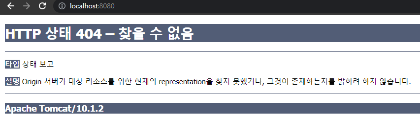

# <a href = "../README.md" target="_blank">배포 자동화와 지속적 인도</a>
## Chapter 02. 도커 소개
### 2.7 도커 네트워킹
1) 서비스 실행 및 호스트의 포트에 바인딩
2) 작성 중...
---

# 2.7 도커 네트워킹

---

## 1) 서비스 실행 및 호스트의 포트에 바인딩

### 1.1 톰캣 서버 실행
```shell
docker run -d tomcat
```
- 톰캣 서버를 백그라운드에서 실행한다.

### 1.2 톰캣 실행 확인
```shell
docker ps
docker logs f2bfe4a7facc
```
```text
01-Dec-2022 03:53:07.912 INFO [main] org.apache.catalina.startup.VersionLoggerListener.log Server version name:   Apache Tomcat/10.1.2
01-Dec-2022 03:53:07.920 INFO [main] org.apache.catalina.startup.VersionLoggerListener.log Server built:          Nov 9 2022 15:47:04 UTC
01-Dec-2022 03:53:07.921 INFO [main] org.apache.catalina.startup.VersionLoggerListener.log Server version number: 10.1.2.0
01-Dec-2022 03:53:07.921 INFO [main] org.apache.catalina.startup.VersionLoggerListener.log OS Name:               Linux
...
```
- docker logs 명령을 통해, 컨테이너의 로그를 확인해보면 정상적으로 실행되는 것을 볼 수 있다.
- 하지만 컨테이너 외부에서 컨테이너의 웹 서버에 접근할 방법이 없다.
- 이 방법을 해결하려면 컨테이너를 실행할 때, 호스트의 포트에 매핑을 해야한다.

### 1.3 호스트의 포트에 바인딩하여, 톰캣 서버 구동


```shell
docker stop f2bfe4a7facc
docker run -d -p 8080:8080 tomcat
```
```shell
-p, --publish <호스트_포트>:<컨테이너_포트>
-p, --publish <IP_주소>:<호스트_포트>:<컨테이너_포트>
```
- 기존의 컨테이너를 중지 상태로 돌리고, 호스트의 8080 포트에 바인딩하여 톰캣 서버를 실행했다.
- 컨테이너에서 바인딩된 포트를, 로컬호스트 혹은 특정 호스트의 포트에 바인딩하려면 `-p` 옵션을 사용하면 된다.

### 1.4 실행 확인


- `http://localhost:8080`으로 접근하면 404 NotFound 오류 페이지를 확인할 수 있다.
- 도커 컨테이너 내부에 있는 톰캣 서버에 정상적으로 접근할 수 있었던 것이다.

---
