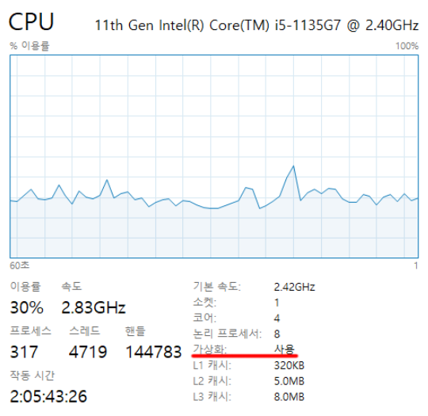

# Windows 에서 도커 설치

---

#### 공식문서
- [windows-install](https://docs.docker.com/desktop/setup/install/windows-install/)

---

#### 하드웨어 사양 조건


- SLAT(Second Level Address Translation) 가 있는 64비트 프로세서
- 4GB 시스템 RAM
- BIOS 설정에서 BIOS 수준 하드웨어 가상화 지원을 활성화해야 함.  
  (활성화 되어 있는지 확인하려면 위와 같이 ctrl+alt + esc를 통해 작업 관리자로 진입해서 확인)

---

#### WSL2 기반(x86_64) 환경 구성
- WSL 버전 1.1.3.0 이상.
- Windows 11 64비트: Home 또는 Pro 버전 22H2 이상, 또는 Enterprise 또는 Education 버전 22H2 이상.
- Windows 10 64비트: 최소 요구 사항은 Home 또는 Pro 22H2(빌드 19045) 이상, 또는 Enterprise 또는 Education 22H2(빌드 19045) 이상
- Windows 에서 WSL 2 기능 활성화
    ```shell
    # Windows PowerShell (관리자 모드)
    dism.exe /online /enable-feature /featurename:Microsoft-Windows-Subsystem-Linux /all /norestart
    ```
- 가상 머신 플랫폼 기능 활성화
    ```shell
    # Windows PowerShell (관리자 모드)
    dism.exe /online /enable-feature /featurename:VirtualMachinePlatform /all /norestart
    ```

---

#### 도커 데스크탑 설치
- [Install Docker Desktop on Windows](https://docs.docker.com/desktop/setup/install/windows-install/)
  - Docker Desktop for Windows 설치

---

#### 참고 자료
- [[Docker] Windows 에서 도커 사용하기 (설치하기)](https://hong-yp-ml-records.tistory.com/126)
- [[Docker] 도커 설치](https://ttasjwi.tistory.com/90) : 내 블로그

---
