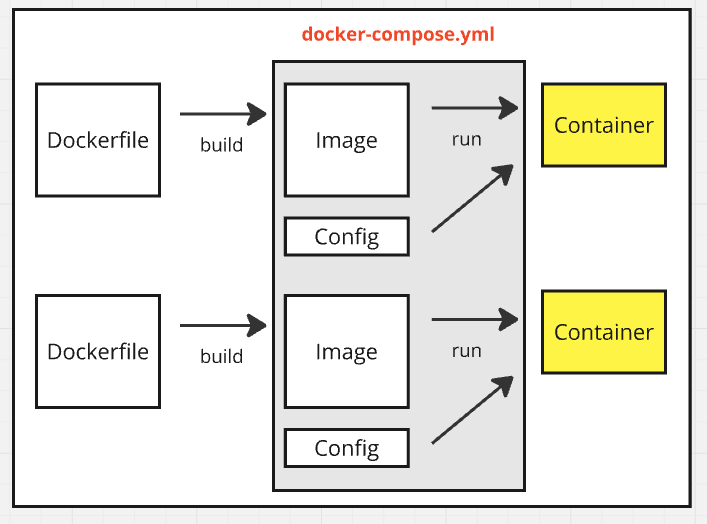

# 도커 컴포즈

---

#### 개요


Docker Compose 는 여러 개의 컨테이너들을 하나의 스택으로 하여 yaml 코드로 정의하고, 이를 실행하기 위한 다중 컨테이너 실행도구다.
- 보통의 서비스들은 단 하나의 컨테이너만으로 구성되지 않는다.
- 그리고 각각을 실행하기 위해서는 파라미터들을 여러개 전달해야하는데 이를 yaml 파일로 작성해두면 관리하기 편리하다

---

#### 도커 컴포즈 설치
- windows 기준 Docker Desktop 설치 시 자동으로 docker-compose 가 함께 설치된다
- ubuntu 기준

---

#### 도커 컴포즈 실행
```shell
# 현재 경로의 docker-compose.yml 파일을 기반으로 도커 컨테이너 실행
docker-compose up

# 특정 docker-compose 파일을 기반으로 도커 컨테이너 실행
docker-compose -f docker-compose-nginx.yml up

# + 백그라운드 실행
docker-compose -f docker-compose-nignx.yml up -d
```

---

#### 도커 컴포즈 명령어
- `docker-compose pull <서비스명>`
  - 서비스를 실행하는데 필요한 이미지를 다운로드
  - 서비스명 생략시, 모든 서비스에 필요한 이미지를 다운로드
- docker-compose build
- docker-compose up
- docker-compose ps
- docker-compose logs
- docker-compose top

---

#### 작성법
- [공식 Reference](https://docs.docker.com/reference/compose-file/)

```yaml
services:
  nginx:
    container_name: nginx
    image: nginx:latest
    hostname: nginx
    ports:
     - "60080:80"
    volumes:
      - "./html:/usr/share/nginx/html"
```
- 버전 정의: 도커 컴포즈의 버전
- 서비스 정의
- 네트워크 정의 : 최상위 레벨에서 정의 가능
- 볼륨 정의 : 최상위 레벨에서 정의 가능

---

#### 버전 및 최상위 요소 이름
- [공식 Reference](https://docs.docker.com/reference/compose-file/version-and-name/)
- version(deprecated)
  - 컴포즈 버전을 기술하기 위한 값
  - 이제 더 이상 필수적이지 않으며, 사실상 이 속성을 사용하는 것은 더 이상 권장되지 않음.
- name
  - 컴포즈의 이름을 지정하기 위한 값
  - 보통 두 개 이상의 컴포즈

---

#### 서비스 정의
- `services.서비스명:` 을 통해 서비스 단위로 정의
- 하위 옵션들
  - container_name
  - host_name
  - ports
  - networks
  - volumes
  - environment
  - command
  - restart
  - depends_on
  - 그 외

---
