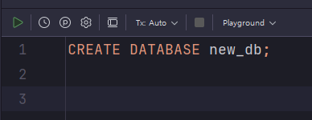

# (예제) 디플로이먼트(Deployment)를 활용해 MySQL 실행시키기

---

## 1. 디플로이먼트(Deployment) 활용해 MySQL 실행시키기

### 1.1 컨피그맵 매니페스트 파일 작성
```yaml
apiVersion: v1
kind: ConfigMap

# ConfigMap 기본 정보
metadata:
  name: mysql-config

# Key, Value 형식으로 설정값 저장
data:
  mysql-database: "kub_practice"
```


### 1.2 시크릿 매니페스트 파일 작성
```yaml
apiVersion: v1
kind: Secret

# Secret 기본 정보
metadata:
  name: mysql-secret # Secret 이름

# Key, Value 형식으로 값 저장
stringData:
  mysql-root-password: 'db1004'
```

### 1.3 디플로이먼트 매니페스트 파일 작성
```yaml
apiVersion: apps/v1
kind: Deployment

# Deployment 기본 정보
metadata:
  name: mysql-deployment # Deployment 이름

# Deployment 세부 정보
spec:
  replicas: 1 # 생성할 파드의 복제본 갯수
  selector:
    matchLabels:
      app: mysql-db # 아래에서 정의한 Pod 중 'app: mysql-db'이라는 값을 가진 파드를 선택

  # 배포할 파드 정의
  template:
    metadata:
      labels: # 레이블(카테고리)
        app: mysql-db
    spec:
      containers:
        - name: mysql-container # 컨테이너 이름
          image: mysql
          ports:
            - containerPort: 3306 # 컨테이너에서 사용하는 포트를 명시적으로 표현
          env:
            - name: MYSQL_ROOT_PASSWORD
              valueFrom:
                secretKeyRef:
                  name: mysql-secret
                  key: mysql-root-password
            - name: MYSQL_DATABASE
              valueFrom:
                configMapKeyRef:
                  name: mysql-config
                  key: mysql-database
```

### 1.4 서비스 매니페스트 파일 작성
```yaml
apiVersion: v1
kind: Service

metadata:
  name: mysql-service

spec:
  type: NodePort
  selector:
    app: mysql-db
  ports:
    - protocol: TCP # 서비스에 접속하기 위한 프로토콜
      targetPort: 3306 # 매핑하기 위한 파드의 포트 번호
      port: 3306 # 쿠버네티스 내부에서 Service에 접속하기 위한 포트 번호
      nodePort: 30002 # 외부에서 사용자들이 접근하게 될 포트 번호
```

### 1.5 매니페스트 파일 기반으로 오브젝트 생성하기
```shell
kubectl apply -f mysql-config.yaml
kubectl apply -f mysql-secret.yaml
kubectl apply -f mysql-deployment.yaml
kubectl apply -f mysql-service.yaml
```

### 1.6 DB 접속


### 1.7 새로운 데이터베이스 생성



---

## 2. MySQL 재시작 시키기
> 여기서 MySQL 이 이유 모를 장애로 서비스가 중단됐다고 가정하자. 그래서 디플로이먼트를 다시 시작해야 하는 상황이라고 해보자.

### 2.1 디플로이먼트 재시작하기
```shell
kubectl rollout restart deployment mysql-deployment
```


### 2.2 데이터베이스 다시 확인해보기


- 데이터베이스를 확인해보면 이전에 만들었던 `new_db`라는 데이터베이스가 없어졌다. 
- 실제 데이터베이스에서는 데이터가 없어져서는 안 된다. 데이터가 보존되도록 볼륨(Volume)을 설정해보자.

---
