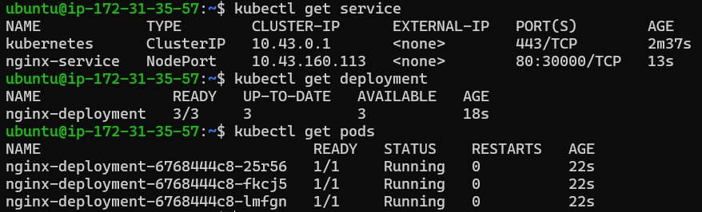
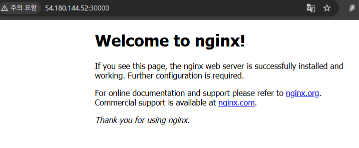

# (예제) 디플로이먼트, 서비스를 활용해 EC2에 웹 서버(Nginx) 띄워보기
- 앞에서 배운 내용들을 실제 배포환경인 EC2 에서도 잘 적용되는 지 확인해볼 것이다.

---

### 매니페스트 파일 작성
```shell
vim deployment.yaml
```

**deployment.yaml**

```yaml
apiVersion: apps/v1
kind: Deployment

# Deployment 기본 정보
metadata:
  name: nginx-deployment # Deployment 이름

# Deployment 세부 정보
spec:
  replicas: 3
  selector:
    matchLabels:
      app: nginx # 아래에서 정의한 Pod 중 'app: nginx'이라는 값을 가진 파드를 선택
  # 배포할 Pod 정의
  template:
    metadata:
      labels: # 레이블(= 카테고리)
        app: nginx
    spec:
      containers:
        - name: nginx-container # 컨테이너 이름
          image: nginx # 컨테이너를 생성할 때 사용할 이미지
          ports:
            - containerPort: 80
```


```shell
vim service.yaml
```

**service.yaml**
```yaml
apiVersion: v1
kind: Service

# Service 기본 정보
metadata:
  name: nginx-service # Service 이름

# Service 세부 정보
spec:
  type: NodePort # Service의 종류
  selector:
    app: nginx # 실행되고 있는 파드 중 'app: nginx'이라는 값을 가진 파드와 서비스를 연결
  ports:
    - protocol: TCP # 서비스에 접속하기 위한 프로토콜
      targetPort: 80 # 매핑하기 위한 파드의 포트 번호
      port: 80 # 쿠버네티스 내부에서 Service에 접속하기 위한 포트 번호
      nodePort: 30000 # 외부에서 사용자들이 접근하게 될 포트 번호
```

---

### 매니페스트 파일 실행
```shell
kubectl apply -f deployment.yaml
kubectl apply -f service.yaml
```

---

### 정상적으로 잘 작동되는 지 확인하기
```shell
kubectl get service
kubectl get deployment
kubectl get pods
```





---

### 생성한 오브젝트 정리하기
```shell
kubectl delete all --all
rm -rf service.yaml
rm -rf deployment.yaml
```

---
