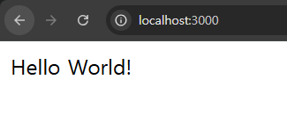
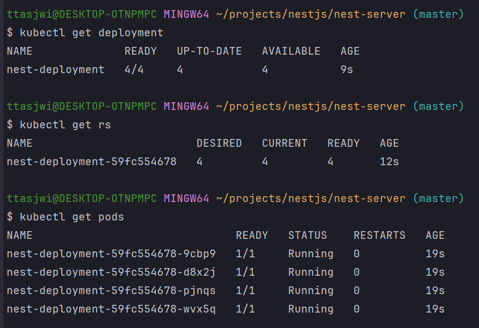
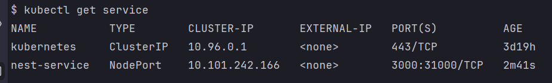
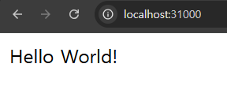
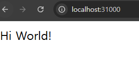

# (예제) 디플로이먼트, 서비스를 활용해 백엔드(Nest.js) 서버 띄워보기

---

## 1. 프로젝트 생성

### 1.1 기존 자원 삭제
```shell
# 모든 자원 삭제
kubectl delete all --all
```

### 1.2 Nest.js 프로젝트 생성
```shell
# nest newe [프로젝트명]
nest new nest-server
```

### 1.3 프로젝트 실행
```shell
npm i
npm run start
```


---

## 2. 도커 이미지 빌드

### 2.1 Dockerfile 작성
```Dockerfile
FROM node

WORKDIR /app

COPY . .

RUN npm install

RUN npm run build

# 문서화 역할 (3000번 포트에서 실행됨 명시)
EXPOSE 3000

ENTRYPOINT [ "node", "dist/main.js" ]
```

### 2.2 `.dockerignore`
```dockerignore
node_modules
```

### 2.3 Dockerfile 을 바탕으로 이미지 빌드
```shell
docker build -t nest-server:1.0
```

### 2.4 이미지가 잘 생성됐는 지 확인하기
```shell
docker image ls # 또는 docker images
```

---

## 3. 디플로이먼트 생성
> 요구사항: 파드 4개 띄우기

### 3.1 매니페스트 파일 작성(`nest-deployment.yaml`)
```yaml
apiVersion: apps/v1
kind: Deployment

metadata:
  name: nest-deployment

spec:
  replicas: 4
  selector:
    matchLabels:
      app: backend-app

  template:
    metadata:
      labels:
        app: backend-app
    spec:
      containers:
        - name: nest-container
          image: nest-server:1.0
          imagePullPolicy: IfNotPresent
          ports:
            - containerPort: 3000
```

### 3.2 디플로이먼트 생성
```shell
kubectl apply -f nest-deployment.yaml
```

### 3.3 생성 확인
```shell
kubectl get deployment
kubectl get rs
kubectl get pods
```


---

## 4. 서비스 생성
> 요구사항: 서비스(Service)를 활용해 `http://localhost:31000` 에서 통신할 수 있도록 만들기

### 4.1 매니페스트 파일 작성(`nest-service.yaml`)
```yaml
apiVersion: v1
kind: Service
metadata:
  name: nest-service
spec:
  type: NodePort
  selector:
    app: backend-app
  ports:
    - protocol: TCP
      targetPort: 3000 # 매핑하기 위한 파드의 포트 번호
      port: 3000 # 쿠버네티스 내부에서 Service에 접속하기 위한 포트 번호
      nodePort: 31000 # 외부에서 사용자들이 접근하게 될 포트 번호
```

### 4.2 서비스 생성
```shell
kubectl apply -f nest-service.yaml
```

### 4.3 서비스 생성 확인
```shell
kubectl get service
```




---

## 5. 업데이트 하기
> 요구사항: 백엔드 서버 띄운 이후에 `Hello World!` 라고 응답하는 서버에서 `Hi World!` 라고 응답하는
> 서버로 업데이트하기

### 5.1 `Nest.js` 코드 수정
```typescript
import { Injectable } from '@nestjs/common';

@Injectable()
export class AppService {
  getHello(): string {
    return 'Hi World!';
  }
}
```

### 5.2 이미지 새로 빌드하기
```shell
docker build -t nest-server:1.1
```

### 5.3 매니페스트 파일(`nest-deployment.yaml`) 수정하기
```yaml
    spec:
      containers:
        - name: nest-container
          image: nest-server:1.1
          imagePullPolicy: IfNotPresent
          ports:
            - containerPort: 3000
          readinessProbe:
            httpGet:
              port: 3000
              path: /
            initialDelaySeconds: 5
            periodSeconds: 10
```

### 5.4 업데이트 적용
```shell
kubectl apply -f nest-deployment.yaml
```

### 5.5 업데이트 확인


---
