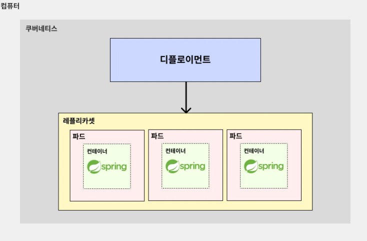

# (예제) 디플로이먼트를 활용해 백엔드(Spring Boot) 서버 3개 띄워보기
> 앞서 매니페스트 파일을 통해 백엔드(Spring Boot) 파드 3대를 띄웠었다.  
> 하지만 기존 방식은 파드 선언을 직접 3번 하는 방식으로 진행되었고, 동적으로 파드의 갯수를 조절하는 것이 어려웠다.  
> 디플로이먼트를 활용해 파드 갯수를 조절하기 좋은 구조를 만들어보자.

---

## 1. 디플로이먼트를 활용해 백엔드(Spring Boot) 서버 3개 띄워보기

### 1.1 기존 매니페스트 파일 수정하기
**기존 매니페스트 파일(spring-pod.yaml)**
```yaml
apiVersion: v1
kind: Pod
metadata:
  name: spring-pod-1
spec:
  containers:
    - name: spring-container
      image: spring-server
      imagePullPolicy: IfNotPresent
      ports:
        - containerPort: 8080
      
---
apiVersion: v1
kind: Pod
metadata:
  name: spring-pod-2
spec:
  containers:
    - name: spring-container
      image: spring-server
      imagePullPolicy: IfNotPresent
      ports:
        - containerPort: 8080
      

---
apiVersion: v1
kind: Pod
metadata:
  name: spring-pod-3
spec:
  containers:
    - name: spring-container
      image: spring-server
      imagePullPolicy: IfNotPresent
      ports:
        - containerPort: 8080
```

**새로운 매니페스트 파일(spring-deployment.yaml)**
```yaml
apiVersion: apps/v1
kind: Deployment

# Deployment 기본 정보
metadata:
  name: spring-deployment # Deployment 이름

# Deployment 상세 정보
spec:
  replicas: 3 # 생성할 복제본 갯수
  selector:
    matchLabels:
      app: backend-app # 아래에서 정의한 Pod 중 'app: backend-app'이라는 레이블를 가진 파드를 선택

  # 배포할 Pod 정의
  template:
    metadata:
      labels: # 레이블 (= 카테고리)
        app: backend-app
    spec:
      containers:
        - name: spring-container # 컨테이너 이름
          image: spring-server # 컨테이너를 생성할 때 사용할 이미지
          imagePullPolicy: IfNotPresent # 로컬에서 이미지를 먼저 가져온다. 없으면 레지스트리에서 가져온다.
          ports:
            - containerPort: 8080 # 컨테이너에서 사용하는 포트를 명시적으로 표현
```

### 1.2 기존 파드 삭제
```shell
$ kubectl delete pod spring-pod-1 spring-pod-2 spring-pod-3
$ kubectl get pods # 잘 삭제됐는 지 확인하기
```


### 1.3 매니페스트 파일을 기반으로 디플로이먼트(Deployment) 생성하기
```shell
kubectl apply -f spring-deployment.yaml
```

### 1.4 디플로이먼트, 레플리카셋, 파드가 잘 생성됐는 지 확인
```shell
$ kubectl get deployment
$ kubectl get replicaset
$ kubectl get pods
```


---

## 2. 전체 구조


---

## 3. 한계
- 실제 요청을 보낼 때는 각 서버에 균등하게 트래픽이 분배되어야 한다. 그런데 사용자보고 여러 백엔드 서버에 알아서 균등하게 요청을 하라고 시킬 수는 없다. 
- 따라서 파드 앞단에 **알아서 여러 파드에 균등하게 요청을 분배해줄 무언가**가 필요하다. 
- 쿠버네티스에서는 **서비스(Service)** 가 여러 파드에 균등하게 요청을 분배해주는 역할을 한다. 

---
