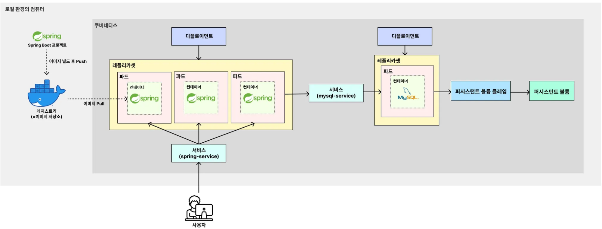

# (예제) 백엔드(Spring Boot) 서버 EC2에 배포하기, DB 연동하기 (+RDS,ECR)
> EC2에 k3s를 활용해 백엔드(Spring Boot) 서버를 배포하고, 백엔드 서버에 DB(MySQL)도 연동시켜보자.

---

### 로컬 환경에서의 아키텍처

---

### 배포 환경에서의 아키텍처

로컬 환경에서의 아키텍처와의 차이점은 크게 2가지이다.

1. **로컬에 도커 이미지를 저장하지 않고, 외부 저장소인 AWS ECR에 도커 이미지를 저장한다.**
2. **로컬의 데이터베이스를 사용하지 않고, 외부 데이터베이스인 AWS RDS를 활용한다.**

위의 아키텍처로 환경을 구성해보자.

---
